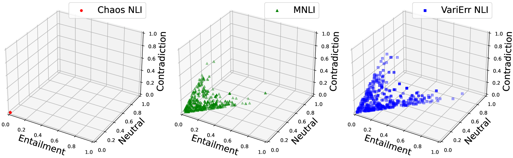

# "以小窥大"：大型语言模型是否能仅通过少数解释，便模拟出人类在自然语言推理任务中的判断分布？

发布时间：2024年06月25日

`LLM应用

这篇论文主要探讨了如何利用大型语言模型（LLMs）来近似人类标签变异（HLV），特别是在自然语言推理（NLI）领域。研究通过使用LLMs作为评估者（“LLM评审者”），并结合少量专家标签和解释来提高LLMs近似HLV的能力。这种方法为扩展HJD标注提供了一种解决方案。此外，论文还讨论了使用LLM生成的MJDs微调软标签感知模型时出现的不一致性，并强调了需要结合实例与全局级度量及可视化来更有效地评估MJDs与人类判断分布的对比。因此，这篇论文属于LLM应用类别，因为它关注的是LLMs在实际标注任务中的应用和效果评估。` `机器学习`

> "Seeing the Big through the Small": Can LLMs Approximate Human Judgment Distributions on NLI from a Few Explanations?

# 摘要

> 人类标签变异（HLV）在多个标注者因合理原因给出不同标签时产生，是宝贵的信息源。在自然语言推理（NLI）领域，早期方法捕捉HLV包括收集众包工人标注或专家语言学家提供详细解释。前者虽信息密集但成本高，后者信息丰富却难扩展。LLMs作为评估者（“LLM评审者”）使用增多，但效果不一，且HJD研究较少。本研究提出利用LLMs，通过少量专家标签和解释近似HJD。实验显示，少量解释大幅提升LLMs近似HJD的能力，为HJD标注扩展提供了解决方案。然而，使用LLM生成的MJDs微调软标签感知模型，结果部分不一致：尽管距离相似，微调模型与分布差异显著。我们强调结合实例与全局级度量及可视化，以更有效地评估MJDs与人类判断分布的对比。

> Human label variation (HLV) is a valuable source of information that arises when multiple human annotators provide different labels for valid reasons. In Natural Language Inference (NLI) earlier approaches to capturing HLV involve either collecting annotations from many crowd workers to represent human judgment distribution (HJD) or use expert linguists to provide detailed explanations for their chosen labels. While the former method provides denser HJD information, obtaining it is resource-intensive. In contrast, the latter offers richer textual information but it is challenging to scale up to many human judges. Besides, large language models (LLMs) are increasingly used as evaluators (``LLM judges'') but with mixed results, and few works aim to study HJDs. This study proposes to exploit LLMs to approximate HJDs using a small number of expert labels and explanations. Our experiments show that a few explanations significantly improve LLMs' ability to approximate HJDs with and without explicit labels, thereby providing a solution to scale up annotations for HJD. However, fine-tuning smaller soft-label aware models with the LLM-generated model judgment distributions (MJDs) presents partially inconsistent results: while similar in distance, their resulting fine-tuned models and visualized distributions differ substantially. We show the importance of complementing instance-level distance measures with a global-level shape metric and visualization to more effectively evaluate MJDs against human judgment distributions.

[Arxiv](https://arxiv.org/abs/2406.17600)