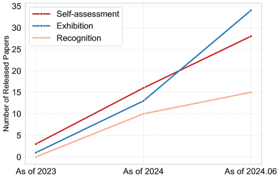
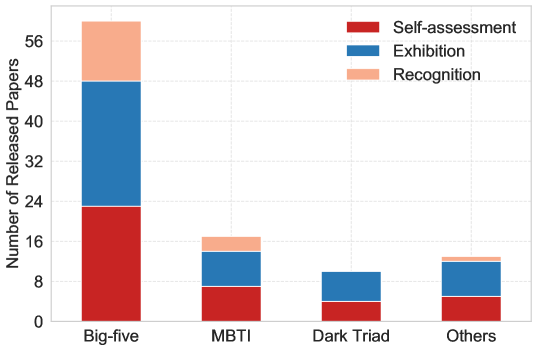
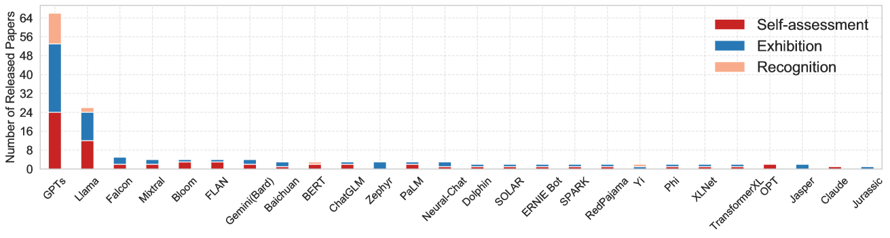

# 自我评价、展示与认可：大型语言模型人格特质的深度探讨

发布时间：2024年06月25日

`LLM理论

理由：这篇论文主要关注大型语言模型（LLMs）中的个性研究，这是一个理论性质的研究领域，涉及对LLMs内在特质和外在表现的深入分析。论文通过综述当前的研究，探讨了LLMs个性研究的三个核心问题，并总结了现有研究的发现和挑战。此外，论文还展望了未来的研究方向，这些都是理论研究的重要组成部分。因此，这篇论文更适合归类为LLM理论。` `心理学` `人工智能`

> Self-assessment, Exhibition, and Recognition: a Review of Personality in Large Language Models

# 摘要

> 随着大型语言模型（LLMs）在文本交互中的人性化表现日益增强，研究者们对LLMs中的个性研究兴趣激增。然而，心理学个性研究的多样性与LLMs的迅猛发展，使得这一跨学科领域的研究虽广泛却零散。不同研究焦点、个性心理测量方法及各类LLMs的研究繁多，使得全面概览变得困难，也增加了将研究成果应用于实际的难度。本文通过将当前研究归类为三个核心问题——自我评估、展示与识别，基于LLMs个性的内在特质与外在表现，提供了一份详尽的综述。我们对每个问题进行了深入分析，并比较了各自的解决方案。同时，我们总结了现有研究的主要发现和面临的挑战，并探讨了其背后的原因。此外，我们汇集了大量公开资源，以助力研究者和开发者。最后，我们展望了未来的研究方向和潜在应用场景。本文作为LLMs个性研究的首次全面综述，旨在通过清晰的分类、深入的分析、有前景的未来方向和丰富的资源，深化理解并推动这一领域的进步。

> As large language models (LLMs) appear to behave increasingly human-like in text-based interactions, more and more researchers become interested in investigating personality in LLMs. However, the diversity of psychological personality research and the rapid development of LLMs have led to a broad yet fragmented landscape of studies in this interdisciplinary field. Extensive studies across different research focuses, different personality psychometrics, and different LLMs make it challenging to have a holistic overview and further pose difficulties in applying findings to real-world applications. In this paper, we present a comprehensive review by categorizing current studies into three research problems: self-assessment, exhibition, and recognition, based on the intrinsic characteristics and external manifestations of personality in LLMs. For each problem, we provide a thorough analysis and conduct in-depth comparisons of their corresponding solutions. Besides, we summarize research findings and open challenges from current studies and further discuss their underlying causes. We also collect extensive publicly available resources to facilitate interested researchers and developers. Lastly, we discuss the potential future research directions and application scenarios. Our paper is the first comprehensive survey of up-to-date literature on personality in LLMs. By presenting a clear taxonomy, in-depth analysis, promising future directions, and extensive resource collections, we aim to provide a better understanding and facilitate further advancements in this emerging field.

[Arxiv](https://arxiv.org/abs/2406.17624)