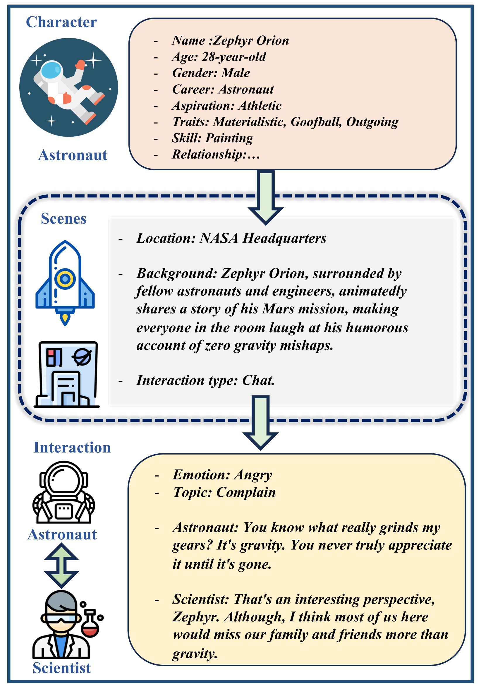

# SimsChat：一款个性化角色驱动的角色扮演智能代理，可根据用户需求定制。

发布时间：2024年06月25日

`Agent

这篇论文介绍了一个可定制对话代理框架，该框架利用大型语言模型（LLMs）来创造出可以根据用户偏好定制的现实世界角色。这个框架特别强调了如何从多个角度利用LLMs来塑造角色的行为，包括职业、抱负、特质和技能等现实元素。此外，论文还提到了创建的SimsConv数据集和开发的SimsChat代理，这些都是为了模拟角色在不同场景和主题中的生活经历及情感交互。因此，这篇论文更符合Agent分类，因为它专注于使用LLMs来创建和定制对话代理，以模拟人类行为。` `角色扮演` `虚拟交互`

> SimsChat: A Customisable Persona-Driven Role-Playing Agent

# 摘要

> 大型语言模型（LLMs）不仅能理解人类指令，还能生成高质量文本，使其成为模拟人类行为的强大工具。它们不仅能复制简单的人类行为，还能以更高级的方式模仿人类。然而，如何从多个角度利用LLMs来塑造角色的研究尚显不足。为此，我们推出了可定制对话代理框架，该框架利用LLMs创造出可根据用户偏好定制的现实世界角色。这一框架有助于根据个人喜好设计角色和角色扮演代理。我们创建了SimsConv数据集，包含68个定制角色和1,360个多轮角色扮演对话，总计13,971个交互对话，角色基于职业、抱负、特质和技能等现实元素。基于此，我们开发了SimsChat，一个可自由定制的角色扮演代理，它模拟了角色在不同场景和主题中的生活经历及情感交互。实验证明，我们的框架表现出色，为未来创造更逼真的人类模拟提供了宝贵指导。相关数据和代码已公开于https://github.com/Bernard-Yang/SimsChat。

> Large Language Models (LLMs) possess the remarkable capability to understand human instructions and generate high-quality text, enabling them to act as agents that simulate human behaviours. This capability allows LLMs to emulate human beings in a more advanced manner, beyond merely replicating simple human behaviours. However, there is a lack of exploring into leveraging LLMs to craft characters from several aspects. In this work, we introduce the Customisable Conversation Agent Framework, which employs LLMs to simulate real-world characters that can be freely customised according to different user preferences. The customisable framework is helpful for designing customisable characters and role-playing agents according to human's preferences. We first propose the SimsConv dataset, which comprises 68 different customised characters, 1,360 multi-turn role-playing dialogues, and encompasses 13,971 interaction dialogues in total. The characters are created from several real-world elements, such as career, aspiration, trait, and skill. Building on these foundations, we present SimsChat, a freely customisable role-playing agent. It incorporates different real-world scenes and topic-specific character interaction dialogues, simulating characters' life experiences in various scenarios and topic-specific interactions with specific emotions. Experimental results show that our proposed framework achieves desirable performance and provides helpful guideline for building better simulacra of human beings in the future. Our data and code are available at https://github.com/Bernard-Yang/SimsChat.

[Arxiv](https://arxiv.org/abs/2406.17962)