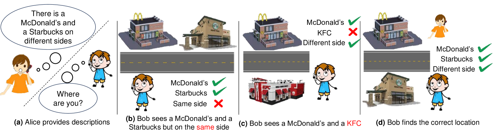
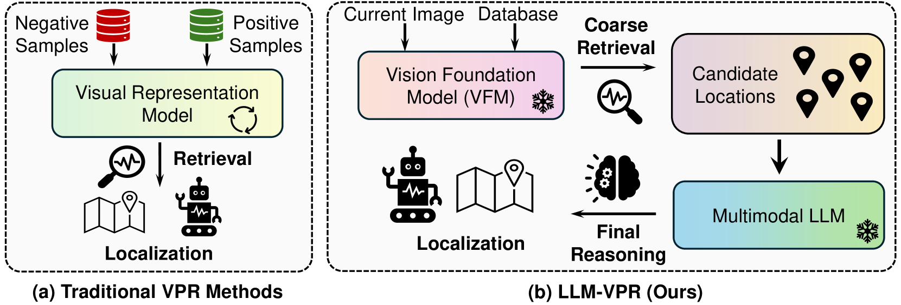
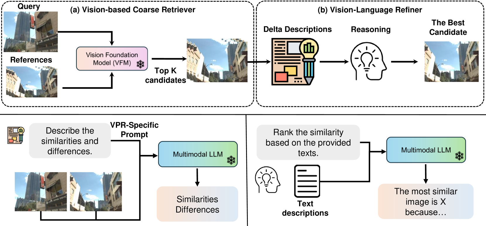
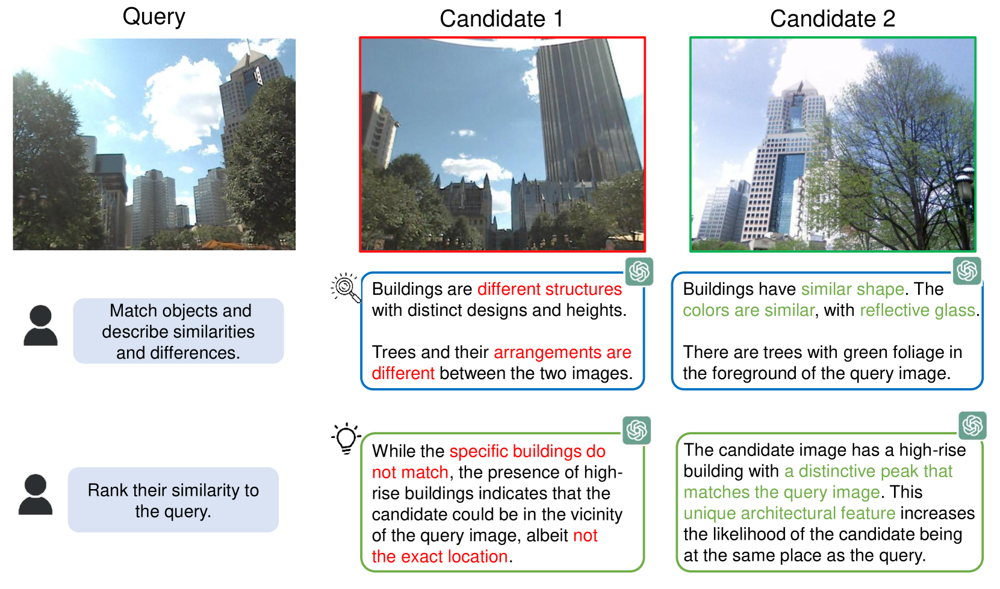
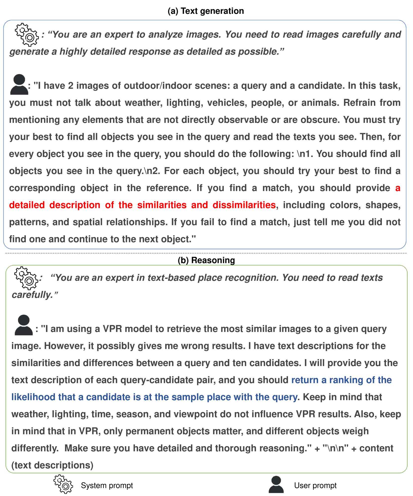
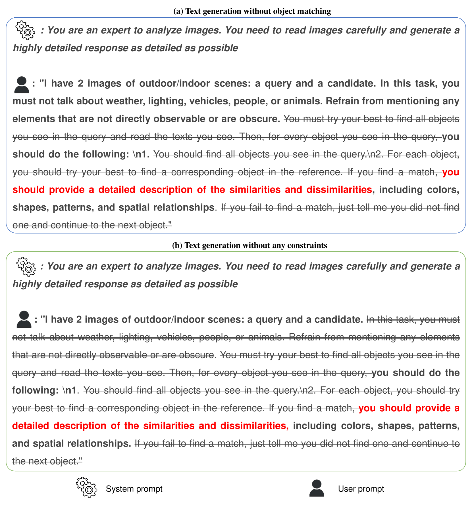
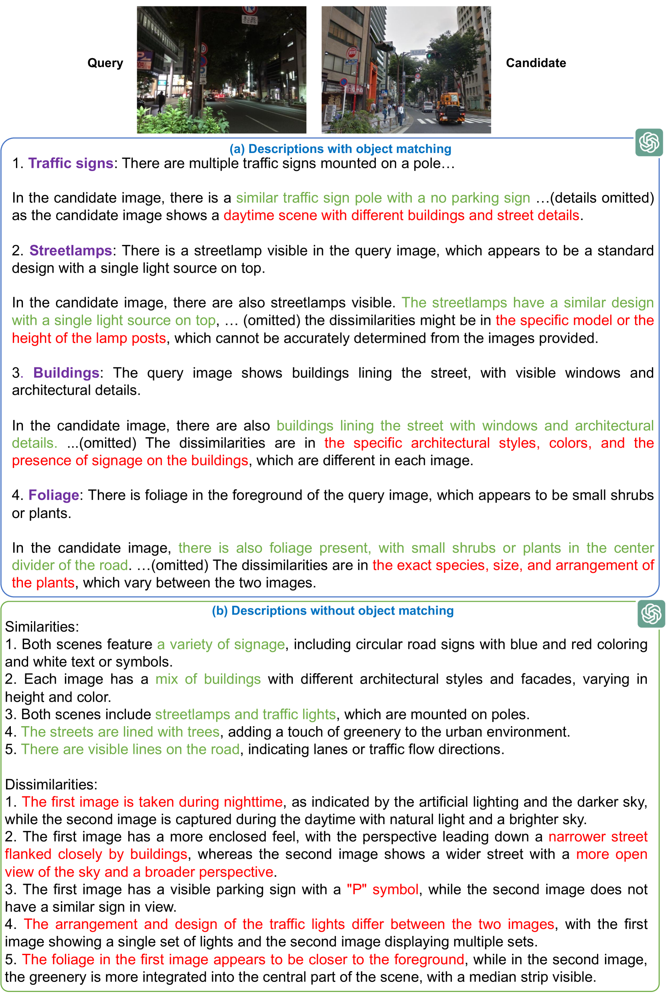
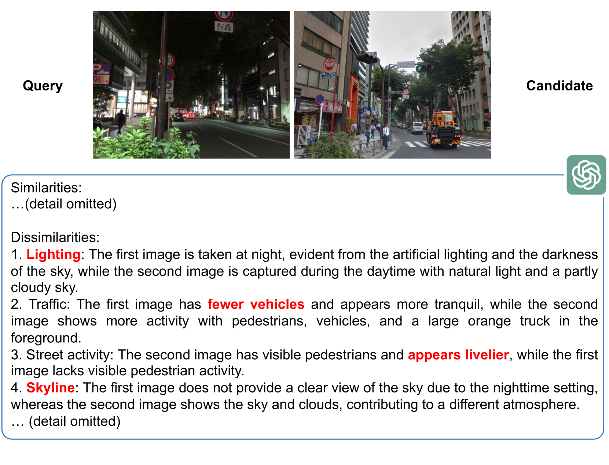
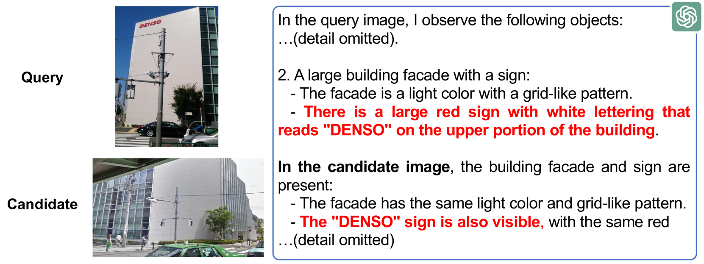

# 告诉我你的位置：多模态LLMs与地点识别的邂逅

发布时间：2024年06月25日

`Agent

理由：这篇论文主要探讨了如何将多模态大型语言模型（MLLMs）应用于机器人领域的视觉位置识别（VPR），以增强机器人的自我定位能力。这种应用涉及到机器人的自主决策和行动，属于Agent的范畴。论文中提到的使用视觉基础模型（VFMs）和MLLMs进行视觉特征筛选和语言推理，以实现高效的位置识别，这表明了机器人在执行任务时需要具备的自主性和智能性，符合Agent的定义和应用场景。` `机器人` `视觉识别`

> Tell Me Where You Are: Multimodal LLMs Meet Place Recognition

# 摘要

> 大型语言模型（LLMs）在机器人领域的长期规划和常识推理方面表现出色，但在位置识别上的应用尚未充分挖掘。本研究中，我们创新性地将多模态大型语言模型（MLLMs）应用于视觉位置识别（VPR），使机器人能通过视觉观察自我定位。我们的核心策略是先通过视觉检索提出多个候选位置，再利用语言推理精细筛选，以确定最终位置。具体操作上，我们借助视觉基础模型（VFMs）的强大视觉特征筛选出候选位置，随后引导MLLMs对比分析当前观察与各候选位置的差异，从而选出最优解。实验结果显示，结合VFMs的视觉特征与MLLMs的推理能力，我们已实现了一种高效的位置识别方法，无需针对VPR的专门训练。我们期望这项研究能为基础模型（如VFMs、LLMs和MLLMs）在移动机器人定位与导航领域的应用和设计开辟新思路。

> Large language models (LLMs) exhibit a variety of promising capabilities in robotics, including long-horizon planning and commonsense reasoning. However, their performance in place recognition is still underexplored. In this work, we introduce multimodal LLMs (MLLMs) to visual place recognition (VPR), where a robot must localize itself using visual observations. Our key design is to use vision-based retrieval to propose several candidates and then leverage language-based reasoning to carefully inspect each candidate for a final decision. Specifically, we leverage the robust visual features produced by off-the-shelf vision foundation models (VFMs) to obtain several candidate locations. We then prompt an MLLM to describe the differences between the current observation and each candidate in a pairwise manner, and reason about the best candidate based on these descriptions. Our results on three datasets demonstrate that integrating the general-purpose visual features from VFMs with the reasoning capabilities of MLLMs already provides an effective place recognition solution, without any VPR-specific supervised training. We believe our work can inspire new possibilities for applying and designing foundation models, i.e., VFMs, LLMs, and MLLMs, to enhance the localization and navigation of mobile robots.

[Arxiv](https://arxiv.org/abs/2406.17520)