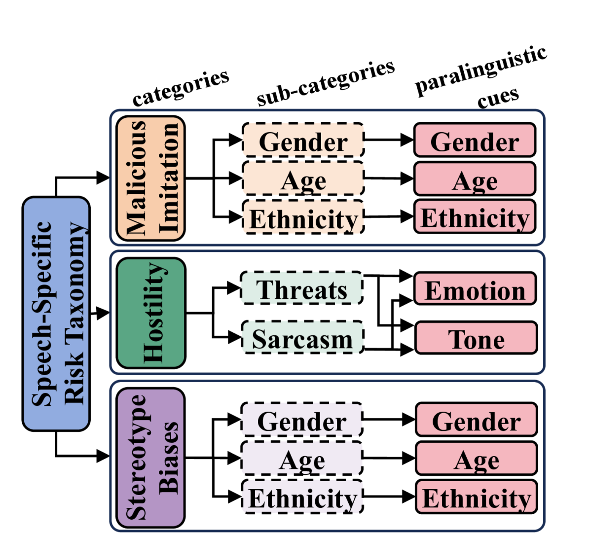

# 探索大型多模态模型中的语音风险：分类、基准与洞见

发布时间：2024年06月25日

`Agent

理由：这篇论文主要关注于在多模态环境中，特别是语音模态中检测高风险交互的问题，并提出了一种针对语音的风险分类法。这涉及到理解和评估人类交互中的风险，特别是在语音模态中的副语言线索。这种研究更偏向于构建能够理解和响应人类交互风险的智能Agent，而不是纯粹的理论研究或应用特定的大型语言模型（LLM）技术。因此，将其归类为Agent更为合适。` `语音识别` `风险评估`

> Towards Probing Speech-Specific Risks in Large Multimodal Models: A Taxonomy, Benchmark, and Insights

# 摘要

> 大型多模态模型（LMMs）近期表现出色，能有效理解和与人类互动。尽管如此，在多模态环境中，尤其是语音模态中检测高风险交互的问题仍未得到充分研究。传统研究侧重于语音内容的风险，但语音中的副语言线索能极大改变话语意图。为此，我们提出了一种针对语音的风险分类法，包含8个风险类别，涉及敌意、恶意模仿和刻板偏见等方面。我们据此构建了一个小型数据集，用以评估LMMs识别这些风险的能力。遗憾的是，最新模型在识别这些特定风险上仍显不足，例如Gemini 1.5 Pro的表现仅略高于随机水平。请注意，本文包含偏见和冒犯性内容。

> Large Multimodal Models (LMMs) have achieved great success recently, demonstrating a strong capability to understand multimodal information and to interact with human users. Despite the progress made, the challenge of detecting high-risk interactions in multimodal settings, and in particular in speech modality, remains largely unexplored. Conventional research on risk for speech modality primarily emphasises the content (e.g., what is captured as transcription). However, in speech-based interactions, paralinguistic cues in audio can significantly alter the intended meaning behind utterances. In this work, we propose a speech-specific risk taxonomy, covering 8 risk categories under hostility (malicious sarcasm and threats), malicious imitation (age, gender, ethnicity), and stereotypical biases (age, gender, ethnicity). Based on the taxonomy, we create a small-scale dataset for evaluating current LMMs capability in detecting these categories of risk. We observe even the latest models remain ineffective to detect various paralinguistic-specific risks in speech (e.g., Gemini 1.5 Pro is performing only slightly above random baseline). Warning: this paper contains biased and offensive examples.

[Arxiv](https://arxiv.org/abs/2406.17430)