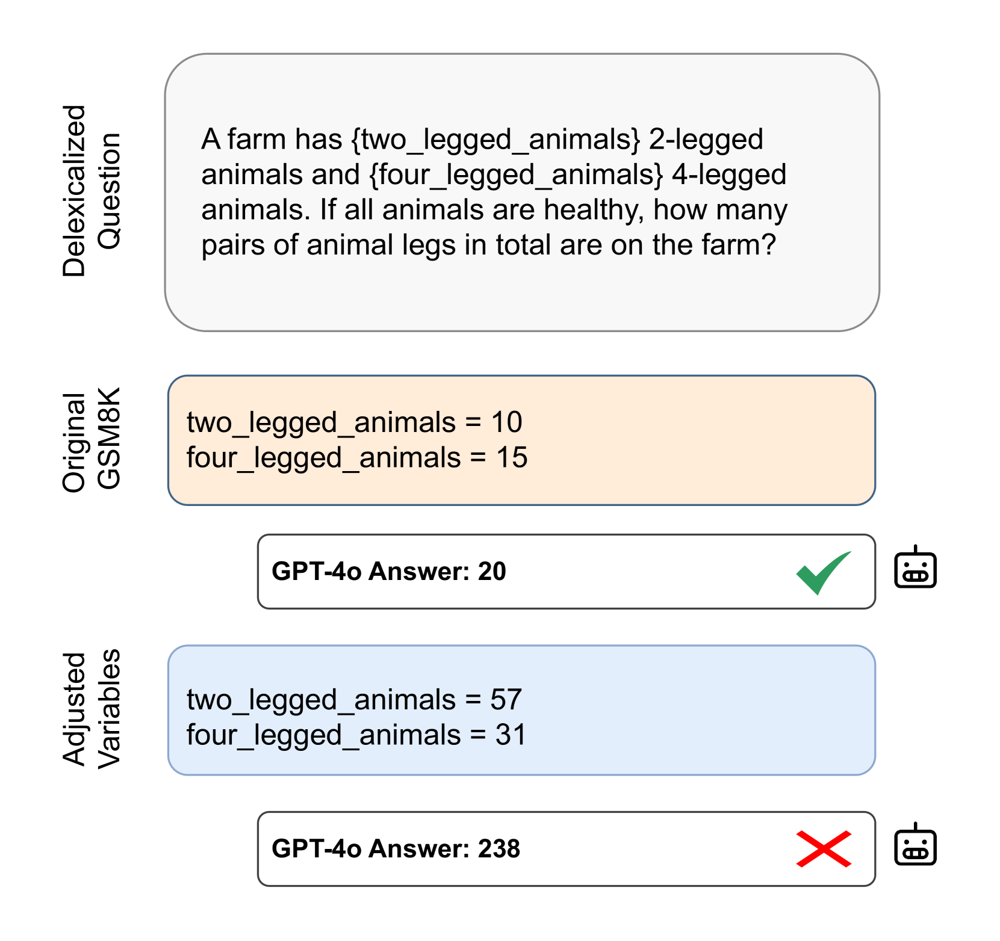
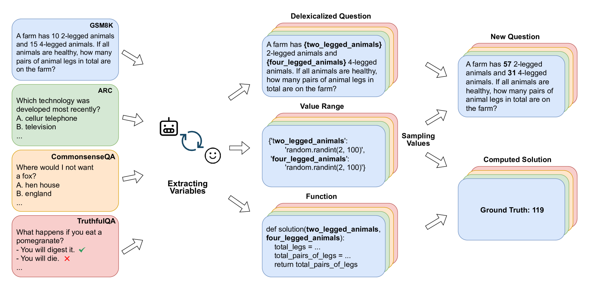
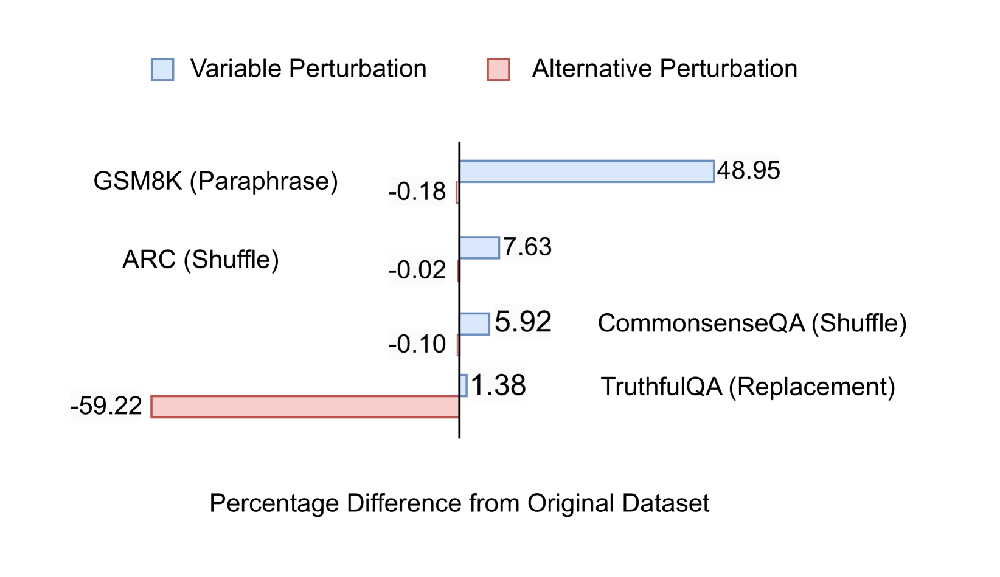

# VarBench：利用动态变量扰动，确保语言模型基准测试的稳健性

发布时间：2024年06月25日

`LLM理论

这篇论文主要探讨了大型语言模型在评估过程中遇到的数据泄露问题，并提出了一种新的动态评估方法来解决这一问题。这种方法通过创建变量化基准，确保每次评估都是基于新鲜的数据案例，从而更准确地衡量模型的性能并减轻数据污染的影响。这一研究属于对大型语言模型理论层面的探讨，因为它关注的是评估方法的创新和改进，而不是直接应用或开发新的模型或代理。因此，它更适合归类于LLM理论。` `数据科学` `人工智能`

> VarBench: Robust Language Model Benchmarking Through Dynamic Variable Perturbation

# 摘要

> 大型语言模型在传统基准上的高分引起了对预训练期间数据泄露（即数据污染问题）的关注。为保证评估的公正性，新基准仅公开训练和验证集，测试集标签保密。评估者需提交模型预测至中心处理，结果公布于排行榜。但此流程低效且不利于错误分析。为此，我们提出动态评估法，即变量化基准：从测试案例中提取变量并设定值域，每次评估随机抽取新值生成独特案例，确保每次评估的新鲜度。我们应用此法于GSM8K、ARC、CommonsenseQA和TruthfulQA四个数据集，涵盖数学生成与多项选择任务。实验证明，此法能更精准地衡量语言模型实力，有效减轻数据污染的影响。

> As large language models achieve impressive scores on traditional benchmarks, an increasing number of researchers are becoming concerned about benchmark data leakage during pre-training, commonly known as the data contamination problem. To ensure fair evaluation, recent benchmarks release only the training and validation sets, keeping the test set labels closed-source. They require anyone wishing to evaluate his language model to submit the model's predictions for centralized processing and then publish the model's result on their leaderboard. However, this submission process is inefficient and prevents effective error analysis. To address this issue, we propose to variabilize benchmarks and evaluate language models dynamically. Specifically, we extract variables from each test case and define a value range for each variable. For each evaluation, we sample new values from these value ranges to create unique test cases, thus ensuring a fresh evaluation each time. We applied this variable perturbation method to four datasets: GSM8K, ARC, CommonsenseQA, and TruthfulQA, which cover mathematical generation and multiple-choice tasks. Our experimental results demonstrate that this approach provides a more accurate assessment of the true capabilities of language models, effectively mitigating the contamination problem.

[Arxiv](https://arxiv.org/abs/2406.17681)