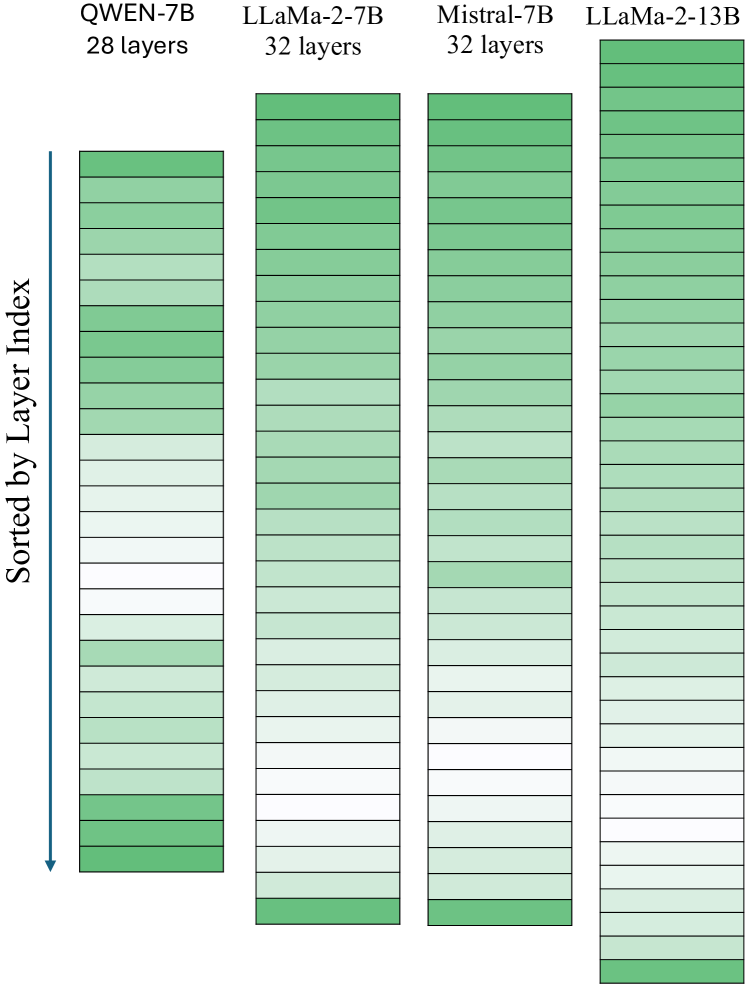

# 层级变量量化：量化大型语言模型的简洁高效之策

发布时间：2024年06月25日

`LLM理论

理由：这篇论文主要探讨了大型语言模型（LLM）的层级变量量化方法，这是一种理论上的模型优化技术，涉及如何根据层的重要性采用不同的量化策略。这种方法旨在优化模型的性能和大小，而不涉及具体的应用场景或Agent的行为。因此，它更符合LLM理论的分类，而不是Agent、RAG或LLM应用。` `模型优化`

> Variable Layer-Wise Quantization: A Simple and Effective Approach to Quantize LLMs

# 摘要

> 我们介绍了一种简便的层级变量量化方法，针对大型语言模型（LLM）的不同层采用不同位级的量化策略。具体而言，我们将关键层以高精度量化，而次要层则以低精度量化，实现浮点量化水平。为此，我们提出了两种评估层重要性的有效方法：一是通过比较层输出与输入嵌入的差异来评估（差异越大，重要性越高）；二是通过统计权重远超平均值的层权重数量来评估（数量越少，重要性越高）。实验表明，依据我们的重要性评分对各层进行差异化量化，能在显著压缩模型大小的同时，几乎不牺牲性能。此外，我们还总结了几个关键的实践发现：(a) 在变量量化下，LLM性能与原始模型相近，直至25-50%的层按我们建议的顺序进行低量化，若无特定顺序，则仅在5-10%时保持相近；(b) 将LLM量化至低比特位优于剪枝，除非采用极端的2位量化；(c) 在层数更多的较大LLM中，层级低比特量化效果优于层数较少的小型LLM。实验代码已公开，详情请访问：https://github.com/RazvanDu/LayerwiseQuant。

> We present a simple variable quantization approach that quantizes different layers of a large language model (LLM) at different bit levels. Specifically, we quantize the most important layers to higher bit precision and less important layers to lower bits to achieve floating point quantization levels. We propose two effective strategies to measure the importance of layers within LLMs: the first measures the importance of a layer based on how different its output embeddings are from the input embeddings (the higher the better); the second estimates the importance of a layer using the number of layer weights that are much larger than average (the smaller the better). We show that quantizing different layers at varying bits according to our importance scores results in minimal performance drop with a far more compressed model size. Finally, we present several practical key takeaways from our variable layer-wise quantization experiments: (a) LLM performance under variable quantization remains close to the original model until 25-50% of layers are moved in lower quantization using our proposed ordering but only until 5-10% if moved using no specific ordering; (b) Quantizing LLMs to lower bits performs substantially better than pruning unless extreme quantization (2-bit) is used; and (c) Layer-wise quantization to lower bits works better in the case of larger LLMs with more layers compared to smaller LLMs with fewer layers. The code used to run the experiments is available at: https://github.com/RazvanDu/LayerwiseQuant.

[Arxiv](https://arxiv.org/abs/2406.17415)