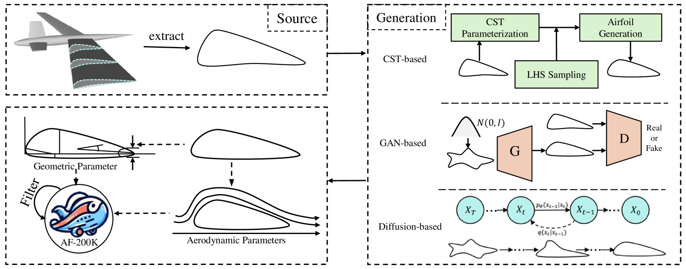
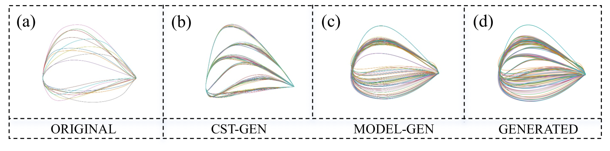
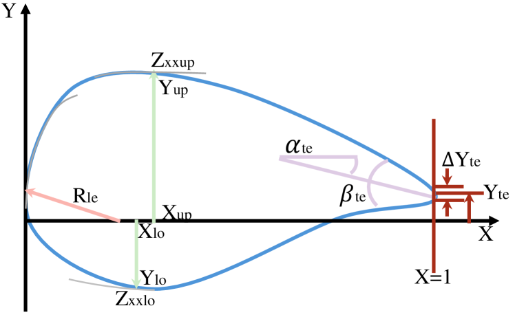
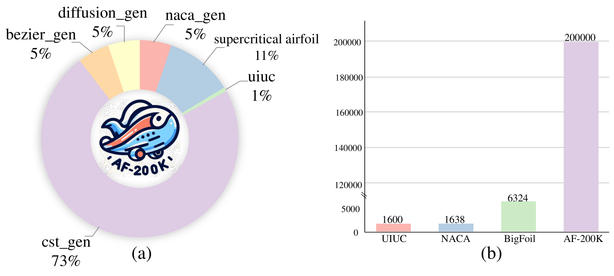
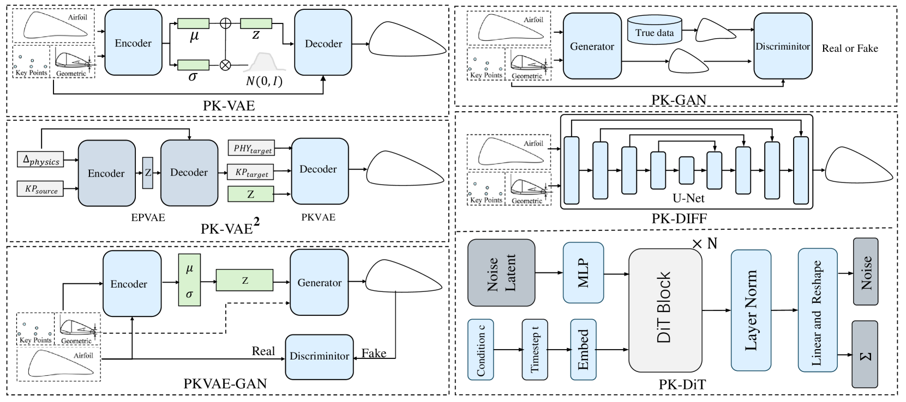
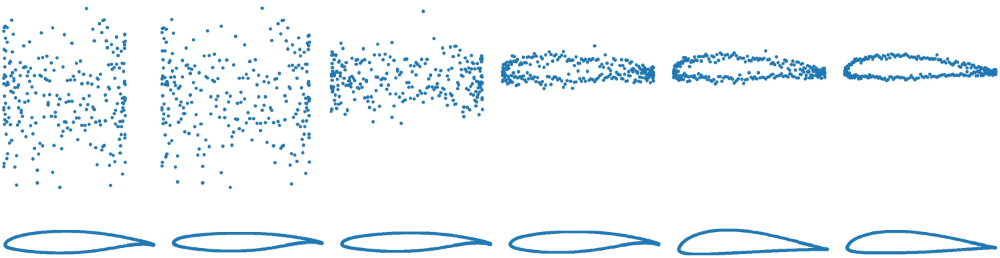
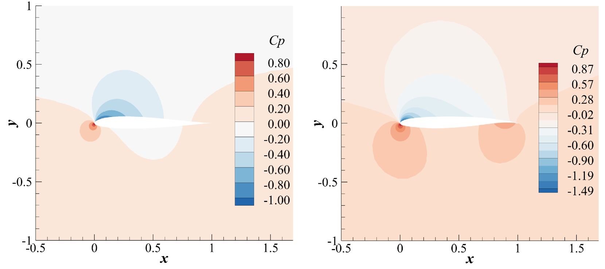
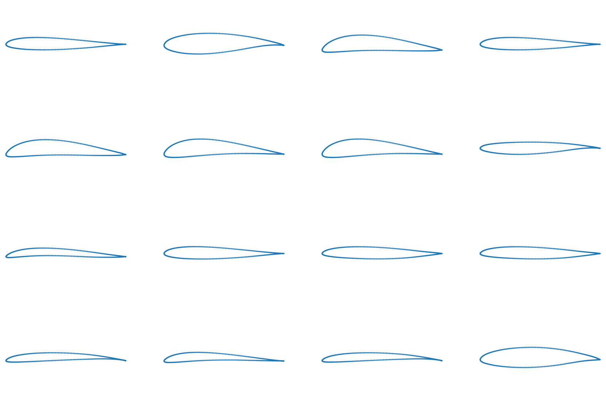

# AFBench：机翼设计的大型规模基准

发布时间：2024年06月26日

`Agent

理由：这篇论文主要介绍了一个开源项目AFBench，它包含大规模数据集和相关任务，旨在通过多模态指令实现数据驱动的可控逆向设计模型。这个项目的目标是连接学术研究与工业应用，提供基线模型和评估指标，推动未来研究。虽然涉及生成模型和数据驱动的方法，但核心在于创建一个工具或平台（Agent），用于支持机械逆向设计领域的研究和应用，而不是专注于大型语言模型（LLM）的理论或应用，也不是关于检索增强生成（RAG）的研究。因此，将其归类为Agent。` `航空航天` `机械设计`

> AFBench: A Large-scale Benchmark for Airfoil Design

# 摘要

> 数据驱动的生成模型正成为实现高效机械逆向设计的有力途径。然而，高昂的时间和金钱成本导致该领域缺乏开源和大规模的基准。特别是在翼型逆向设计中，需要根据多模态指令（如拖动点和物理参数）生成和编辑多样化的几何和气动合格的翼型。本文介绍了开源项目AFBench，它包含一个拥有20万翼型的大规模数据集，以及高质量的气动和几何标签。此外，还提出了两个实用的翼型逆向设计任务：基于多模态物理参数的条件生成和可控编辑，并提供了评估现有方法的综合指标。我们的目标是将AFBench打造成一个生态系统，专注于通过多模态指令实现的数据驱动可控逆向设计模型，旨在连接学术研究与工业应用。我们已提供基线模型、详尽的实验观察和分析，以推动未来研究。基线模型在RTX 3090 GPU上训练了16小时，相关代码库、数据集和基准将在https://hitcslj.github.io/afbench/上公开。

> Data-driven generative models have emerged as promising approaches towards achieving efficient mechanical inverse design. However, due to prohibitively high cost in time and money, there is still lack of open-source and large-scale benchmarks in this field. It is mainly the case for airfoil inverse design, which requires to generate and edit diverse geometric-qualified and aerodynamic-qualified airfoils following the multimodal instructions, \emph{i.e.,} dragging points and physical parameters. This paper presents the open-source endeavors in airfoil inverse design, \emph{AFBench}, including a large-scale dataset with 200 thousand airfoils and high-quality aerodynamic and geometric labels, two novel and practical airfoil inverse design tasks, \emph{i.e.,} conditional generation on multimodal physical parameters, controllable editing, and comprehensive metrics to evaluate various existing airfoil inverse design methods. Our aim is to establish \emph{AFBench} as an ecosystem for training and evaluating airfoil inverse design methods, with a specific focus on data-driven controllable inverse design models by multimodal instructions capable of bridging the gap between ideas and execution, the academic research and industrial applications. We have provided baseline models, comprehensive experimental observations, and analysis to accelerate future research. Our baseline model is trained on an RTX 3090 GPU within 16 hours. The codebase, datasets and benchmarks will be available at \url{https://hitcslj.github.io/afbench/}.

[Arxiv](https://arxiv.org/abs/2406.18846)