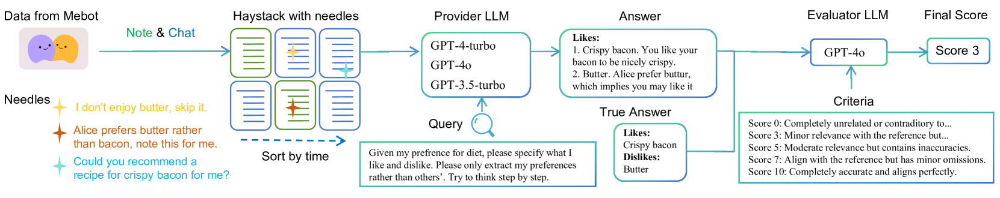
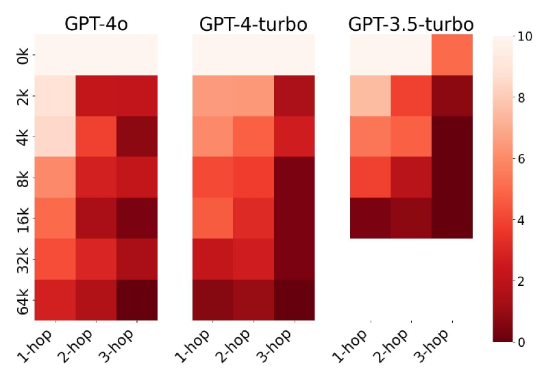
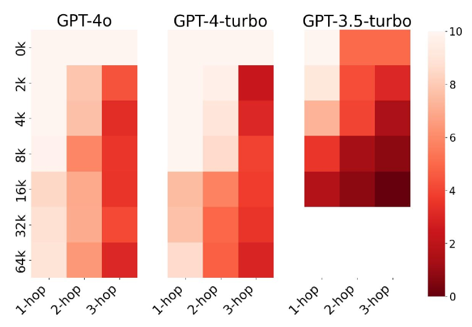
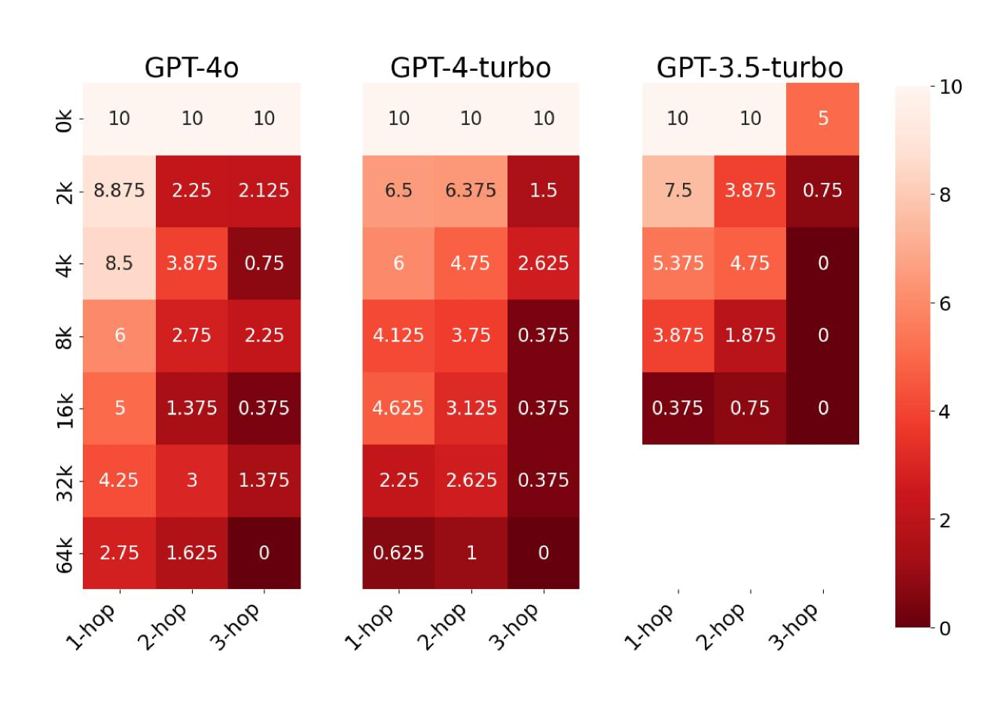
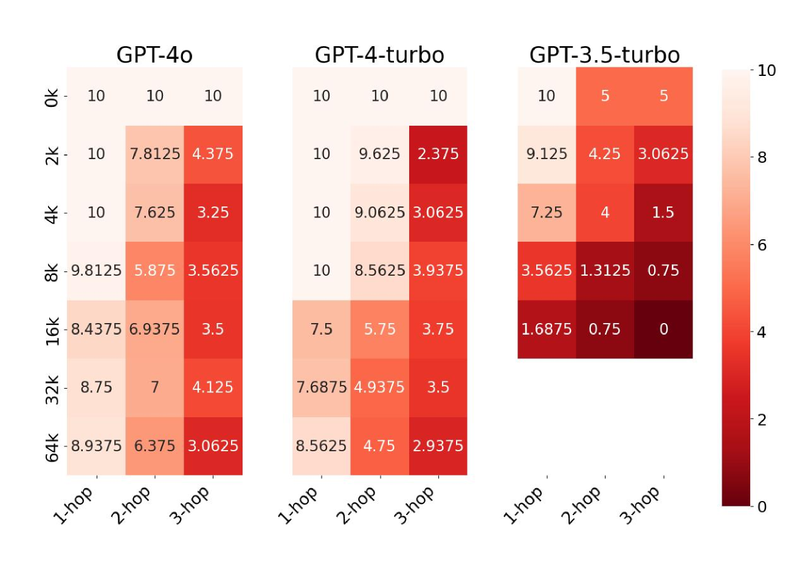

# AI原生记忆：大型语言模型迈向通用人工智能的桥梁

发布时间：2024年06月26日

`LLM理论

这篇论文探讨了大型语言模型（LLMs）在实现人工通用智能（AGI）方面的潜力，并提出了通过整合记忆来增强LLMs的方法。论文不仅讨论了现有LLMs在处理长上下文方面的局限性，还提出了一个理论框架，即通过记忆的整合来改进LLMs的性能，使其更接近AGI。这一讨论涉及了对LLMs理论层面的深入分析和改进建议，因此属于LLM理论分类。` `人工智能` `通用智能`

> AI-native Memory: A Pathway from LLMs Towards AGI

# 摘要

> 大型语言模型（LLMs）已初露人工通用智能（AGI）的端倪。一些专注于LLMs的初创公司认为，拥有近乎无限上下文长度的LLM能实现AGI。然而，他们对现有LLMs处理长上下文能力的乐观可能过于乐观——（1）最新研究表明，这些模型的实际有效上下文长度远低于其宣称；（2）我们的“干草堆中推理”实验揭示，从冗长上下文中提取相关信息并进行推理几乎不可能。本文提出，通过整合\emph{记忆}，LLMs可迈向AGI。我们认为，AGI系统应以LLMs为核心，其记忆不仅存储原始数据，还应包含大量推理得出的关键结论。与仅处理原始数据的检索增强生成（RAG）相比，此方法不仅加强了语义关联，还简化了查询时的复杂推理。作为过渡，记忆将以自然语言描述形式存在，便于用户直接使用。最终，每个人都将拥有一个深度神经网络模型（AI原生），该模型能参数化和压缩所有类型的记忆，包括无法用自然语言描述的记忆。最后，我们探讨了AI原生记忆在AGI时代推动主动参与、个性化、分发和社会变革的潜力，以及随之而来的隐私和安全挑战及其初步解决方案。

> Large language models (LLMs) have demonstrated the world with the sparks of artificial general intelligence (AGI). One opinion, especially from some startups working on LLMs, argues that an LLM with nearly unlimited context length can realize AGI. However, they might be too optimistic about the long-context capability of (existing) LLMs -- (1) Recent literature has shown that their effective context length is significantly smaller than their claimed context length; and (2) Our reasoning-in-a-haystack experiments further demonstrate that simultaneously finding the relevant information from a long context and conducting (simple) reasoning is nearly impossible. In this paper, we envision a pathway from LLMs to AGI through the integration of \emph{memory}. We believe that AGI should be a system where LLMs serve as core processors. In addition to raw data, the memory in this system would store a large number of important conclusions derived from reasoning processes. Compared with retrieval-augmented generation (RAG) that merely processing raw data, this approach not only connects semantically related information closer, but also simplifies complex inferences at the time of querying. As an intermediate stage, the memory will likely be in the form of natural language descriptions, which can be directly consumed by users too. Ultimately, every agent/person should have its own large personal model, a deep neural network model (thus \emph{AI-native}) that parameterizes and compresses all types of memory, even the ones cannot be described by natural languages. Finally, we discuss the significant potential of AI-native memory as the transformative infrastructure for (proactive) engagement, personalization, distribution, and social in the AGI era, as well as the incurred privacy and security challenges with preliminary solutions.

[Arxiv](https://arxiv.org/abs/2406.18312)