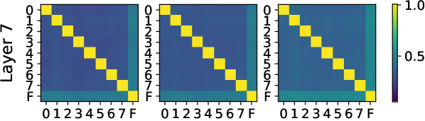
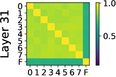
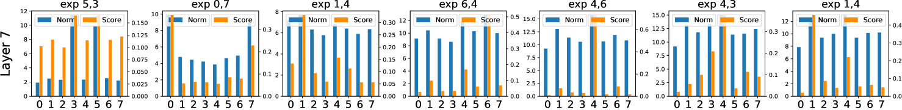

# 深入剖析大型语言模型中的专家混合策略

发布时间：2024年06月26日

`LLM理论

这篇论文深入研究了混合专家（MoE）大型语言模型的内部机制，分析了其参数和行为，并提供了关于路由器设计和专家分配的建议。这些研究内容主要关注于大型语言模型（LLM）的理论层面，特别是MoE模型的内部工作原理和性能优化，因此属于LLM理论分类。` `机器学习`

> A Closer Look into Mixture-of-Experts in Large Language Models

# 摘要

> 混合专家（MoE）因其独特性能，在语言任务上备受瞩目。MoE通过稀疏激活参数，在不损计算效率的前提下扩大模型规模，巧妙平衡了性能与成本。但MoE的内在机制尚待深究，其模块化程度亦存疑。本文首次深入MoE大型语言模型，详尽分析了三种MoE模型的参数与行为，揭示了神经元如细粒度专家般运作、路由器偏好输出范数大的专家、专家多样性随层数增加而增长（最后一层除外）等现象。我们为MoE实践者提供了路由器设计与专家分配的建议，期待此研究能启迪MoE及其他模块化架构的未来探索。相关代码已发布于https://github.com/kamanphoebe/Look-into-MoEs。

> Mixture-of-experts (MoE) is gaining increasing attention due to its unique properties and remarkable performance, especially for language tasks. By sparsely activating a subset of parameters for each token, MoE architecture could increase the model size without sacrificing computational efficiency, achieving a better trade-off between performance and training costs. However, the underlying mechanism of MoE still lacks further exploration, and its modularization degree remains questionable. In this paper, we make an initial attempt to understand the inner workings of MoE-based large language models. Concretely, we comprehensively study the parametric and behavioral features of three recent MoE-based models and reveal some intriguing observations, including (1) Neurons act like fine-grained experts. (2) The router of MoE usually selects experts with larger output norms. (3) The expert diversity increases as the layer increases, while the last layer is an outlier. Based on the observations, we also provide suggestions for a broad spectrum of MoE practitioners, such as router design and expert allocation. We hope this work could shed light on future research on the MoE framework and other modular architectures. Code is available at https://github.com/kamanphoebe/Look-into-MoEs.

[Arxiv](https://arxiv.org/abs/2406.18219)