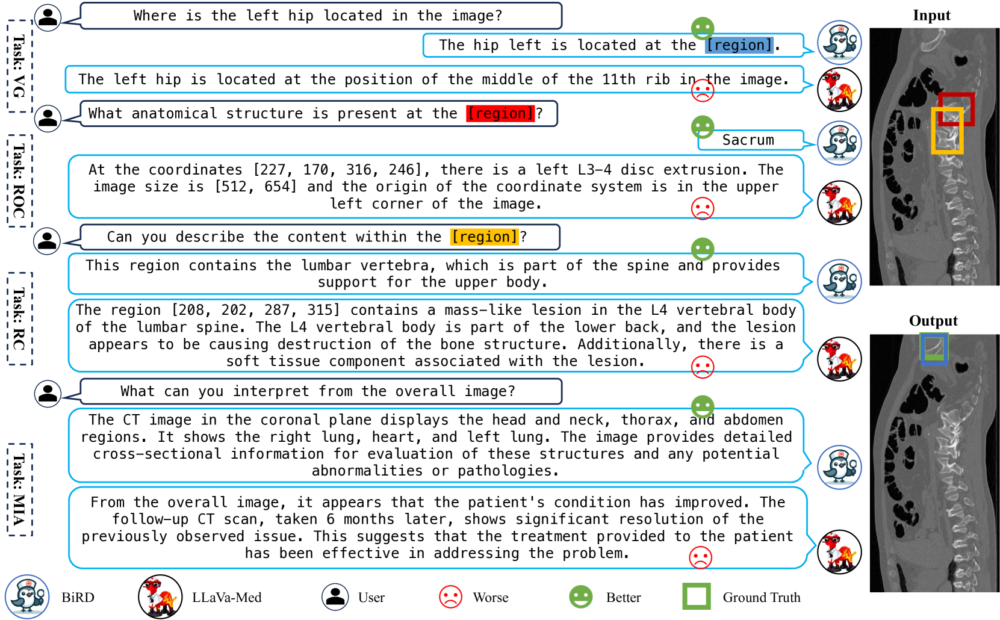

# 生物医学领域的新星：参考与定位多模态大型语言模型

发布时间：2024年06月26日

`RAG

理由：这篇论文主要介绍了在生物医学领域开发的多模态大型语言模型（MLLMs），特别是通过创建新的数据集Med-GRIT-270k和开发名为BiRD的模型，来增强在视觉聊天中的refer和ground功能。这些工作集中在增强模型的多模态理解和交互能力，特别是在生物医学图像处理方面。因此，这更符合RAG（检索增强生成）的分类，因为它涉及通过特定领域的数据集增强模型的理解和生成能力。` `生物医学` `医疗成像`

> A Refer-and-Ground Multimodal Large Language Model for Biomedicine

# 摘要

> 随着多模态大型语言模型（MLLMs）的迅速发展，尤其是在视觉聊天中利用refer和ground功能的能力，其重要性日益凸显。然而，生物医学领域在这一方面存在显著空白，主要原因是缺乏专为生物医学图像设计的refer和ground数据集。为此，我们开发了Med-GRIT-270k数据集，包含270,000个问答对，覆盖八种医学成像模式，并首次专注于生物医学领域，整合了refer和ground对话。我们通过从医学分割数据集中提取大规模生物医学图像-掩码对，并利用chatGPT生成文本指令数据集，实现了这一创新。此外，我们还推出了名为BiRD的Refer-and-Ground多模态大型语言模型，通过多任务指令学习，该模型展现出卓越的多模态和细粒度交互能力。这些成果对于智能生物医学助手的研究和开发具有重要的参考价值。

> With the rapid development of multimodal large language models (MLLMs), especially their capabilities in visual chat through refer and ground functionalities, their significance is increasingly recognized. However, the biomedical field currently exhibits a substantial gap in this area, primarily due to the absence of a dedicated refer and ground dataset for biomedical images. To address this challenge, we devised the Med-GRIT-270k dataset. It comprises 270k question-and-answer pairs and spans eight distinct medical imaging modalities. Most importantly, it is the first dedicated to the biomedical domain and integrating refer and ground conversations. The key idea is to sample large-scale biomedical image-mask pairs from medical segmentation datasets and generate instruction datasets from text using chatGPT. Additionally, we introduce a Refer-and-Ground Multimodal Large Language Model for Biomedicine (BiRD) by using this dataset and multi-task instruction learning. Extensive experiments have corroborated the efficacy of the Med-GRIT-270k dataset and the multi-modal, fine-grained interactive capabilities of the BiRD model. This holds significant reference value for the exploration and development of intelligent biomedical assistants.

[Arxiv](https://arxiv.org/abs/2406.18146)