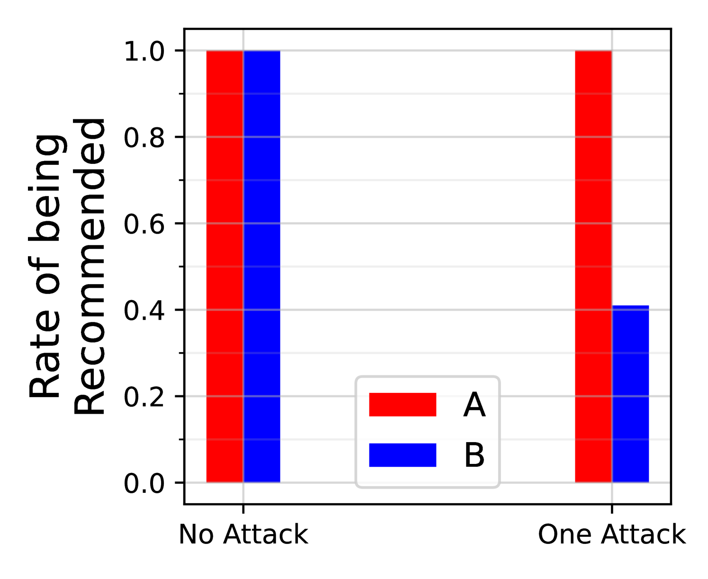
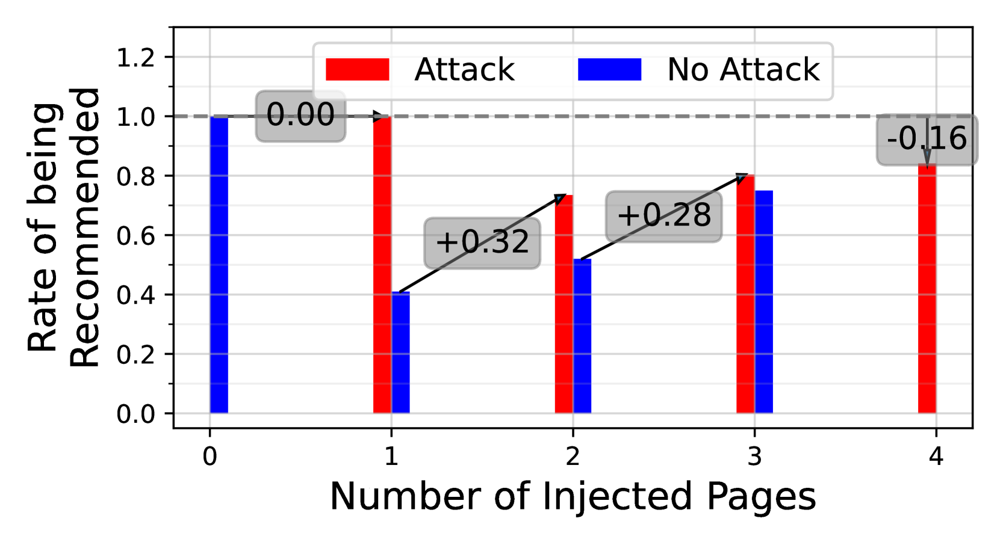
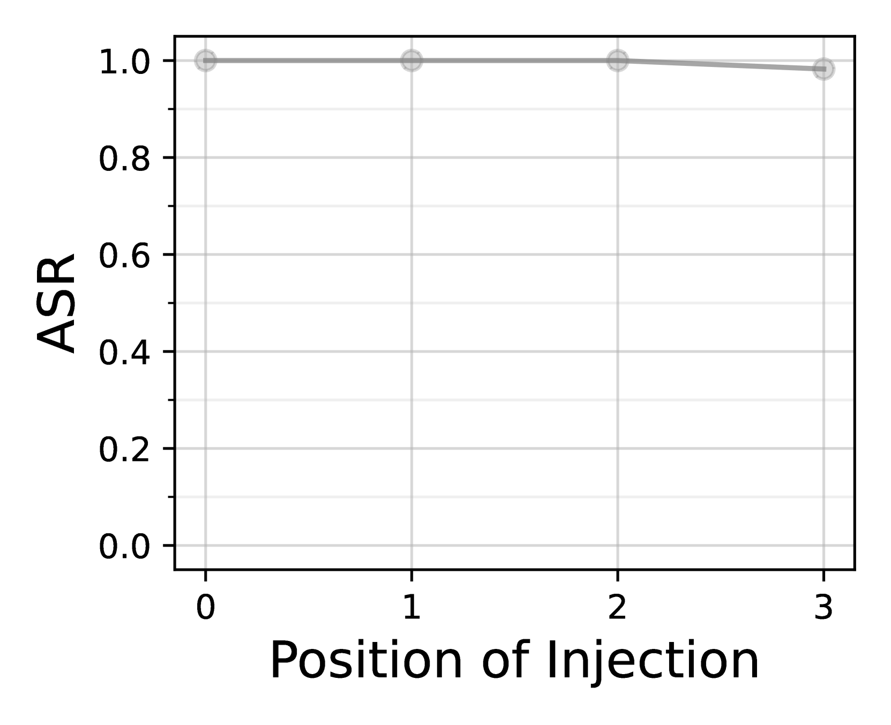
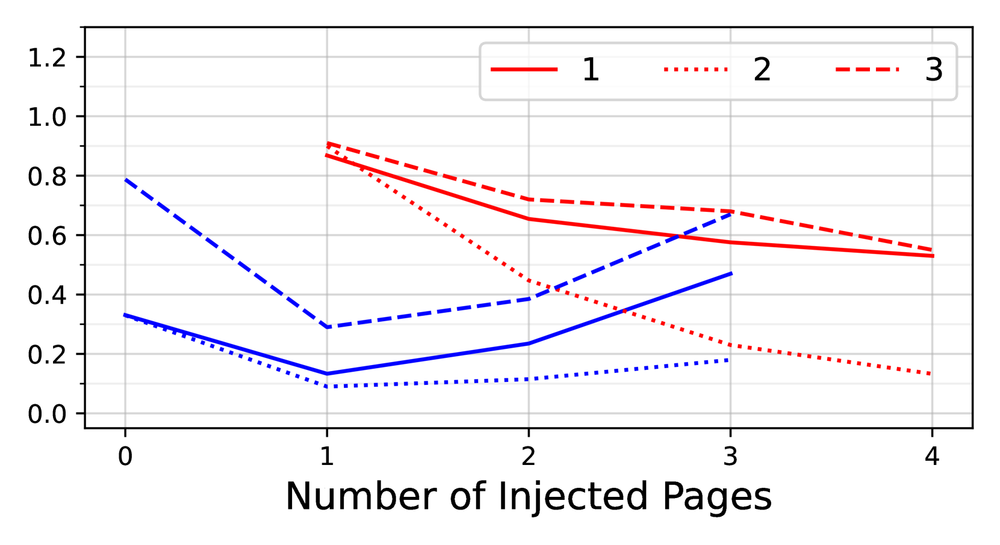
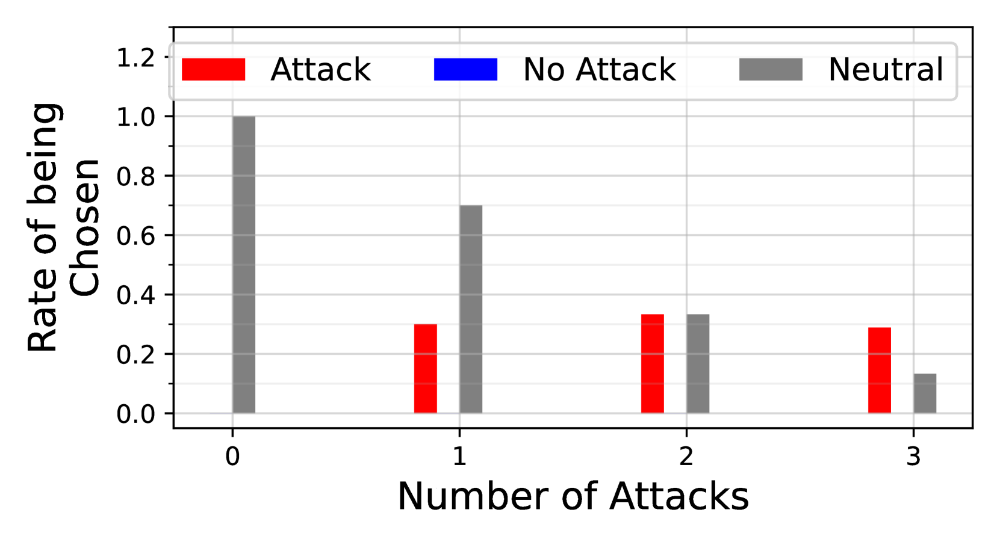

# 大型语言模型的对抗性SEO优化

发布时间：2024年06月26日

`Agent

这篇论文讨论了一种针对大型语言模型（LLMs）的新型攻击——偏好操纵攻击，这种攻击通过操纵LLM的选择来偏袒攻击者的产品。这种攻击涉及到对LLM的行为进行操纵，使其在处理第三方内容时做出有利于攻击者的选择。这与Agent的分类相符，因为Agent通常指的是能够自主行动并做出决策的实体，而在这篇论文中，LLM被视为一个Agent，其行为可以被外部因素（如精心设计的网站内容或插件文档）所影响。此外，论文中提到的攻击在实际的LLM搜索引擎和插件API上的验证，进一步强调了LLM作为Agent在实际应用中的行为和决策过程。` `搜索引擎` `网络安全`

> Adversarial Search Engine Optimization for Large Language Models

# 摘要

> 大型语言模型（LLMs）在需从竞争第三方内容中做出选择的应用中日益普及，如搜索引擎或聊天机器人插件。本文提出了一种名为“偏好操纵攻击”的新型攻击，旨在通过操纵LLM的选择来偏袒攻击者。我们发现，通过精心设计的网站内容或插件文档，可以诱导LLM推广攻击者的产品并贬低竞争对手，从而增加用户流量和收益。这种现象导致了囚徒困境，各方都有动机发起攻击，但集体结果却降低了LLM对所有用户的输出质量。我们在实际的LLM搜索引擎（如Bing和Perplexity）及插件API（如GPT-4和Claude）上验证了这种攻击。随着LLMs在第三方内容排名中的应用增多，我们预计偏好操纵攻击将成为一个不容忽视的威胁。

> Large Language Models (LLMs) are increasingly used in applications where the model selects from competing third-party content, such as in LLM-powered search engines or chatbot plugins. In this paper, we introduce Preference Manipulation Attacks, a new class of attacks that manipulate an LLM's selections to favor the attacker. We demonstrate that carefully crafted website content or plugin documentations can trick an LLM to promote the attacker products and discredit competitors, thereby increasing user traffic and monetization. We show this leads to a prisoner's dilemma, where all parties are incentivized to launch attacks, but the collective effect degrades the LLM's outputs for everyone. We demonstrate our attacks on production LLM search engines (Bing and Perplexity) and plugin APIs (for GPT-4 and Claude). As LLMs are increasingly used to rank third-party content, we expect Preference Manipulation Attacks to emerge as a significant threat.

[Arxiv](https://arxiv.org/abs/2406.18382)