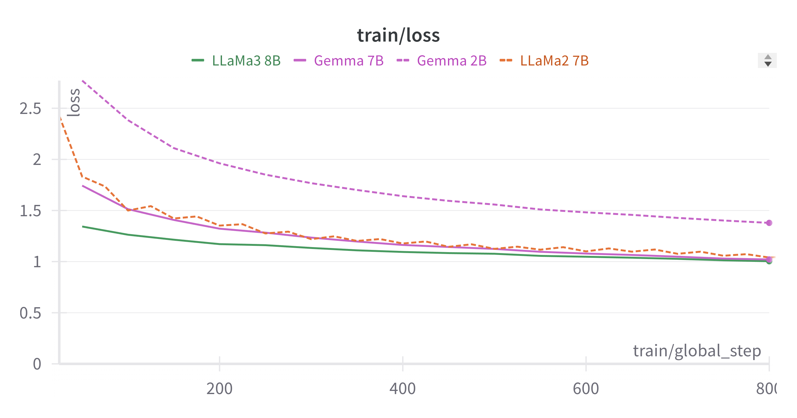

# ArzEn-LLM：借助 LLMs，实现埃及阿拉伯语与英语间的代码转换翻译及语音识别

发布时间：2024年06月26日

`LLM应用

理由：这篇论文主要探讨了如何使用大型语言模型（如LLama和Gemma）以及自动语音识别技术（如Whisper模型）来处理埃及阿拉伯语与英语间的代码转换问题，并构建了一个结合自动语音识别（ASR）与机器翻译（MT）的连续语音转文本系统。这些应用展示了LLM在特定语言处理任务中的实际应用，因此属于LLM应用类别。` `机器翻译` `语音识别`

> ArzEn-LLM: Code-Switched Egyptian Arabic-English Translation and Speech Recognition Using LLMs

# 摘要

> 受埃及阿拉伯语与英语间代码转换现象日益增多的启发，本文深入探讨了机器翻译与自动语音识别系统的精妙之处，专注于将混合使用的埃及阿拉伯语-英语转换为纯英语或埃及阿拉伯语。我们旨在揭示开发这些系统的方法，运用如LLama和Gemma等大型语言模型。在自动语音识别领域，我们采用Whisper模型来识别代码转换的埃及阿拉伯语，详述了实验流程，包括数据预处理和训练策略。通过构建一个结合ASR与MT的连续语音转文本系统，我们力求克服资源稀缺和埃及阿拉伯语方言特性的挑战。评估结果显示，我们的方法在英语翻译上超越了现有技术56%，在阿拉伯语翻译上提升了9.3%。鉴于代码转换在口语中的普遍性，ASR系统必须能有效应对这一现象，这对于在商业、文化和学术等多个领域实现流畅交流至关重要。我们的模型和代码已作为开源资源公开。代码链接：\url{http://github.com/ahmedheakl/arazn-llm}，模型链接：\url{http://huggingface.co/collections/ahmedheakl/arazn-llm-662ceaf12777656607b9524e}。

> Motivated by the widespread increase in the phenomenon of code-switching between Egyptian Arabic and English in recent times, this paper explores the intricacies of machine translation (MT) and automatic speech recognition (ASR) systems, focusing on translating code-switched Egyptian Arabic-English to either English or Egyptian Arabic. Our goal is to present the methodologies employed in developing these systems, utilizing large language models such as LLama and Gemma. In the field of ASR, we explore the utilization of the Whisper model for code-switched Egyptian Arabic recognition, detailing our experimental procedures including data preprocessing and training techniques. Through the implementation of a consecutive speech-to-text translation system that integrates ASR with MT, we aim to overcome challenges posed by limited resources and the unique characteristics of the Egyptian Arabic dialect. Evaluation against established metrics showcases promising results, with our methodologies yielding a significant improvement of $56\%$ in English translation over the state-of-the-art and $9.3\%$ in Arabic translation. Since code-switching is deeply inherent in spoken languages, it is crucial that ASR systems can effectively handle this phenomenon. This capability is crucial for enabling seamless interaction in various domains, including business negotiations, cultural exchanges, and academic discourse. Our models and code are available as open-source resources. Code: \url{http://github.com/ahmedheakl/arazn-llm}}, Models: \url{http://huggingface.co/collections/ahmedheakl/arazn-llm-662ceaf12777656607b9524e}.

[Arxiv](https://arxiv.org/abs/2406.18120)