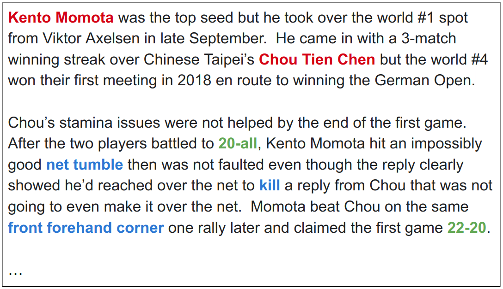
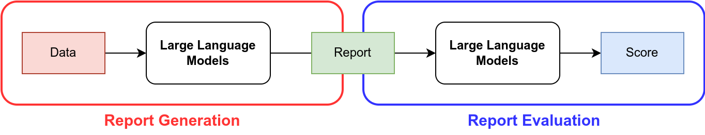
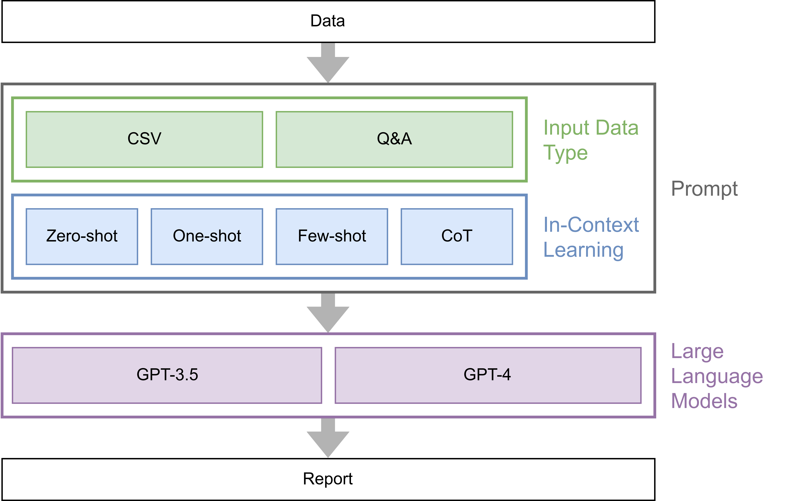
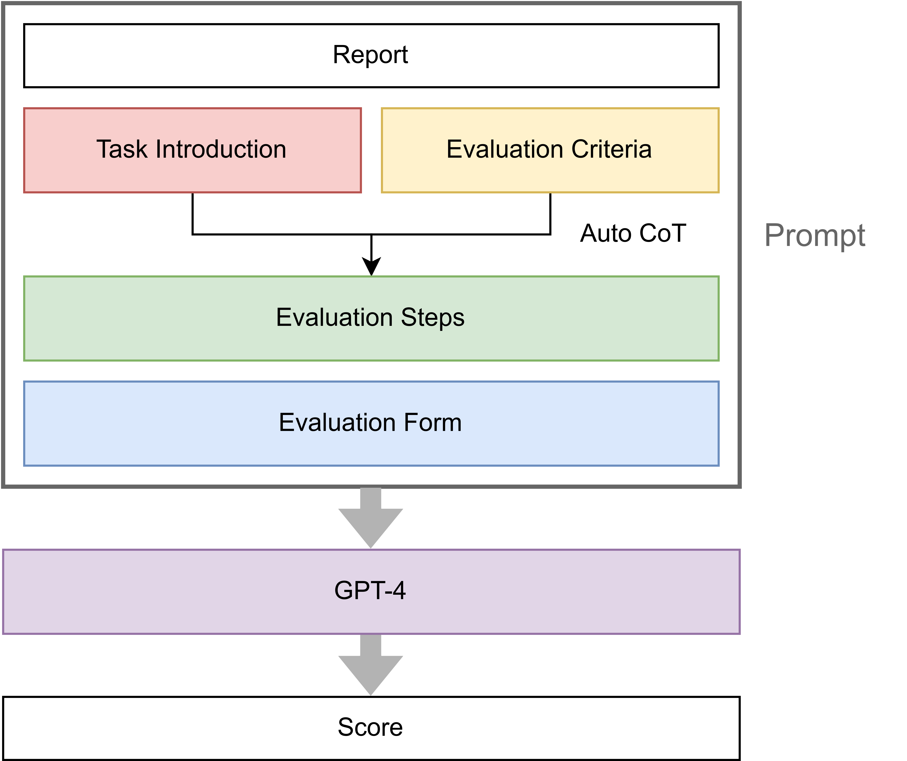
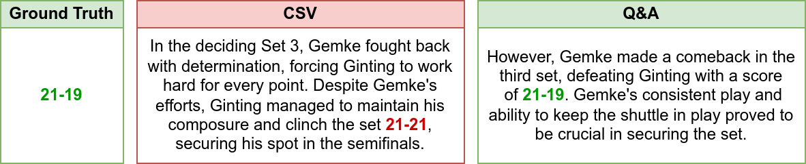
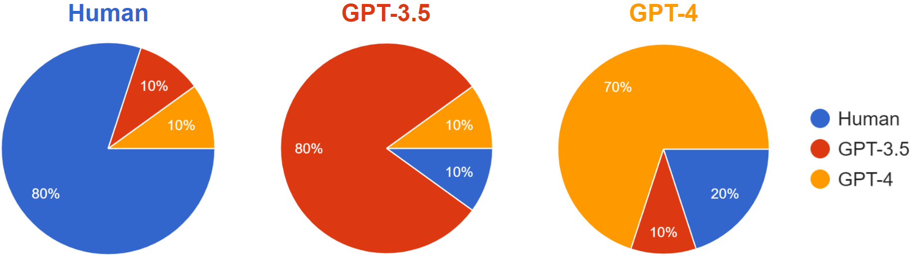

# BADGE：利用LLM进行羽毛球报告的生成与评估

发布时间：2024年06月26日

`LLM应用

这篇论文探讨了大型语言模型（LLM）在自动化生成和评估羽毛球比赛报告中的应用。通过开发BADGE框架，作者展示了LLM如何处理羽毛球数据并生成详尽的报告，以及如何通过LLM对这些报告进行质量评估。这种应用展示了LLM在特定领域（如体育报道）的实际应用潜力，因此属于LLM应用分类。` `自动化报告生成`

> BADGE: BADminton report Generation and Evaluation with LLM

# 摘要

> 羽毛球因其广泛的人气而备受关注，比赛报道详尽，涵盖选手信息、比分及球种等，为观众呈现全面的比赛画面。但撰写此类报告颇为耗时。为此，我们探索了大型语言模型（LLM）自动化生成与评估羽毛球报告的可能性，并开发了BADGE框架，专为此设计。该方法分为报告生成与评估两大阶段。首先，LLM处理羽毛球数据，生成详尽报告。测试显示，GPT-4在CSV数据与思维链提示下表现最佳。生成后，LLM对报告进行评估打分，以衡量其质量。比较GPT-4与人类裁判的评分，发现GPT-4的报告更受青睐。鉴于LLM在羽毛球报道领域的应用尚处起步，我们的研究为此领域的未来发展奠定了基础，并可推广至其他体育项目，助力体育推广。欲了解更多，请访问https://github.com/AndyChiangSH/BADGE。

> Badminton enjoys widespread popularity, and reports on matches generally include details such as player names, game scores, and ball types, providing audiences with a comprehensive view of the games. However, writing these reports can be a time-consuming task. This challenge led us to explore whether a Large Language Model (LLM) could automate the generation and evaluation of badminton reports. We introduce a novel framework named BADGE, designed for this purpose using LLM. Our method consists of two main phases: Report Generation and Report Evaluation. Initially, badminton-related data is processed by the LLM, which then generates a detailed report of the match. We tested different Input Data Types, In-Context Learning (ICL), and LLM, finding that GPT-4 performs best when using CSV data type and the Chain of Thought prompting. Following report generation, the LLM evaluates and scores the reports to assess their quality. Our comparisons between the scores evaluated by GPT-4 and human judges show a tendency to prefer GPT-4 generated reports. Since the application of LLM in badminton reporting remains largely unexplored, our research serves as a foundational step for future advancements in this area. Moreover, our method can be extended to other sports games, thereby enhancing sports promotion. For more details, please refer to https://github.com/AndyChiangSH/BADGE.

[Arxiv](https://arxiv.org/abs/2406.18116)