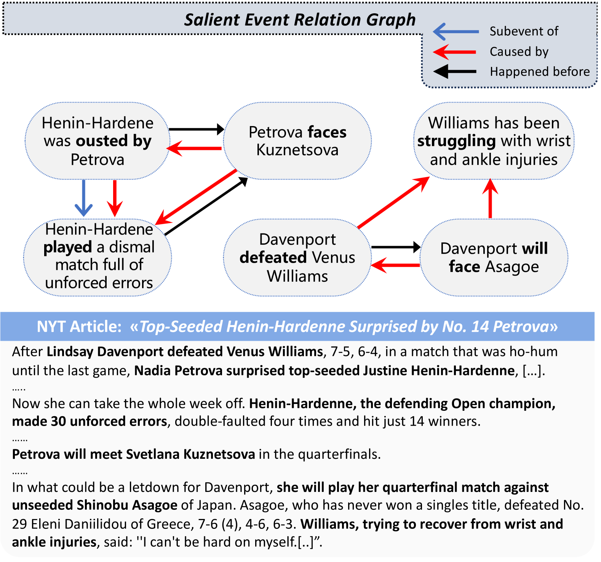
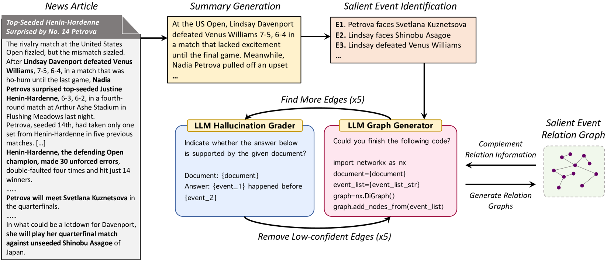
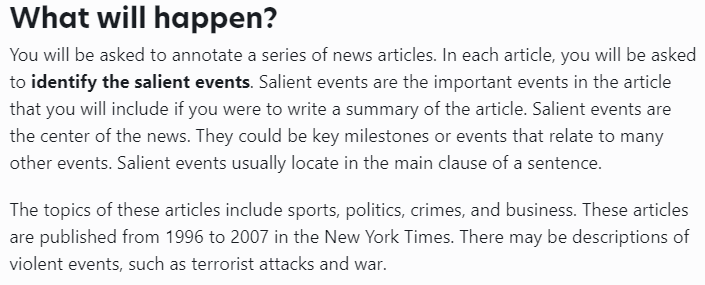
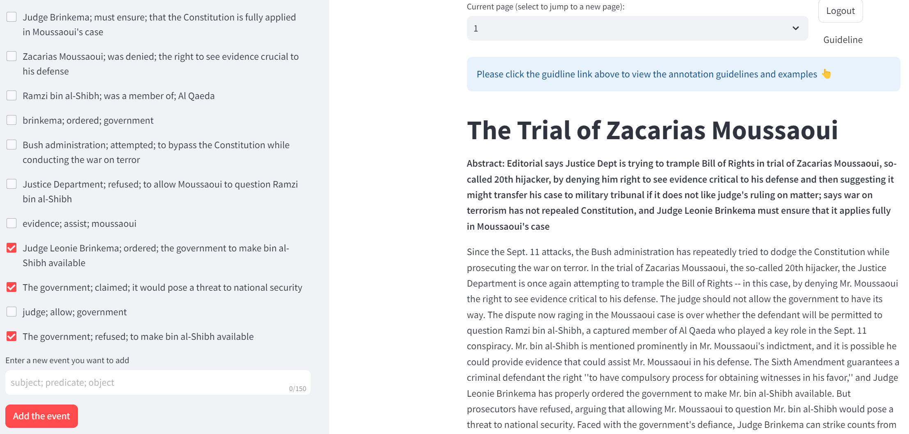
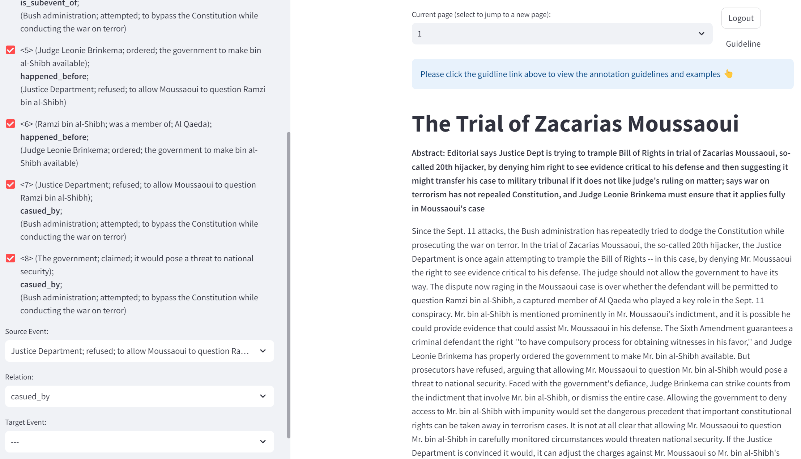
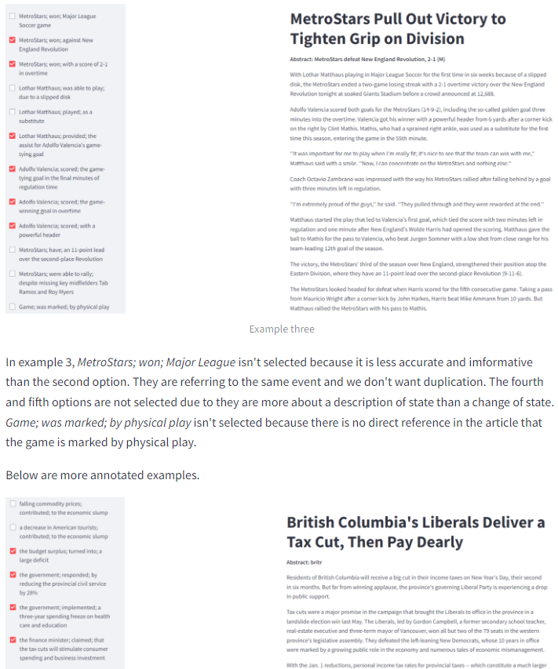
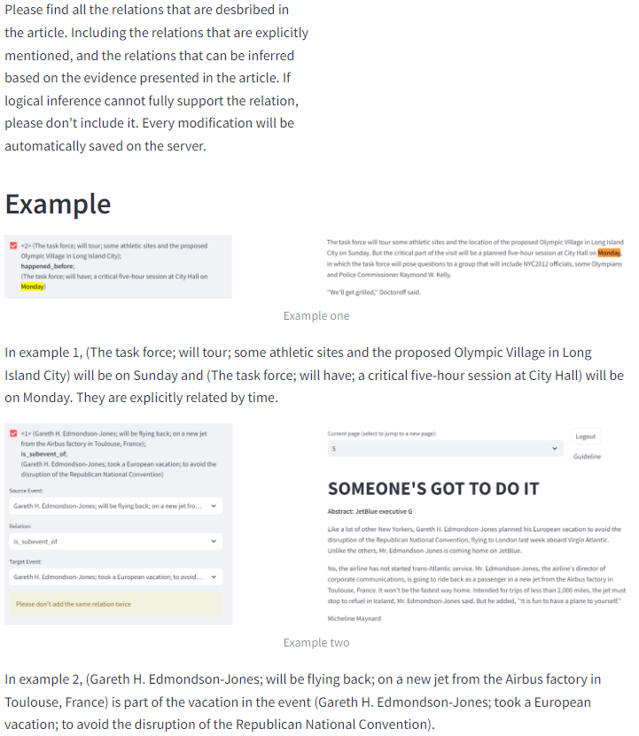

# 利用级联大型语言模型构建关键事件图谱

发布时间：2024年06月26日

`Agent

理由：这篇论文介绍了一个名为CALLMSAE的框架，该框架利用大型语言模型（LLMs）的能力来处理从长文档中提取事件图的复杂任务。这个框架通过自动化的方式识别和构建事件关系图，展示了Agent的特性，即能够自主地执行任务并做出决策。此外，该框架通过迭代优化策略来改进事件图的构建，这进一步体现了Agent在解决问题时的主动性和适应性。因此，这篇论文更适合归类为Agent。` `事件提取`

> Cascading Large Language Models for Salient Event Graph Generation

# 摘要

> 从长文档中提取事件图颇具挑战，涉及多重任务，如事件检测、关系识别及非结构化输入与结构化图表的整合。现有研究往往对所有事件一视同仁，忽略了那些对叙事理解至关重要的显著事件。本文介绍的CALLMSAE框架，利用大型语言模型的力量，无需人工标注，便能精准捕捉这些显著事件。首先，我们通过让LLMs生成摘要来筛选出关键事件。随后，采用迭代代码优化策略构建事件关系图，剔除错误关联，补全遗漏连接。在LLM生成的图上微调的上下文化图生成模型，其表现超越了基于CAEVO数据训练的模型。实验证明，我们的方法在人工标注的测试集上生成了更为精准和显著的事件图，显著优于其他方法。

> Generating event graphs from long documents is challenging due to the inherent complexity of multiple tasks involved such as detecting events, identifying their relationships, and reconciling unstructured input with structured graphs. Recent studies typically consider all events with equal importance, failing to distinguish salient events crucial for understanding narratives. This paper presents CALLMSAE, a CAscading Large Language Model framework for SAlient Event graph generation, which leverages the capabilities of LLMs and eliminates the need for costly human annotations. We first identify salient events by prompting LLMs to generate summaries, from which salient events are identified. Next, we develop an iterative code refinement prompting strategy to generate event relation graphs, removing hallucinated relations and recovering missing edges. Fine-tuning contextualised graph generation models on the LLM-generated graphs outperforms the models trained on CAEVO-generated data. Experimental results on a human-annotated test set show that the proposed method generates salient and more accurate graphs, outperforming competitive baselines.

[Arxiv](https://arxiv.org/abs/2406.18449)