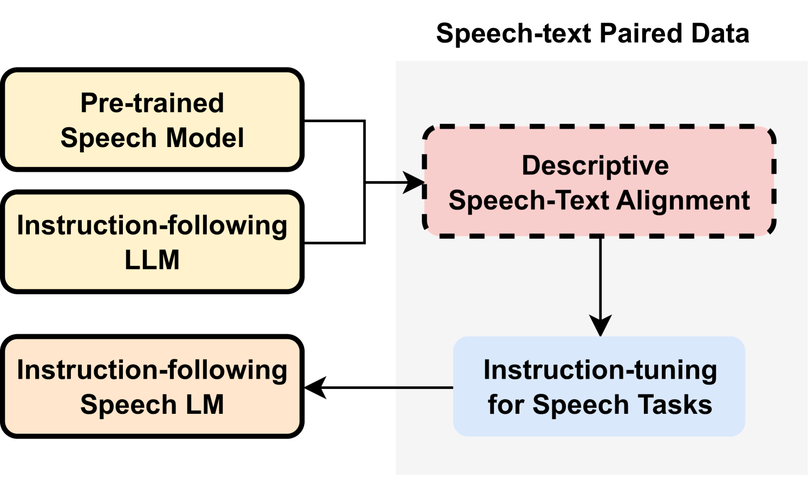
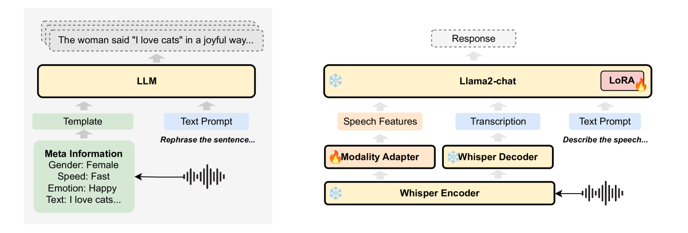

# DeSTA：借助描述性语音与文本对齐技术，提升语音语言模型的性能

发布时间：2024年06月26日

`Agent

理由：这篇论文主要探讨了语音语言模型（SLMs）如何通过融合预训练语音模型和采用描述性语音-文本对齐策略来提升对语音中语言及非语言特征的理解能力，并展示了零-shot指令跟随能力。这些特性使得模型能够更像一个智能代理（Agent），能够理解和响应语音指令，而不仅仅是处理语言数据或理论分析。因此，这篇论文更适合归类为Agent。` `语音识别`

> DeSTA: Enhancing Speech Language Models through Descriptive Speech-Text Alignment

# 摘要

> 最新的语音语言模型（SLMs）通过融合预训练语音模型，拓展了大型语言模型（LLMs）的功能。本文提出了一种描述性语音-文本对齐策略，借助语音字幕技术，有效连接了语音与文本两种模式，使SLMs能够深入解读并生成详尽的自然语言描述，进而提升了对语音中语言及非语言特征的理解能力。采用此策略的模型在Dynamic-SUPERB测试中表现卓越，尤其在处理未曾接触的任务时更显优势。更有趣的是，我们发现这种对齐模型无需专门的语音指令训练，便能展现出零-shot指令跟随能力。这些成果揭示了通过丰富描述性语音字幕来革新指令跟随SLMs的可能性。

> Recent speech language models (SLMs) typically incorporate pre-trained speech models to extend the capabilities from large language models (LLMs). In this paper, we propose a Descriptive Speech-Text Alignment approach that leverages speech captioning to bridge the gap between speech and text modalities, enabling SLMs to interpret and generate comprehensive natural language descriptions, thereby facilitating the capability to understand both linguistic and non-linguistic features in speech. Enhanced with the proposed approach, our model demonstrates superior performance on the Dynamic-SUPERB benchmark, particularly in generalizing to unseen tasks. Moreover, we discover that the aligned model exhibits a zero-shot instruction-following capability without explicit speech instruction tuning. These findings highlight the potential to reshape instruction-following SLMs by incorporating rich, descriptive speech captions.

[Arxiv](https://arxiv.org/abs/2406.18871)