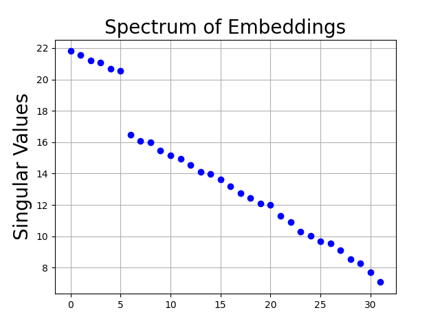

# 当被禁止想象时，大型语言模型是否仍会幻想大象？探索变压器中的潜在概念关联与联想记忆之谜。

发布时间：2024年06月26日

`LLM理论

这篇论文探讨了大型语言模型（LLMs）的内部机制，特别是变压器模型如何通过自注意力机制和值矩阵实现关联记忆。这种分析从数学角度深入探讨了LLMs的工作原理，特别是它们如何存储和检索事实。这与LLMs的理论研究相关，因为它关注的是模型内部的运作机制和理论基础，而不是具体的应用或安全性问题。因此，它属于LLM理论分类。` `机器学习`

> Do LLMs dream of elephants (when told not to)? Latent concept association and associative memory in transformers

# 摘要

> 大型语言模型（LLMs）能够存储并回忆事实，实验表明，通过调整上下文，即使不改变事实本身，也能轻易操纵其检索事实的能力。这表明LLMs可能类似于一种关联记忆模型，上下文中的特定标记充当检索事实的线索。我们通过分析LLMs的核心组件——变压器如何执行记忆任务，从数学角度探讨了这一特性。我们以一层变压器解决了一个简单的潜在概念关联问题，理论与实证均显示，变压器利用自注意力机制收集信息，并通过值矩阵实现关联记忆。

> Large Language Models (LLMs) have the capacity to store and recall facts. Through experimentation with open-source models, we observe that this ability to retrieve facts can be easily manipulated by changing contexts, even without altering their factual meanings. These findings highlight that LLMs might behave like an associative memory model where certain tokens in the contexts serve as clues to retrieving facts. We mathematically explore this property by studying how transformers, the building blocks of LLMs, can complete such memory tasks. We study a simple latent concept association problem with a one-layer transformer and we show theoretically and empirically that the transformer gathers information using self-attention and uses the value matrix for associative memory.

[Arxiv](https://arxiv.org/abs/2406.18400)