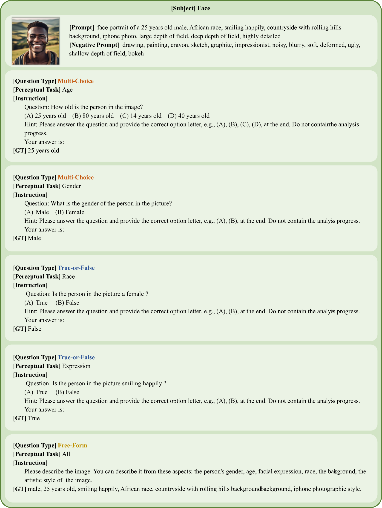

# Dysca：动态可扩展的基准，专为评估大型视觉语言模型的感知能力而设计

发布时间：2024年06月26日

`LLM应用

理由：这篇论文介绍了一个新的基准测试Dysca，用于评估大型视觉-语言模型（LVLMs）的感知能力。它通过使用合成图像和多种场景、问题类型来全面评估这些模型。这个工作直接应用于评估和改进现有的LVLMs，因此属于LLM应用类别。` `计算机视觉` `人工智能`

> Dysca: A Dynamic and Scalable Benchmark for Evaluating Perception Ability of LVLMs

# 摘要

> 为了评估大型视觉-语言模型（LVLMs）的感知能力，现有的许多基准测试存在局限性，如数据泄露风险和仅关注现实风格图像及清洁场景。为此，我们推出了一个动态且可扩展的基准测试Dysca，它利用合成图像来全面评估LVLMs。通过稳定扩散技术和规则驱动的方法，Dysca能动态生成多样化的图像、问题及答案，覆盖51种图像风格和20个子任务。在清洁、损坏、打印攻击和对抗攻击等4种场景及多项选择、真假判断和自由形式等3种问题类型下，Dysca展现了其评估能力。由于其生成式特性，Dysca易于扩展，可不断纳入新任务和场景。我们评估了8个顶级开源LVLMs的10个版本，揭示了这些模型的短板。Dysca的详细信息已发布于\url{https://github.com/Benchmark-Dysca/Dysca}。

> Currently many benchmarks have been proposed to evaluate the perception ability of the Large Vision-Language Models (LVLMs). However, most benchmarks conduct questions by selecting images from existing datasets, resulting in the potential data leakage. Besides, these benchmarks merely focus on evaluating LVLMs on the realistic style images and clean scenarios, leaving the multi-stylized images and noisy scenarios unexplored. In response to these challenges, we propose a dynamic and scalable benchmark named Dysca for evaluating LVLMs by leveraging synthesis images. Specifically, we leverage Stable Diffusion and design a rule-based method to dynamically generate novel images, questions and the corresponding answers. We consider 51 kinds of image styles and evaluate the perception capability in 20 subtasks. Moreover, we conduct evaluations under 4 scenarios (i.e., Clean, Corruption, Print Attacking and Adversarial Attacking) and 3 question types (i.e., Multi-choices, True-or-false and Free-form). Thanks to the generative paradigm, Dysca serves as a scalable benchmark for easily adding new subtasks and scenarios. A total of 8 advanced open-source LVLMs with 10 checkpoints are evaluated on Dysca, revealing the drawbacks of current LVLMs. The benchmark is released in \url{https://github.com/Benchmark-Dysca/Dysca}.

[Arxiv](https://arxiv.org/abs/2406.18849)