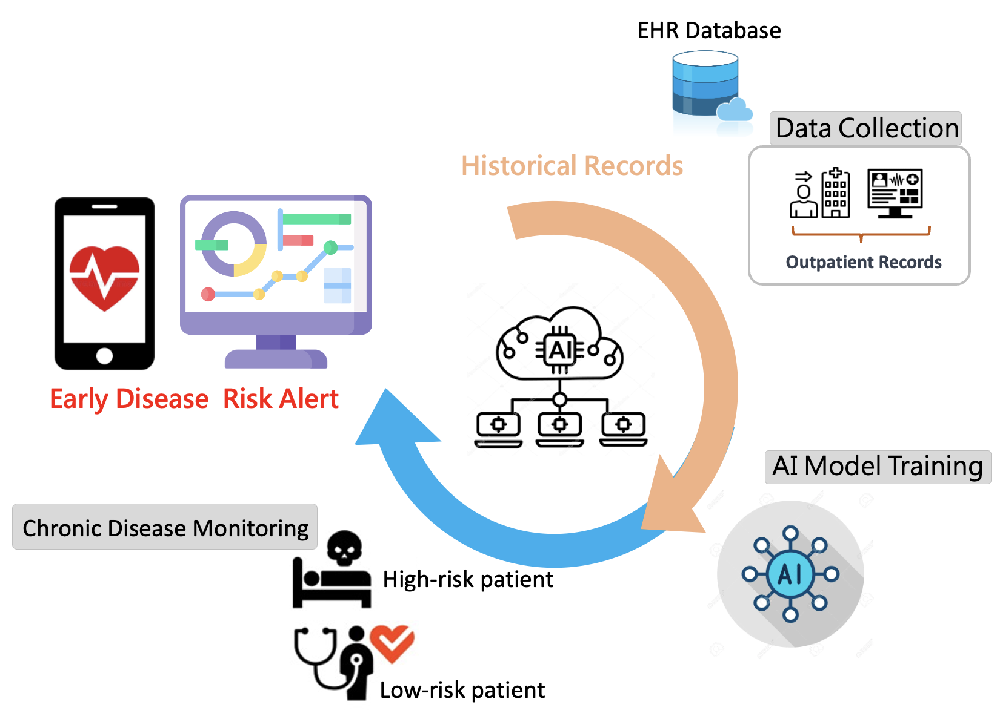
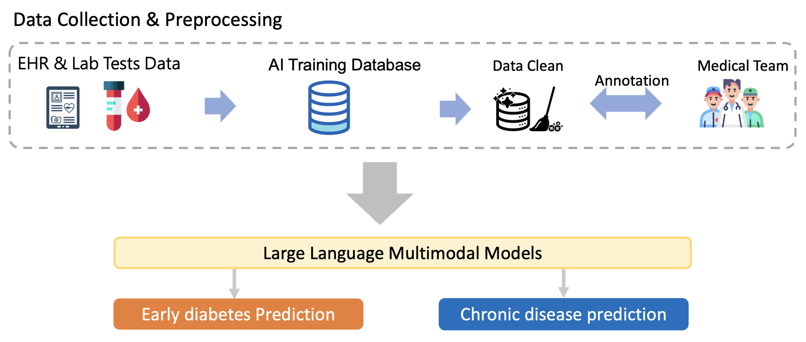
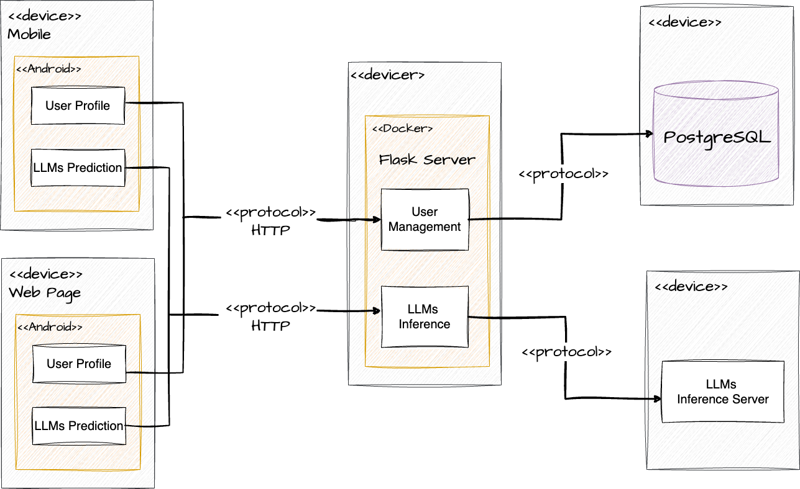
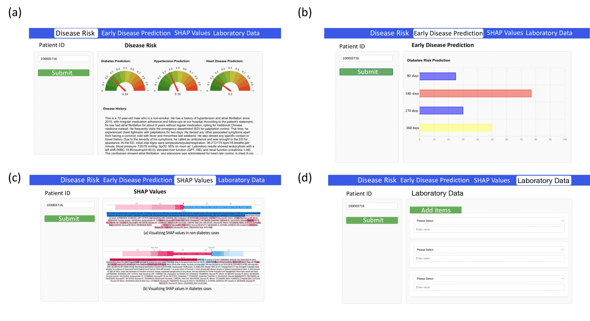
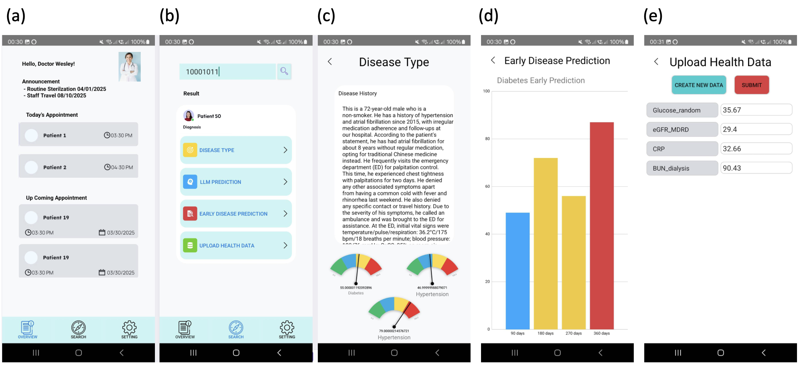

# 利用大型语言多模态模型，构建基于电子健康记录的移动与网页平台，精准预测慢性疾病风险

发布时间：2024年06月26日

`LLM应用

理由：这篇论文描述了一个基于大型语言多模态模型的慢性病预测平台的开发和应用。该平台利用了电子健康记录数据，并将其集成到网页和移动应用中，以提供实时的风险评估。这种应用展示了LLM技术在医疗领域的实际应用，特别是在疾病预测和医疗决策支持方面，因此属于LLM应用分类。` `慢性病管理`

> EHR-Based Mobile and Web Platform for Chronic Disease Risk Prediction Using Large Language Multimodal Models

# 摘要

> 传统上，慢性疾病的诊断依赖于患者与医生的面对面咨询。然而，利用临床笔记和血液检测值进行疾病预测及应用系统开发的研究尚显不足。我们收集了2017至2021年间台湾医院五年间的电子健康记录，构建了一个AI数据库。基于此，我们开发了一款利用大型语言多模态模型的慢性病预测平台，该平台不仅与网页及移动应用无缝集成，还能实时接入医院数据库，为医生提供即时的风险评估。欲了解更多，请访问演示链接：https://www.youtube.com/watch?v=oqmL9DEDFgA。

> Traditional diagnosis of chronic diseases involves in-person consultations with physicians to identify the disease. However, there is a lack of research focused on predicting and developing application systems using clinical notes and blood test values. We collected five years of Electronic Health Records (EHRs) from Taiwan's hospital database between 2017 and 2021 as an AI database. Furthermore, we developed an EHR-based chronic disease prediction platform utilizing Large Language Multimodal Models (LLMMs), successfully integrating with frontend web and mobile applications for prediction. This prediction platform can also connect to the hospital's backend database, providing physicians with real-time risk assessment diagnostics. The demonstration link can be found at https://www.youtube.com/watch?v=oqmL9DEDFgA.

[Arxiv](https://arxiv.org/abs/2406.18087)