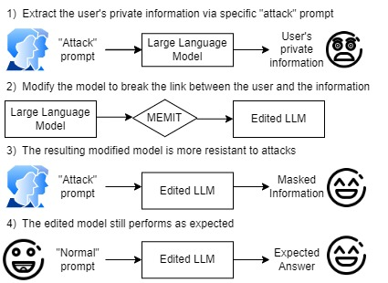
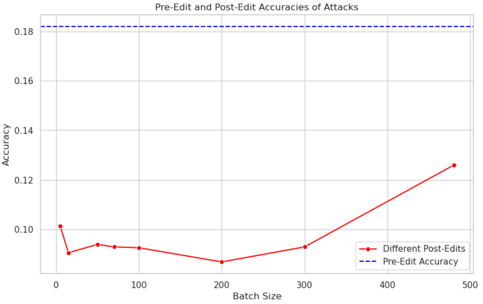

# 利用私有关联编辑提升大型语言模型中的数据隐私保护

发布时间：2024年06月26日

`LLM应用

这篇论文主要讨论了大型语言模型（LLMs）在处理私人信息时的隐私保护问题，并提出了一种新的防御策略——私人关联编辑（PAE）。该策略旨在不重新训练模型的情况下，有效移除个人身份信息（PII），从而减少私人数据泄露的风险。这种方法直接应用于LLMs的实际应用中，以提高数据隐私保护，因此属于LLM应用分类。` `数据隐私` `人工智能安全`

> Enhancing Data Privacy in Large Language Models through Private Association Editing

# 摘要

> 大型语言模型（LLMs）虽应用广泛，但其记忆私人信息的倾向令人担忧，私人数据泄露风险高。本文提出了一种名为私人关联编辑（PAE）的新防御策略，旨在不重新训练模型的情况下，有效移除个人身份信息（PII）。PAE通过四个步骤操作：检测记忆的PII、应用PAE卡片减轻私人数据记忆、验证对定向数据提取攻击的抵抗力，以及确保编辑后模型的一致性。PAE的批量修改能力及其高效性，显著提升了LLMs的数据隐私保护。实验证明，PAE能有效减少私人数据泄露。我们相信，PAE将成为保护LLMs数据隐私的关键工具，推动更安全模型的开发，以适应现实世界的应用需求。

> Large Language Models (LLMs) are powerful tools with extensive applications, but their tendency to memorize private information raises significant concerns as private data leakage can easily happen. In this paper, we introduce Private Association Editing (PAE), a novel defense approach for private data leakage. PAE is designed to effectively remove Personally Identifiable Information (PII) without retraining the model. Our approach consists of a four-step procedure: detecting memorized PII, applying PAE cards to mitigate memorization of private data, verifying resilience to targeted data extraction (TDE) attacks, and ensuring consistency in the post-edit LLMs. The versatility and efficiency of PAE, which allows for batch modifications, significantly enhance data privacy in LLMs. Experimental results demonstrate the effectiveness of PAE in mitigating private data leakage. We believe PAE will serve as a critical tool in the ongoing effort to protect data privacy in LLMs, encouraging the development of safer models for real-world applications.

[Arxiv](https://arxiv.org/abs/2406.18221)