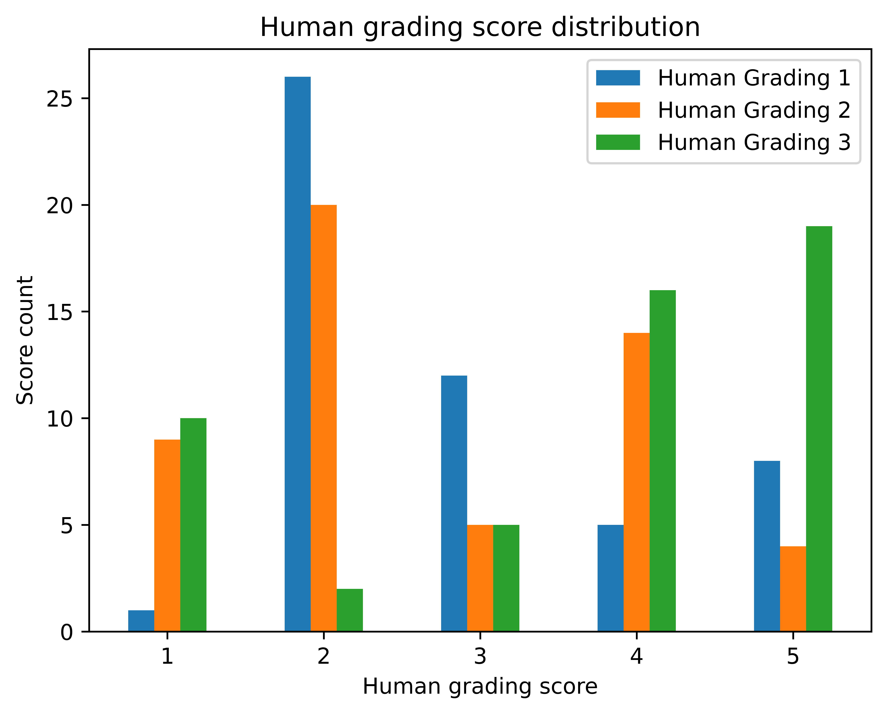
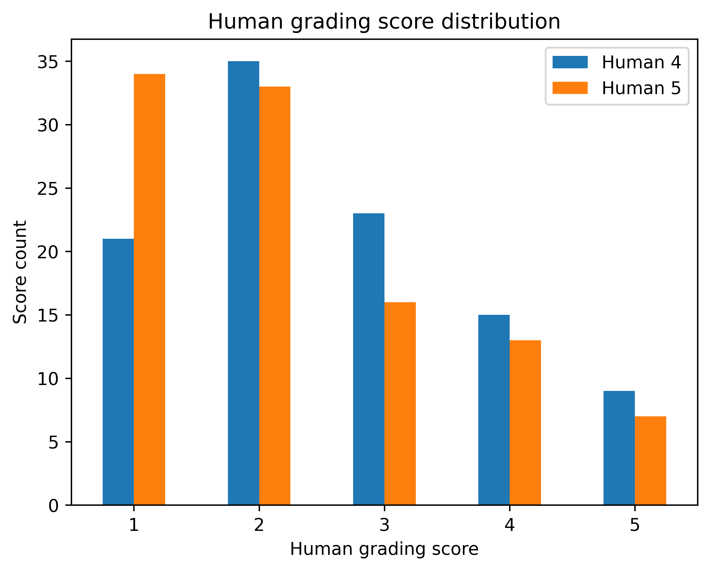
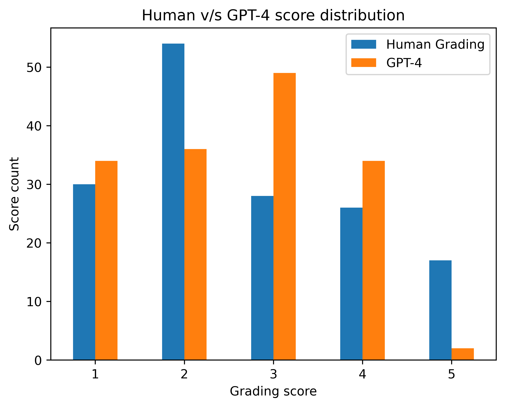
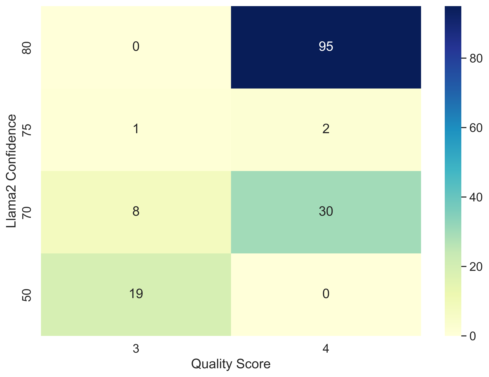

# 检索增强生成答案的质量评估：强大的 LLM 是关键

发布时间：2024年06月26日

`RAG

理由：这篇论文主要关注的是检索增强生成（RAG）应用的评估系统（vRAG-Eval），并探讨了其在评估答案质量方面的应用。虽然涉及了大型语言模型（LLMs），但重点在于评估RAG应用的效果，而不是深入探讨LLM的理论或应用。因此，将其归类为RAG更为合适。` `聊天应用` `业务决策`

> Evaluating Quality of Answers for Retrieval-Augmented Generation: A Strong LLM Is All You Need

# 摘要

> 我们开发了vRAG-Eval这一创新评分系统，全面评估检索增强生成（RAG）应用的答案质量，关注正确性、完整性和诚实性。通过将评分简化为接受或拒绝的二元决策，我们模拟了聊天应用中常见的“点赞”或“踩”直观反馈。这种方法在需要明确决策的事实性业务环境中尤为适用。我们运用vRAG-Eval评估了两种大型语言模型（LLMs）生成的答案，并与人类专家的判断进行了对比。结果显示，GPT-4与人类专家在决策上达到了83%的一致性，凸显了LLMs在资源密集型的人类评估场景中作为可靠评估者的潜力。

> We present a comprehensive evaluation of answer quality in Retrieval-Augmented Generation (RAG) applications using vRAG-Eval, a novel grading system that is designed to assess correctness, completeness, and honesty. We further map the grading of quality aspects aforementioned into a binary score, indicating an accept or reject decision, mirroring the intuitive "thumbs-up" or "thumbs-down" gesture commonly used in chat applications. This approach suits factual business settings where a clear decision opinion is essential. Our assessment applies vRAG-Eval to two Large Language Models (LLMs), evaluating the quality of answers generated by a vanilla RAG application. We compare these evaluations with human expert judgments and find a substantial alignment between GPT-4's assessments and those of human experts, reaching 83% agreement on accept or reject decisions. This study highlights the potential of LLMs as reliable evaluators in closed-domain, closed-ended settings, particularly when human evaluations require significant resources.

[Arxiv](https://arxiv.org/abs/2406.18064)