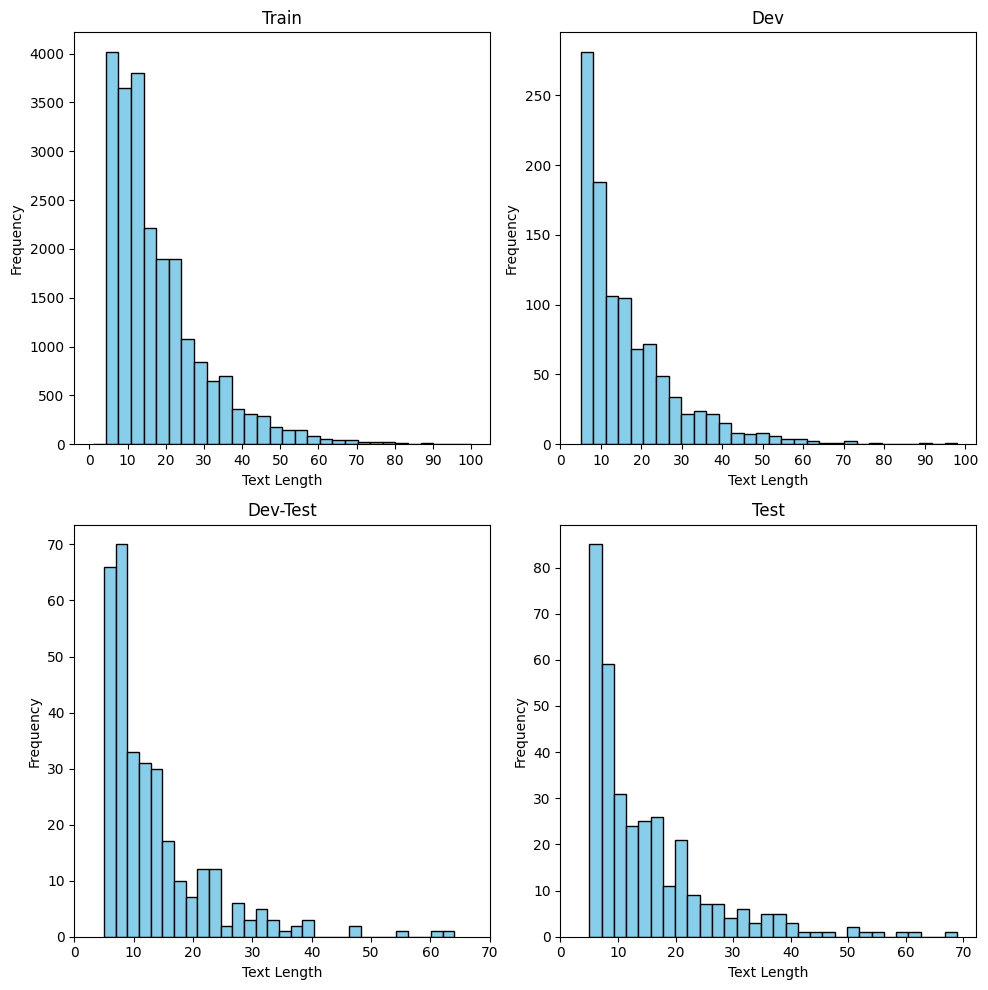
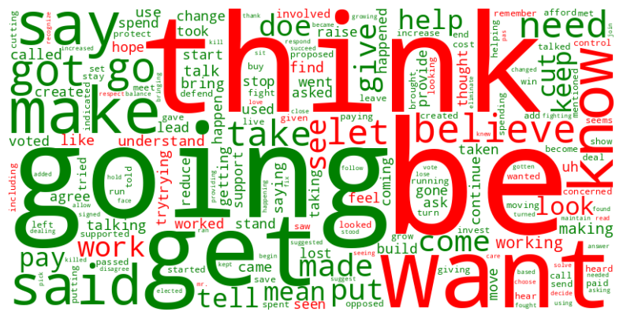
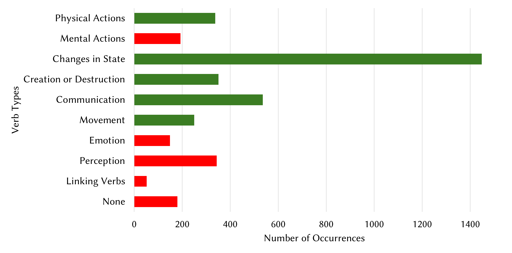
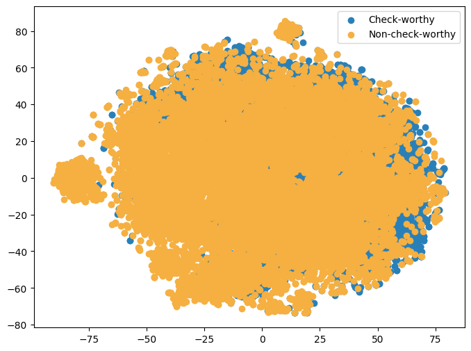
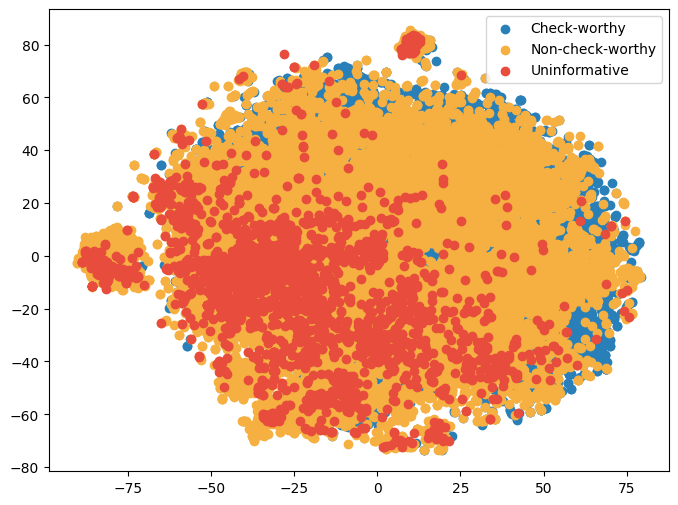
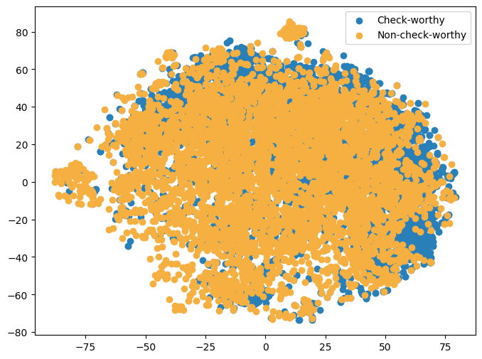
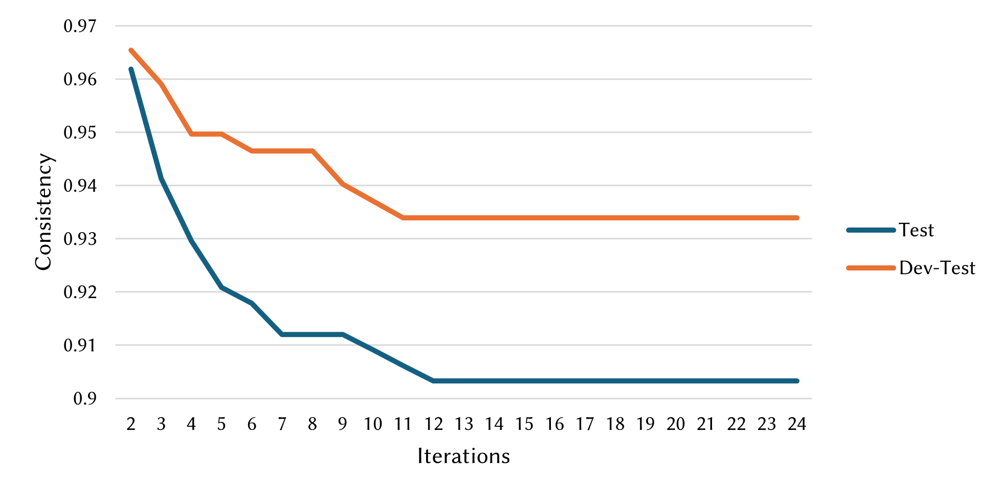
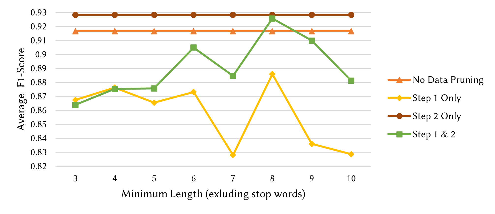

# 在 CheckThat! 2024 中，FactFinders 利用数据修剪技术，借助大型语言模型（LLMs）精炼了对值得核查声明的检测能力。

发布时间：2024年06月26日

`Agent

这篇论文主要关注的是如何利用大型语言模型（LLMs）来识别和筛选社交媒体和互联网上的信息，以确定哪些声明最值得进行事实核查。研究中使用了八种领先的开源LLMs，并通过微调和提示工程来优化这些模型的性能。此外，论文还提出了一种两步数据修剪策略，以自动筛选出高质量的训练数据，从而提升模型的学习效果。这种方法在CheckThat! 2024的英语语言数据集上得到了验证，并取得了优异的成绩。因此，这篇论文更符合Agent分类，因为它描述了一个系统或代理如何使用LLMs来执行特定的任务（即事实核查的优先级确定）。` `社交媒体` `事实核查`

> FactFinders at CheckThat! 2024: Refining Check-worthy Statement Detection with LLMs through Data Pruning

# 摘要

> 社交媒体和互联网的信息迅速传播给事实核查带来了挑战，特别是在从海量信息中筛选出值得核查的声明。这一挑战凸显了确定核查优先级的重要性，即哪些声明最值得关注。尽管近年来有所进步，但大型语言模型（如GPT）的应用才刚刚引起研究界的注意，许多开源LLMs仍待深入探索。本研究聚焦于八种领先的开源LLMs，通过微调和提示工程，从政治抄本中识别出值得核查的声明，并提出了一种两步数据修剪策略，自动筛选出高质量的训练数据，以提升学习效果。我们在CheckThat! 2024的英语语言数据集上验证了这一方法的效率，并通过数据修剪实验证明，仅用约44%的训练数据即可达到优异性能。我们的团队在英语语言的核查价值估计任务中荣获第一。

> The rapid dissemination of information through social media and the Internet has posed a significant challenge for fact-checking, among others in identifying check-worthy claims that fact-checkers should pay attention to, i.e. filtering claims needing fact-checking from a large pool of sentences. This challenge has stressed the need to focus on determining the priority of claims, specifically which claims are worth to be fact-checked. Despite advancements in this area in recent years, the application of large language models (LLMs), such as GPT, has only recently drawn attention in studies. However, many open-source LLMs remain underexplored. Therefore, this study investigates the application of eight prominent open-source LLMs with fine-tuning and prompt engineering to identify check-worthy statements from political transcriptions. Further, we propose a two-step data pruning approach to automatically identify high-quality training data instances for effective learning. The efficiency of our approach is demonstrated through evaluations on the English language dataset as part of the check-worthiness estimation task of CheckThat! 2024. Further, the experiments conducted with data pruning demonstrate that competitive performance can be achieved with only about 44\% of the training data. Our team ranked first in the check-worthiness estimation task in the English language.

[Arxiv](https://arxiv.org/abs/2406.18297)