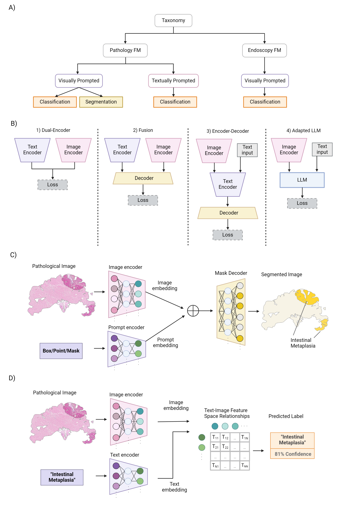

# 胃炎诊断新视角：病理与内窥镜图像的基础模型应用

发布时间：2024年06月26日

`Agent

这篇论文主要探讨了基础模型（FM）在胃肠镜和病理成像领域的应用，特别是在上消化道癌症管理中的作用，特别是在胃癌（GC）的早期发现和预后改善方面。论文详细讨论了这些模型的核心原理、架构、训练方法以及大规模数据在其预测能力开发中的关键作用。此外，论文还展望了未来的研究方向，包括多模态数据的整合、更强大和公平模型的开发，以及实时诊断支持的潜力。这些内容更符合Agent分类，因为它们涉及模型在特定领域（如医疗诊断）的应用和功能，而不是理论研究或特定技术（如RAG或LLM）的深入探讨。` `人工智能`

> Foundational Models for Pathology and Endoscopy Images: Application for Gastric Inflammation

# 摘要

> 人工智能（AI）的融入极大地推动了上消化道癌症的管理，这是全球癌症死亡的主因之一。尤其在胃癌（GC）领域，慢性炎症引发的黏膜变化，如萎缩、肠上皮化生（IM）、异型增生，最终可能导致癌症。内镜常规监测的早期发现对改善预后至关重要。基础模型（FM），这些在多样数据上训练的机器或深度学习模型，为提升内镜及病理图像分析的准确性提供了希望。本文深入探讨了FM在胃肠镜和病理成像领域的最新进展、应用及挑战，并阐述了这些模型的核心原理、架构及其训练方法，强调了大规模数据在其预测能力开发中的关键作用。同时，本文还展望了未来研究方向，包括多模态数据的整合、更强大和公平模型的开发，以及实时诊断支持的潜力。本综述旨在为研究者和临床医生提供指导，帮助他们将FM融入临床实践，有效预防和管理GC，从而提升患者的生活质量。

> The integration of artificial intelligence (AI) in medical diagnostics represents a significant advancement in managing upper gastrointestinal (GI) cancer, a major cause of global cancer mortality. Specifically for gastric cancer (GC), chronic inflammation causes changes in the mucosa such as atrophy, intestinal metaplasia (IM), dysplasia and ultimately cancer. Early detection through endoscopic regular surveillance is essential for better outcomes. Foundation models (FM), which are machine or deep learning models trained on diverse data and applicable to broad use cases, offer a promising solution to enhance the accuracy of endoscopy and its subsequent pathology image analysis. This review explores the recent advancements, applications, and challenges associated with FM in endoscopy and pathology imaging. We started by elucidating the core principles and architectures underlying these models, including their training methodologies and the pivotal role of large-scale data in developing their predictive capabilities. Moreover, this work discusses emerging trends and future research directions, emphasizing the integration of multimodal data, the development of more robust and equitable models, and the potential for real-time diagnostic support. This review aims to provide a roadmap for researchers and practitioners in navigating the complexities of incorporating FM into clinical practice for prevention/management of GC cases, thereby improving patient outcomes.

[Arxiv](https://arxiv.org/abs/2406.18249)