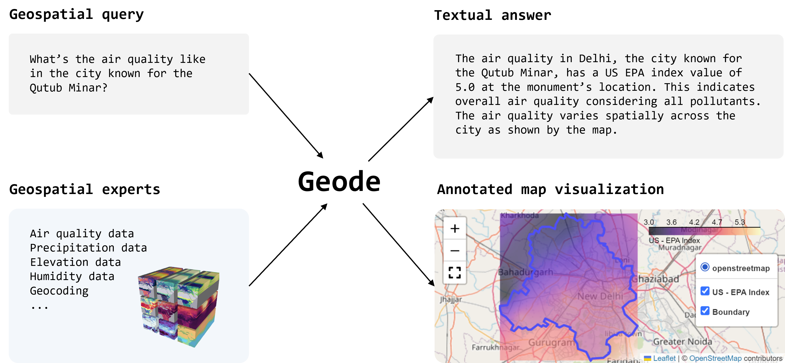
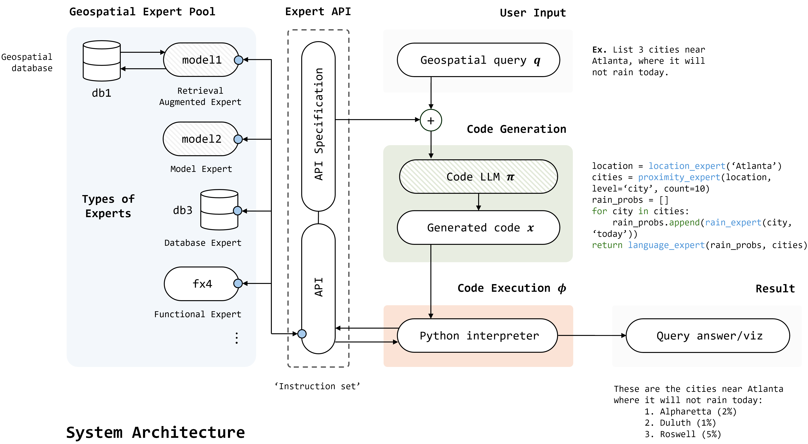
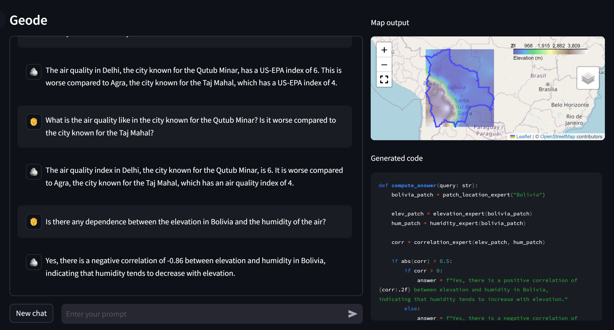

# Geode：一款零-shot 地理空间问答代理，具备明确推理能力和精确的时空信息检索功能。

发布时间：2024年06月26日

`LLM应用` `地理信息系统`

> Geode: A Zero-shot Geospatial Question-Answering Agent with Explicit Reasoning and Precise Spatio-Temporal Retrieval

# 摘要

> 大型语言模型 (LLM) 在处理多源数据信息方面表现出色。尤其是采用自注意力机制的基础模型，极大提升了我们对多样数据语义的理解。在众多受益于多模态的领域中，地理空间数据因其多模态特性而尤为突出。然而，现有的自然语言处理 (NLP) 技术在应对地理空间查询时显得力不从心。预训练的 LLM 模型由于无法实时精确检索时空数据，导致在处理复杂地理空间查询时的准确性大打折扣。为此，我们推出了 Geode 系统，该系统专为高精度零-shot 地理空间问答任务设计，通过高效的时空数据检索技术，显著提升了地理空间问答的性能，超越了现有最先进的预训练模型。

> Large language models (LLMs) have shown promising results in learning and contextualizing information from different forms of data. Recent advancements in foundational models, particularly those employing self-attention mechanisms, have significantly enhanced our ability to comprehend the semantics of diverse data types. One such area that could highly benefit from multi-modality is in understanding geospatial data, which inherently has multiple modalities. However, current Natural Language Processing (NLP) mechanisms struggle to effectively address geospatial queries. Existing pre-trained LLMs are inadequately equipped to meet the unique demands of geospatial data, lacking the ability to retrieve precise spatio-temporal data in real-time, thus leading to significantly reduced accuracy in answering complex geospatial queries. To address these limitations, we introduce Geode--a pioneering system designed to tackle zero-shot geospatial question-answering tasks with high precision using spatio-temporal data retrieval. Our approach represents a significant improvement in addressing the limitations of current LLM models, demonstrating remarkable improvement in geospatial question-answering abilities compared to existing state-of-the-art pre-trained models.

[Arxiv](https://arxiv.org/abs/2407.11014)