# 层次上下文剪枝：借助仓库级预训练代码大型语言模型，优化实际代码补全效率

发布时间：2024年06月26日

`LLM应用

这篇论文主要探讨了如何优化大型语言模型（LLM）在代码补全任务中的应用，特别是在处理大型代码仓库时的上下文限制问题。通过提出分层上下文修剪（HCP）策略，该研究解决了Repo-Code LLMs在实际应用中的性能问题，提高了代码补全的精度和效率。因此，这篇论文属于LLM应用类别，因为它关注的是LLM在特定任务（代码补全）中的实际应用和优化。` `软件开发` `代码优化`

> Hierarchical Context Pruning: Optimizing Real-World Code Completion with Repository-Level Pretrained Code LLMs

# 摘要

> 近期开发的代码大型语言模型（Code LLMs），通过预训练于仓库级代码数据（Repo-Code LLMs），已能识别仓库结构并利用跨文件信息优化代码补全。但在实际开发中，简单拼接整个代码仓库常超出Repo-Code LLMs的上下文限制，导致性能大打折扣。本研究对六种Repo-Code LLMs进行了深入实验与分析，发现保持文件间的拓扑依赖并丰富补全提示中的代码内容能提升补全精度；而修剪依赖文件中特定函数的具体实现对精度影响不大。据此，我们提出了分层上下文修剪（HCP）策略，该策略在函数层面重构代码仓库，既保留了文件间的依赖关系，又剔除了大量无关代码，大幅缩减了仓库级代码补全的输入长度。实验证明，HCP策略能显著提升六种Repo-Code LLMs的补全精度，并大幅缩短输入长度。相关代码和数据已公开于https://github.com/Hambaobao/HCP-Coder。

> Some recently developed code large language models (Code LLMs) have been pre-trained on repository-level code data (Repo-Code LLMs), enabling these models to recognize repository structures and utilize cross-file information for code completion. However, in real-world development scenarios, simply concatenating the entire code repository often exceeds the context window limits of these Repo-Code LLMs, leading to significant performance degradation. In this study, we conducted extensive preliminary experiments and analyses on six Repo-Code LLMs. The results indicate that maintaining the topological dependencies of files and increasing the code file content in the completion prompts can improve completion accuracy; pruning the specific implementations of functions in all dependent files does not significantly reduce the accuracy of completions. Based on these findings, we proposed a strategy named Hierarchical Context Pruning (HCP) to construct completion prompts with high informational code content. The HCP models the code repository at the function level, maintaining the topological dependencies between code files while removing a large amount of irrelevant code content, significantly reduces the input length for repository-level code completion. We applied the HCP strategy in experiments with six Repo-Code LLMs, and the results demonstrate that our proposed method can significantly enhance completion accuracy while substantially reducing the length of input. Our code and data are available at https://github.com/Hambaobao/HCP-Coder.

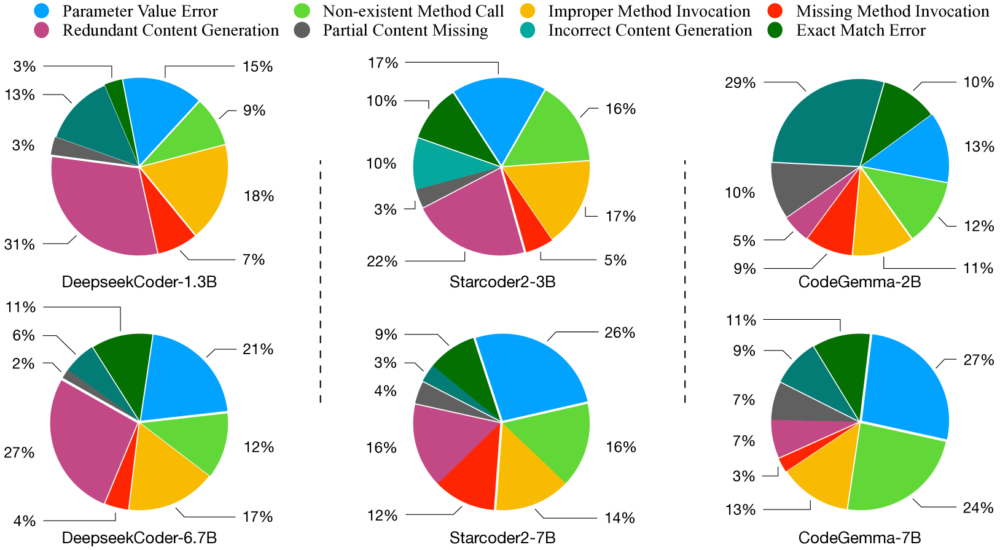

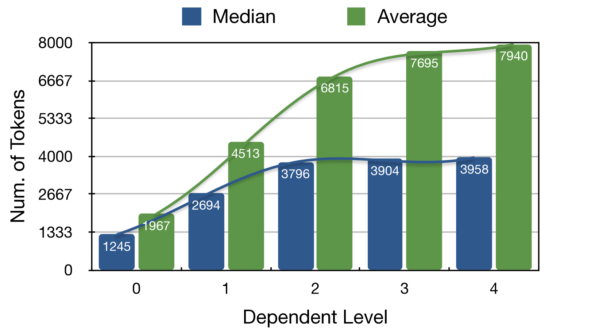

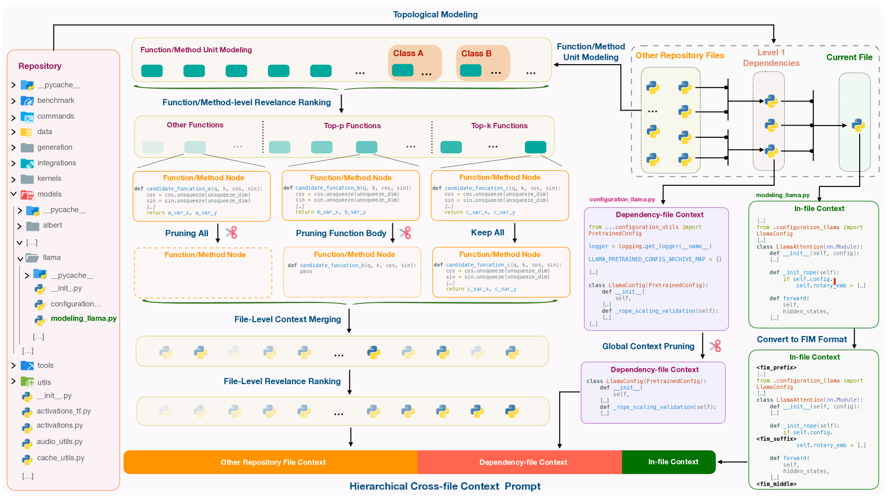

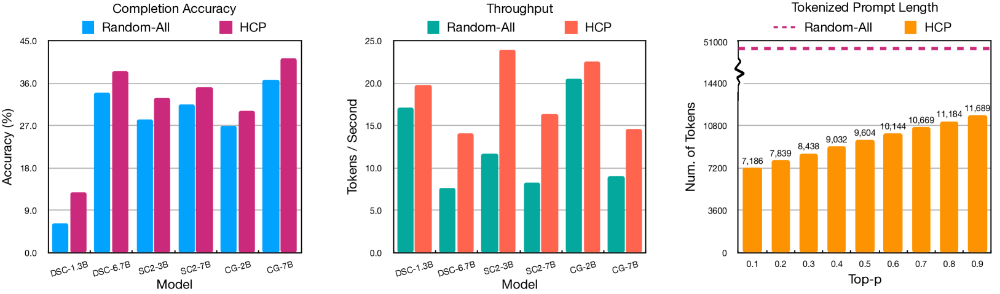

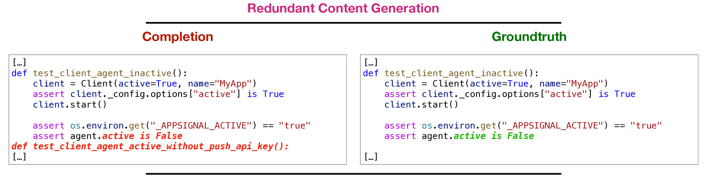

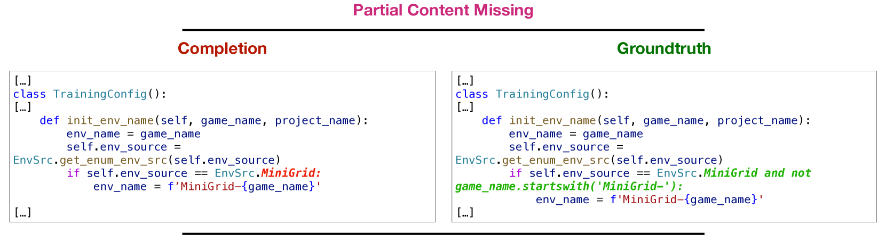

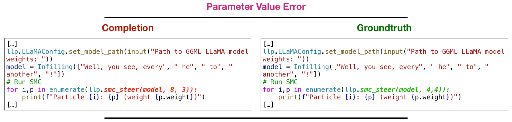

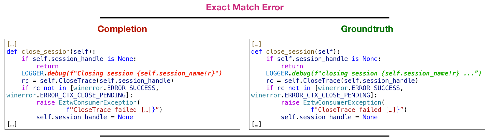

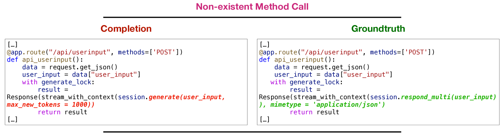

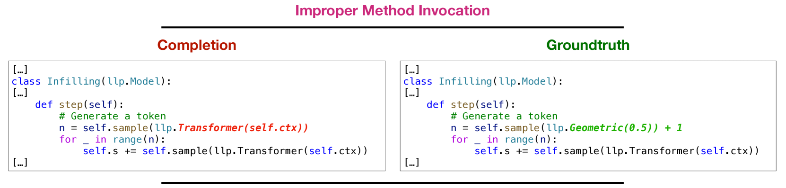

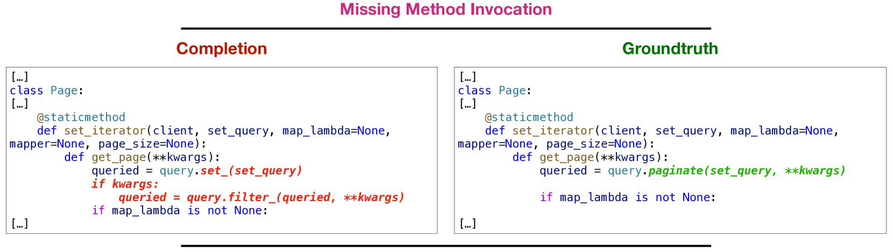

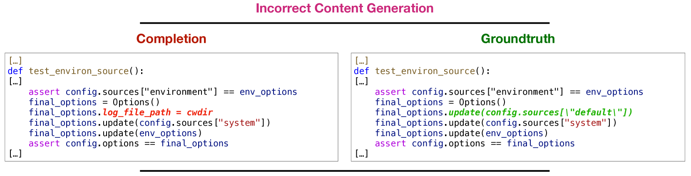

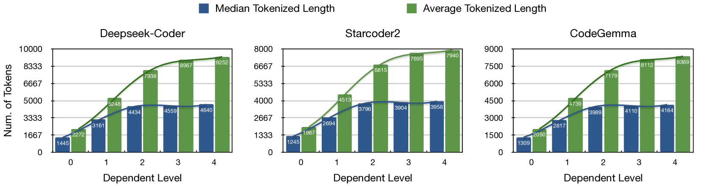

[Arxiv](https://arxiv.org/abs/2406.18294)