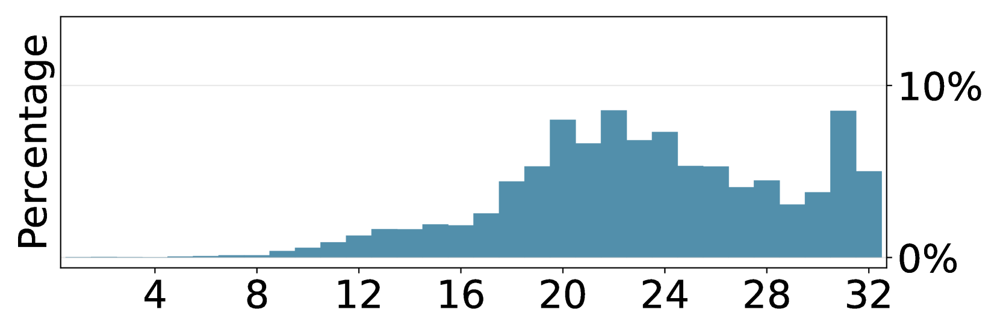
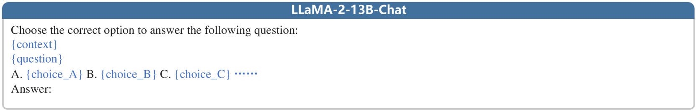
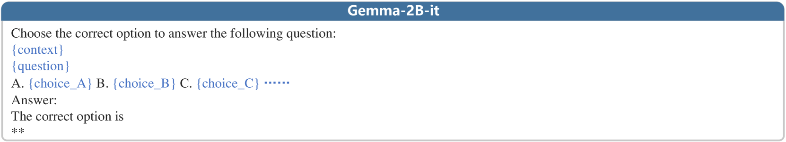

# IRCAN：借助上下文感知神经元的识别与权重调整，化解大型语言模型生成过程中的知识冲突

发布时间：2024年06月26日

`LLM理论

理由：这篇论文主要关注大型语言模型（LLMs）内部的知识冲突问题，并提出了一种名为IRCAN的框架来解决这一问题。该框架通过识别和重新加权关键的上下文感知神经元，以改进模型对新知识的敏感性。这一研究深入探讨了LLMs的内部机制和知识处理，属于对LLM理论的深入研究，而非直接的应用开发或Agent、RAG相关的研究。因此，将其归类为LLM理论是合适的。` `机器学习`

> IRCAN: Mitigating Knowledge Conflicts in LLM Generation via Identifying and Reweighting Context-Aware Neurons

# 摘要

> 众所周知，大型语言模型（LLMs）在海量数据训练后，积累了丰富的知识库。然而，最新研究发现，LLMs在生成内容时会出现知识冲突，即模型内部过时或错误的知识与上下文中提供的新信息相抵触。为此，我们开发了IRCAN框架（识别与重新加权上下文感知神经元），旨在利用那些对上下文信息处理至关重要的神经元。IRCAN首先通过集成梯度得出的上下文感知归因分数，识别出这些关键神经元，然后通过重新加权来强化它们。这一过程使得LLMs能够根据上下文中的新知识，生成更为敏感的输出。实验证明，IRCAN不仅有效解决了知识冲突问题，还提供了一个可扩展、即插即用的解决方案，能够与现有模型完美融合。

> It is widely acknowledged that large language models (LLMs) encode a vast reservoir of knowledge after being trained on mass data. Recent studies disclose knowledge conflicts in LLM generation, wherein outdated or incorrect parametric knowledge (i.e., encoded knowledge) contradicts new knowledge provided in the context. To mitigate such knowledge conflicts, we propose a novel framework, IRCAN (Identifying and Reweighting Context-Aware Neurons) to capitalize on neurons that are crucial in processing contextual cues. Specifically, IRCAN first identifies neurons that significantly contribute to context processing, utilizing a context-aware attribution score derived from integrated gradients. Subsequently, the identified context-aware neurons are strengthened via reweighting. In doing so, we steer LLMs to generate context-sensitive outputs with respect to the new knowledge provided in the context. Extensive experiments conducted across a variety of models and tasks demonstrate that IRCAN not only achieves remarkable improvements in handling knowledge conflicts but also offers a scalable, plug-andplay solution that can be integrated seamlessly with existing models.

[Arxiv](https://arxiv.org/abs/2406.18406)