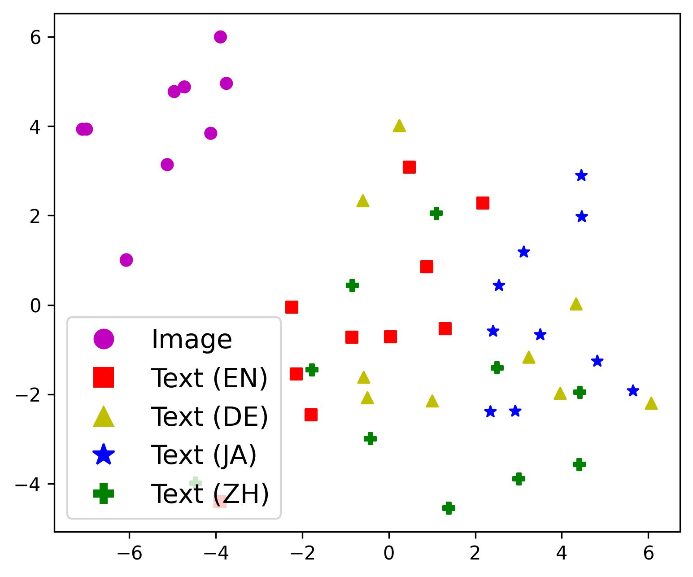

# 采用1-to-K对比学习策略，优化跨语言跨模态检索的一致性

发布时间：2024年06月26日

`RAG

理由：这篇论文主要关注的是跨语言跨模态检索（CCR）的问题，并提出了一种新的对比学习方法来解决跨语言和跨模态检索中的不一致问题。这种方法涉及到多模态数据的处理和优化，以及新的评估指标的引入，这些都是RAG（Retrieval-Augmented Generation）领域的关键技术。RAG领域通常关注如何通过检索增强生成过程，以提高模型的性能和适应性，尤其是在多语言和多模态的环境中。因此，这篇论文的内容与RAG领域的研究方向高度契合。` `跨语言检索` `多模态学习`

> Improving the Consistency in Cross-Lingual Cross-Modal Retrieval with 1-to-K Contrastive Learning

# 摘要

> 跨语言跨模态检索（CCR）旨在通过单一模型，在多语言环境中实现图像与文本的检索，打破模态与语言的双重壁垒。近年来，基于大规模数据对比学习的跨语言跨模态预训练方法取得了显著进步，但这些方法沿用现有策略，导致CCR中出现两个不一致问题：跨语言方法因模态内错误传播，使得不同语言的召回性能在整个数据集中不一致；跨模态方法则因模态间优化方向偏差，导致每个实例中不同语言的排名不一致，这一现象无法通过Recall@K体现。为此，我们提出了一种平等对待每种语言的1对K对比学习方法，有效消除了错误传播和优化偏差，并引入新的评估指标——平均排名方差（MRV），以衡量不同语言间的排名不一致性。实验结果显示，我们的方法在较小的预训练数据规模下，显著提升了召回率和MRV，达到了新的技术高峰。

> Cross-lingual Cross-modal Retrieval (CCR) is an essential task in web search, which aims to break the barriers between modality and language simultaneously and achieves image-text retrieval in the multi-lingual scenario with a single model. In recent years, excellent progress has been made based on cross-lingual cross-modal pre-training; particularly, the methods based on contrastive learning on large-scale data have significantly improved retrieval tasks. However, these methods directly follow the existing pre-training methods in the cross-lingual or cross-modal domain, leading to two problems of inconsistency in CCR: The methods with cross-lingual style suffer from the intra-modal error propagation, resulting in inconsistent recall performance across languages in the whole dataset. The methods with cross-modal style suffer from the inter-modal optimization direction bias, resulting in inconsistent rank across languages within each instance, which cannot be reflected by Recall@K. To solve these problems, we propose a simple but effective 1-to-K contrastive learning method, which treats each language equally and eliminates error propagation and optimization bias. In addition, we propose a new evaluation metric, Mean Rank Variance (MRV), to reflect the rank inconsistency across languages within each instance. Extensive experiments on four CCR datasets show that our method improves both recall rates and MRV with smaller-scale pre-trained data, achieving the new state-of-art.

[Arxiv](https://arxiv.org/abs/2406.18254)