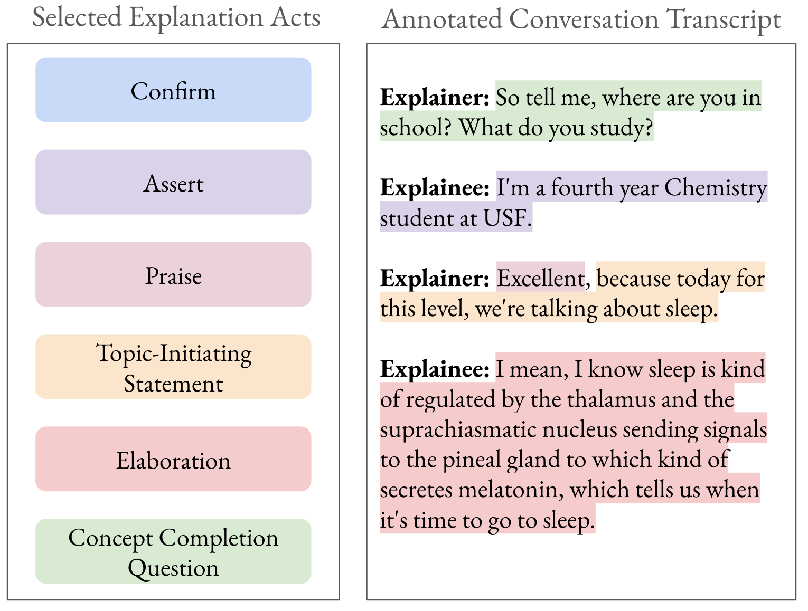
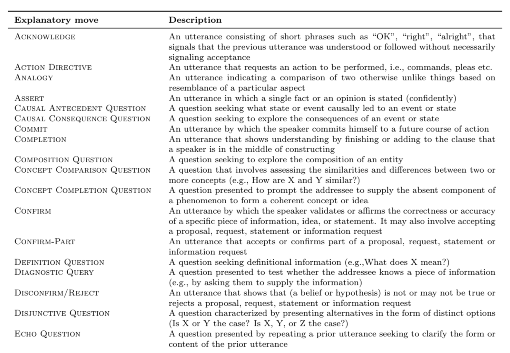

# “ChatGPT 解释力超越教授？”：探究大型语言模型在对话中的解释能力，与人类专家一较高下

发布时间：2024年06月26日

`LLM应用

理由：这篇论文主要探讨了大型语言模型（LLMs）在对话式解释中的应用，特别是在解释者和被解释者之间的互动中如何利用LLMs来提高解释的质量和效果。研究通过使用特定的数据集和评估方法，分析了LLMs在生成解释回应方面的能力，这属于LLM在实际应用中的探索和评估，因此归类为LLM应用。` `人工智能`

> "Is ChatGPT a Better Explainer than My Professor?": Evaluating the Explanation Capabilities of LLMs in Conversation Compared to a Human Baseline

# 摘要

> 解释是知识共享的基石，它融合了沟通原则、社会动态和学习理论。我们专注于对话式解释，因其高度适应性和互动性。我们的研究基于解释行为框架，探讨了对话中解释者和被解释者所采用的策略，以促进相互理解和互动。我们采用了Wachsmuth等人基于WIRED YouTube系列构建的5-Levels数据集，并由Booshehri等人进行了解释行为标注，这有助于我们理解双方在回应时的结构安排。随着生成式AI的快速发展，我们旨在深入了解大型语言模型（LLMs）的潜力，并探索它们如何助力专家在对话中更好地解释。为此，我们利用了Booshehri等人2023年标注的5-Levels数据集，以评估LLMs在解释对话中的参与能力。我们通过比较三种策略——人类解释者回应、GPT4标准回应及结合解释动作的GPT4回应，并由人类标注者进行评估，来衡量LLMs生成解释回应的效果。

> Explanations form the foundation of knowledge sharing and build upon communication principles, social dynamics, and learning theories. We focus specifically on conversational approaches for explanations because the context is highly adaptive and interactive. Our research leverages previous work on explanatory acts, a framework for understanding the different strategies that explainers and explainees employ in a conversation to both explain, understand, and engage with the other party. We use the 5-Levels dataset was constructed from the WIRED YouTube series by Wachsmuth et al., and later annotated by Booshehri et al. with explanatory acts. These annotations provide a framework for understanding how explainers and explainees structure their response when crafting a response.
  With the rise of generative AI in the past year, we hope to better understand the capabilities of Large Language Models (LLMs) and how they can augment expert explainer's capabilities in conversational settings. To achieve this goal, the 5-Levels dataset (We use Booshehri et al.'s 2023 annotated dataset with explanatory acts.) allows us to audit the ability of LLMs in engaging in explanation dialogues. To evaluate the effectiveness of LLMs in generating explainer responses, we compared 3 different strategies, we asked human annotators to evaluate 3 different strategies: human explainer response, GPT4 standard response, GPT4 response with Explanation Moves.

[Arxiv](https://arxiv.org/abs/2406.18512)