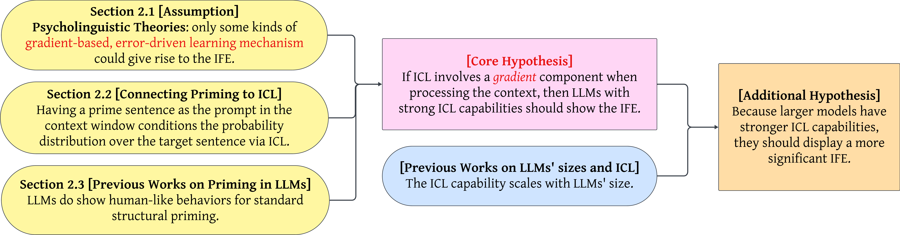
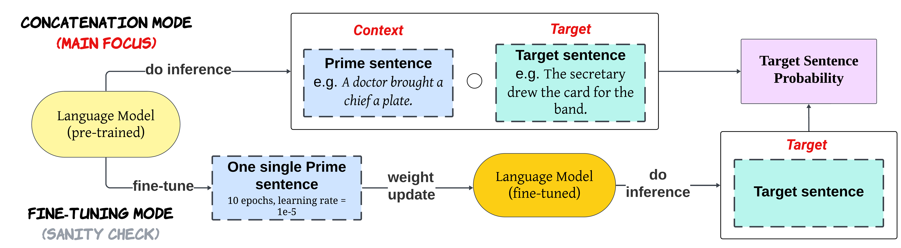
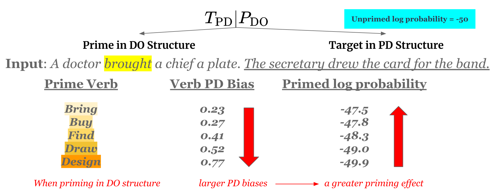
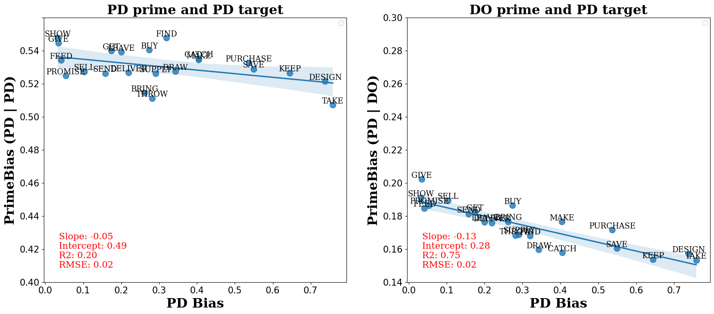
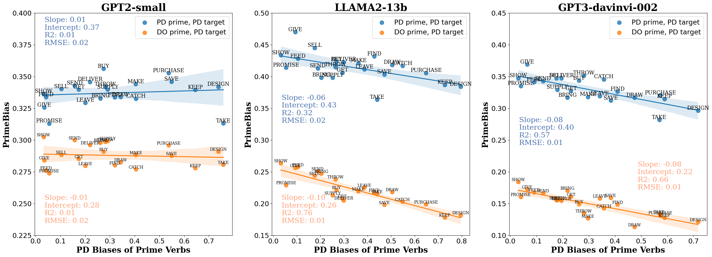
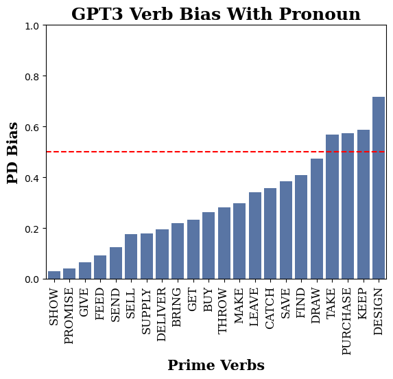
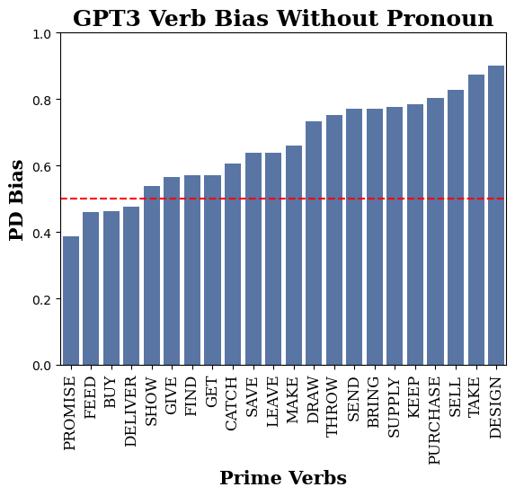

# 情境学习是否可归类为基于梯度的学习？结构启动中的逆频率效应为此提供了线索。

发布时间：2024年06月26日

`LLM理论

这篇论文探讨了大型语言模型（LLMs）中的情境学习（ICL）机制，并将其与基于梯度的学习方法进行比较。通过实验观察逆频率效应（IFE）在LLMs中的表现，论文支持了ICL过程中可能涉及基于梯度的学习机制的假设。这种研究深入探讨了LLMs的理论基础，特别是它们如何模拟人类的学习过程，因此属于LLM理论分类。` `人工智能` `认知科学`

> Is In-Context Learning a Type of Gradient-Based Learning? Evidence from the Inverse Frequency Effect in Structural Priming

# 摘要

> 大型语言模型（LLMs）已展现出情境学习（ICL）的新能力。有研究认为，ICL在功能上类似于梯度下降。本文提出了一种新方法，用以判断ICL是否等同于基于梯度的学习。我们依据逆频率效应（IFE）——一种现象，即错误驱动的学习者在处理不常见例子时更新幅度更大。此前，心理语言学研究已发现人类在结构启动中表现出IFE（人们倾向于重复近期遇到的句子结构），并以此证明人类结构启动涉及错误驱动的学习机制。我们的实验模拟了ICL中的结构启动，发现LLMs也表现出IFE，且大模型中效应更显著。这证实了ICL是一种基于梯度的学习，支持了ICL过程中前向传递隐含计算梯度的假设。结果显示，人类和LLMs均采用基于梯度、错误驱动的处理机制。

> Large language models (LLMs) have shown the emergent capability of in-context learning (ICL). One line of research has explained ICL as functionally performing gradient descent. In this paper, we introduce a new way of diagnosing whether ICL is functionally equivalent to gradient-based learning. Our approach is based on the inverse frequency effect (IFE) -- a phenomenon in which an error-driven learner is expected to show larger updates when trained on infrequent examples than frequent ones. The IFE has previously been studied in psycholinguistics because humans show this effect in the context of structural priming (the tendency for people to produce sentence structures they have encountered recently); the IFE has been used as evidence that human structural priming must involve error-driven learning mechanisms. In our experiments, we simulated structural priming within ICL and found that LLMs display the IFE, with the effect being stronger in larger models. We conclude that ICL is indeed a type of gradient-based learning, supporting the hypothesis that a gradient component is implicitly computed in the forward pass during ICL. Our results suggest that both humans and LLMs make use of gradient-based, error-driven processing mechanisms.

[Arxiv](https://arxiv.org/abs/2406.18501)