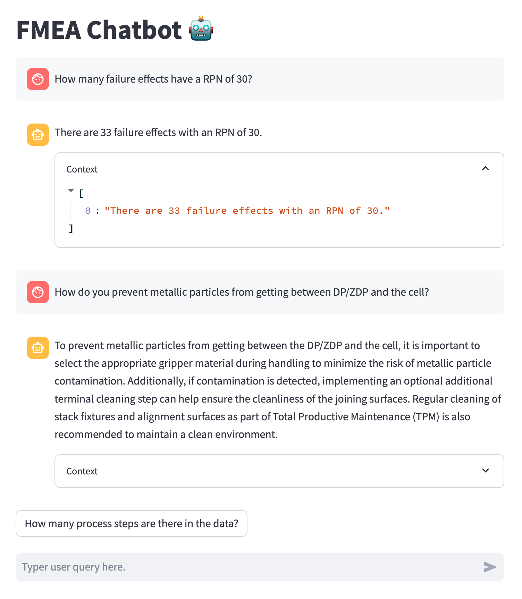
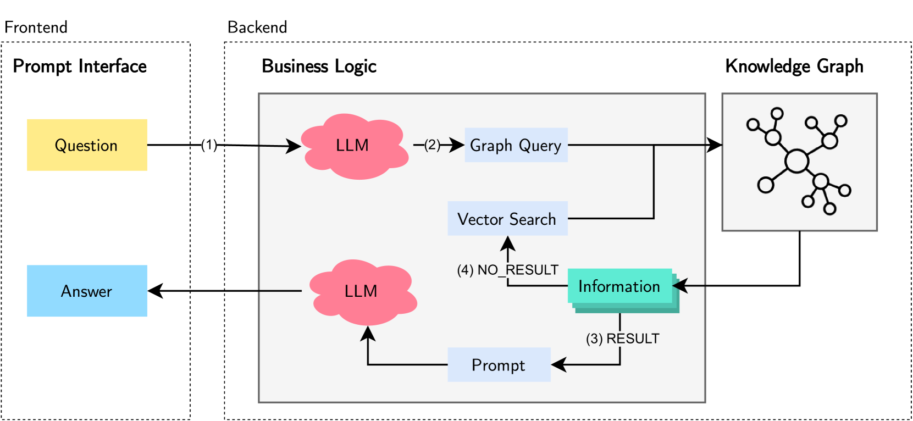

# 利用知识图谱增强的检索增强生成技术，优化故障模式与影响分析流程

发布时间：2024年06月26日

`RAG

这篇论文主要关注的是检索增强生成（RAG）方法在故障模式与影响分析（FMEA）中的应用，特别是通过集成知识图谱（KG）来强化RAG框架，以提升FMEA数据上的分析和语义问答能力。论文中提出的新方法包括FMEA观察本体的提出、从FMEA KG生成向量嵌入的算法以及KG增强的RAG框架。这些内容主要涉及RAG方法的改进和应用，因此归类为RAG。` `制造业` `风险管理`

> Knowledge Graph Enhanced Retrieval-Augmented Generation for Failure Mode and Effects Analysis

# 摘要

> 故障模式与影响分析（FMEA）在新产品爬坡阶段预防潜在故障方面至关重要，但其效果常因FMEA工具的推理能力不足而受限，这些工具多为表格结构。大型语言模型（LLMs）为定制数据集上的推理提供了新机遇，但在需要事实知识的任务上仍显不足，检索增强生成（RAG）方法正是为了弥补这一缺陷。RAG从非参数数据存储中提取信息，并结合语言模型生成答案。我们进一步提出，通过集成知识图谱（KG）来强化RAG框架，旨在提升FMEA数据上的分析和语义问答能力。本文贡献包括提出新的FMEA观察本体、从FMEA KG生成向量嵌入的算法以及KG增强的RAG框架。通过人类研究验证了我们的方法，并评估了上下文检索的召回率和精确度。

> Failure mode and effects analysis (FMEA) is a critical tool for mitigating potential failures, particular during ramp-up phases of new products. However, its effectiveness is often limited by the missing reasoning capabilities of the FMEA tools, which are usually tabular structured. Meanwhile, large language models (LLMs) offer novel prospects for fine-tuning on custom datasets for reasoning within FMEA contexts. However, LLMs face challenges in tasks that require factual knowledge, a gap that retrieval-augmented generation (RAG) approaches aim to fill. RAG retrieves information from a non-parametric data store and uses a language model to generate responses. Building on this idea, we propose to advance the non-parametric data store with a knowledge graph (KG). By enhancing the RAG framework with a KG, our objective is to leverage analytical and semantic question-answering capabilities on FMEA data. This paper contributes by presenting a new ontology for FMEA observations, an algorithm for creating vector embeddings from the FMEA KG, and a KG enhanced RAG framework. Our approach is validated through a human study and we measure the performance of the context retrieval recall and precision.

[Arxiv](https://arxiv.org/abs/2406.18114)