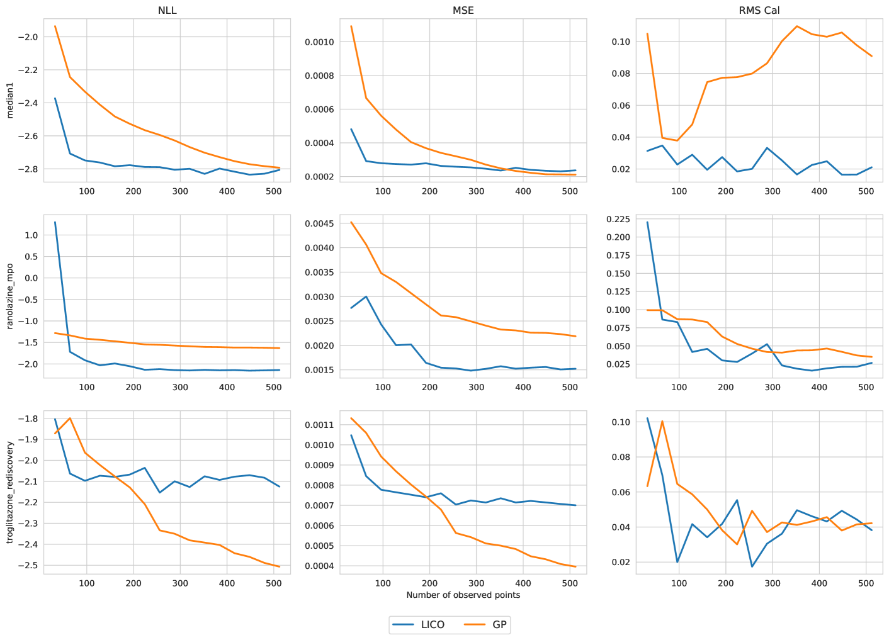
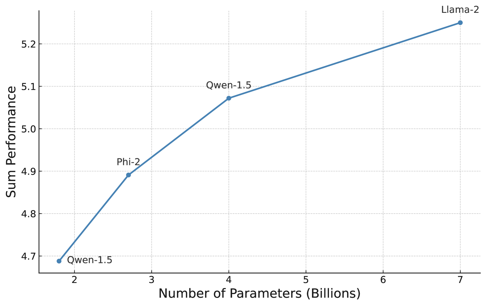

# LICO：利用大型语言模型进行分子优化的上下文化策略

发布时间：2024年06月26日

`Agent

理由：该论文介绍了一种名为LICO的通用模型，它扩展了任意大型语言模型（LLMs）以进行黑盒优化，特别是在分子领域。这种模型通过添加独立的嵌入与预测层，并训练其在多样化函数上进行上下文预测，以实现对未知分子属性的推广。这种模型的设计和应用涉及到对环境的感知、决策和行动，符合Agent的定义，即一个能够感知环境并采取行动以达到目标的系统。因此，该论文应归类于Agent。` `分子设计` `优化算法`

> LICO: Large Language Models for In-Context Molecular Optimization

# 摘要

> 优化黑盒函数是科学与工程的核心挑战。为此，我们开发了LICO，一种通用模型，它扩展了任意大型语言模型（LLMs）以进行黑盒优化，特别针对分子领域。通过为LLMs添加独立的嵌入与预测层，并训练其在多样化函数上进行上下文预测，LICO能够通过简单的上下文提示推广至未知的分子属性。在PMO这一包含20多个目标函数的分子优化挑战性基准上，LICO展现了顶尖的性能。

> Optimizing black-box functions is a fundamental problem in science and engineering. To solve this problem, many approaches learn a surrogate function that estimates the underlying objective from limited historical evaluations. Large Language Models (LLMs), with their strong pattern-matching capabilities via pretraining on vast amounts of data, stand out as a potential candidate for surrogate modeling. However, directly prompting a pretrained language model to produce predictions is not feasible in many scientific domains due to the scarcity of domain-specific data in the pretraining corpora and the challenges of articulating complex problems in natural language. In this work, we introduce LICO, a general-purpose model that extends arbitrary base LLMs for black-box optimization, with a particular application to the molecular domain. To achieve this, we equip the language model with a separate embedding layer and prediction layer, and train the model to perform in-context predictions on a diverse set of functions defined over the domain. Once trained, LICO can generalize to unseen molecule properties simply via in-context prompting. LICO achieves state-of-the-art performance on PMO, a challenging molecular optimization benchmark comprising over 20 objective functions.

[Arxiv](https://arxiv.org/abs/2406.18851)