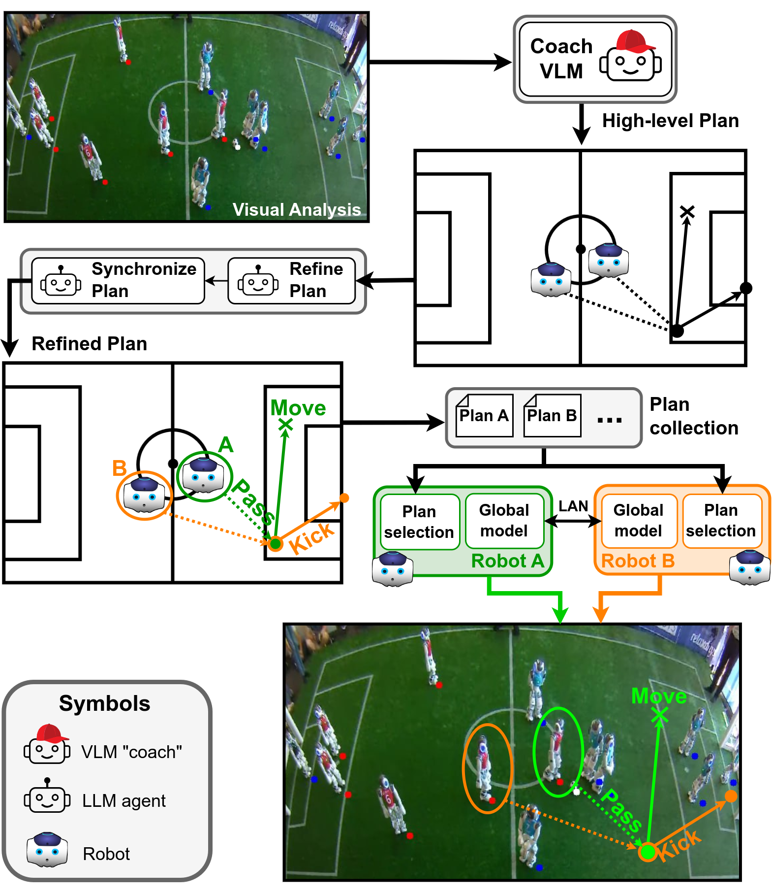
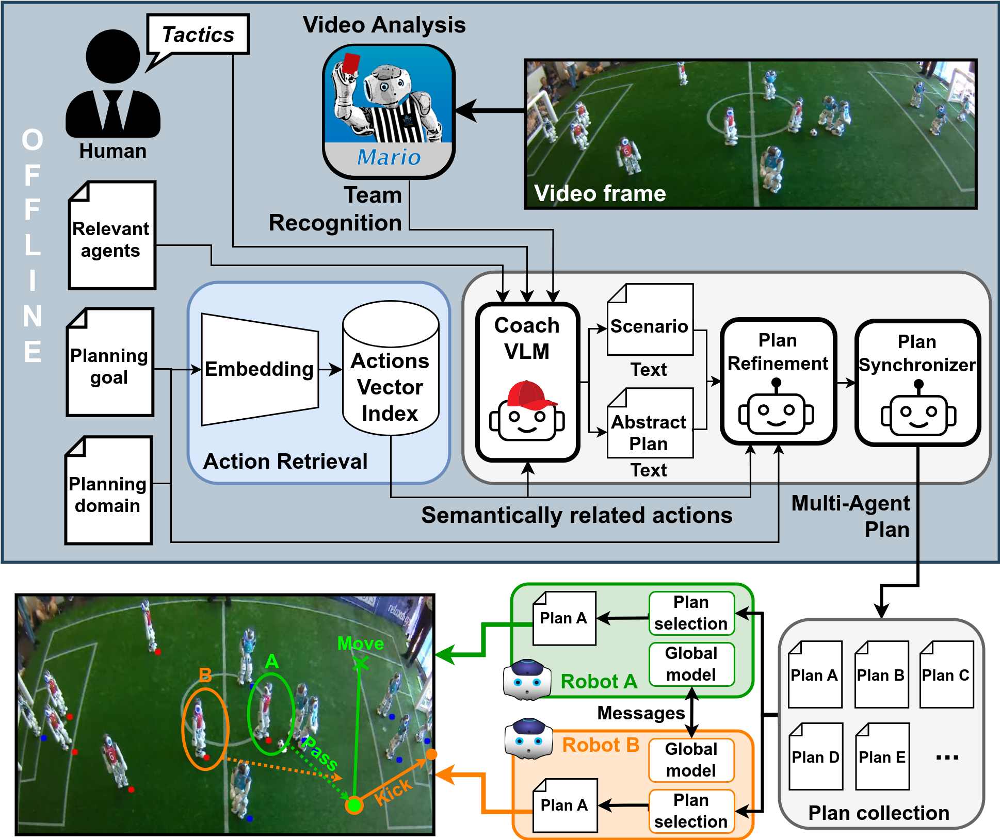
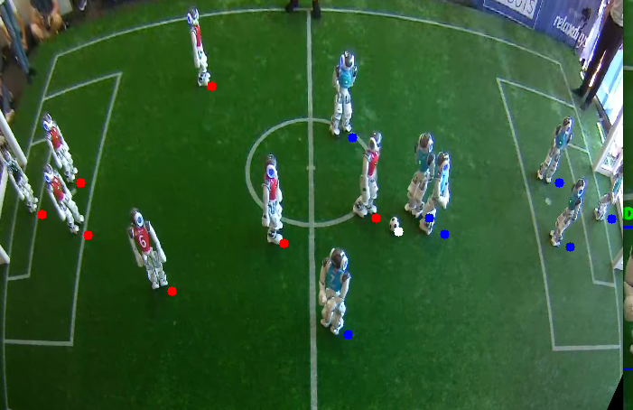

# LLCoach：借助多角色大型语言模型，巧妙制定机器人足球策略

发布时间：2024年06月26日

`Agent

理由：这篇论文主要关注的是在动态多变的非结构化环境中，如何利用大型语言模型（LLMs）为机器人制定策略，以应对个体代理间的互动变化。这涉及到机器人的自主行为和决策，属于Agent的范畴。虽然文中提到了LLMs的应用，但核心在于机器人的行为和策略制定，而非LLMs的理论研究或特定应用。因此，将其归类为Agent更为合适。` `机器人技术` `人工智能`

> LLCoach: Generating Robot Soccer Plans using Multi-Role Large Language Models

# 摘要

> 在动态多变的非结构化环境中部署机器人，需要精妙的规划策略。RoboCup 的足球赛为机器人提供了一个模拟人类活动的舞台。在此类场景中，机器人依赖的预设行为在未知变数面前可能失效。本文创新性地运用大型语言模型（LLMs），旨在为 RoboCup 标准平台联赛（SPL）中的机器人足球队制定策略，使其能自主应对个体代理间的互动变化。我们提出了一种多角色策略，利用 LLMs 的强大功能，为机器人足球队制定和优化战术。通过模拟比赛，我们验证了这种方法的潜力，展示了 AI 规划的机器人与人类编码的机器人之间的较量。

> The deployment of robots into human scenarios necessitates advanced planning strategies, particularly when we ask robots to operate in dynamic, unstructured environments. RoboCup offers the chance to deploy robots in one of those scenarios, a human-shaped game represented by a soccer match. In such scenarios, robots must operate using predefined behaviors that can fail in unpredictable conditions. This paper introduces a novel application of Large Language Models (LLMs) to address the challenge of generating actionable plans in such settings, specifically within the context of the RoboCup Standard Platform League (SPL) competitions where robots are required to autonomously execute soccer strategies that emerge from the interactions of individual agents. In particular, we propose a multi-role approach leveraging the capabilities of LLMs to generate and refine plans for a robotic soccer team. The potential of the proposed method is demonstrated through an experimental evaluation,carried out simulating multiple matches where robots with AI-generated plans play against robots running human-built code.

[Arxiv](https://arxiv.org/abs/2406.18285)