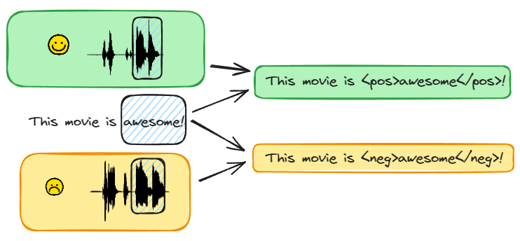
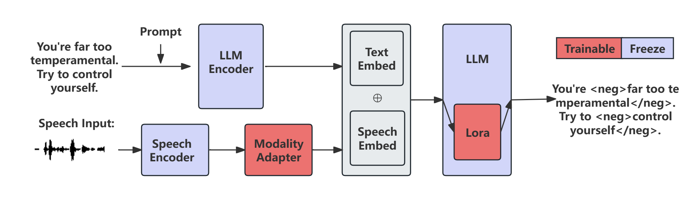

# 利用大型语言模型进行多模态观点表达的精准识别

发布时间：2024年06月26日

`LLM应用

这篇论文主要探讨了如何利用大型语言模型（LLMs）来提升多模态意见表达识别（MOEI）任务的性能。论文中提出了新的数据集和方法，通过结合文本和语音模态来识别意见表达，这在实际应用中具有重要价值，如语音助手和抑郁症诊断等。因此，这篇论文更符合LLM应用分类，因为它关注的是LLMs在特定任务中的应用和优化，而不是理论研究或Agent的设计。` `情感分析`

> LLM-Driven Multimodal Opinion Expression Identification

# 摘要

> 在NLP领域，意见表达识别（OEI）对于从语音助手到抑郁症诊断的应用至关重要。本研究将OEI拓展至多模态输入，凸显了听觉线索在传达文本所不及的情感细微差别中的重要性。我们创新性地提出了多模态OEI（MOEI）任务，融合文本与语音，模拟真实世界的交互场景。通过CMU MOSEI和IEMOCAP数据集，我们构建了CI-MOEI数据集，并利用文本转语音技术对MPQA数据集进行处理，生成了CIM-OEI数据集。为了最大化利用大型语言模型（LLMs）的生成潜力，我们为OEI任务设计了专门的模板。在此基础上，我们进一步提出了一种基于LLM的STOEI方法，该方法通过结合语音和文本模态，有效识别意见表达。实验结果显示，MOEI任务显著提升了性能，我们的方法超越了现有技术9.20%，达到了行业领先水平。

> Opinion Expression Identification (OEI) is essential in NLP for applications ranging from voice assistants to depression diagnosis. This study extends OEI to encompass multimodal inputs, underlining the significance of auditory cues in delivering emotional subtleties beyond the capabilities of text. We introduce a novel multimodal OEI (MOEI) task, integrating text and speech to mirror real-world scenarios. Utilizing CMU MOSEI and IEMOCAP datasets, we construct the CI-MOEI dataset. Additionally, Text-to-Speech (TTS) technology is applied to the MPQA dataset to obtain the CIM-OEI dataset. We design a template for the OEI task to take full advantage of the generative power of large language models (LLMs). Advancing further, we propose an LLM-driven method STOEI, which combines speech and text modal to identify opinion expressions. Our experiments demonstrate that MOEI significantly improves the performance while our method outperforms existing methods by 9.20\% and obtains SOTA results.

[Arxiv](https://arxiv.org/abs/2406.18088)