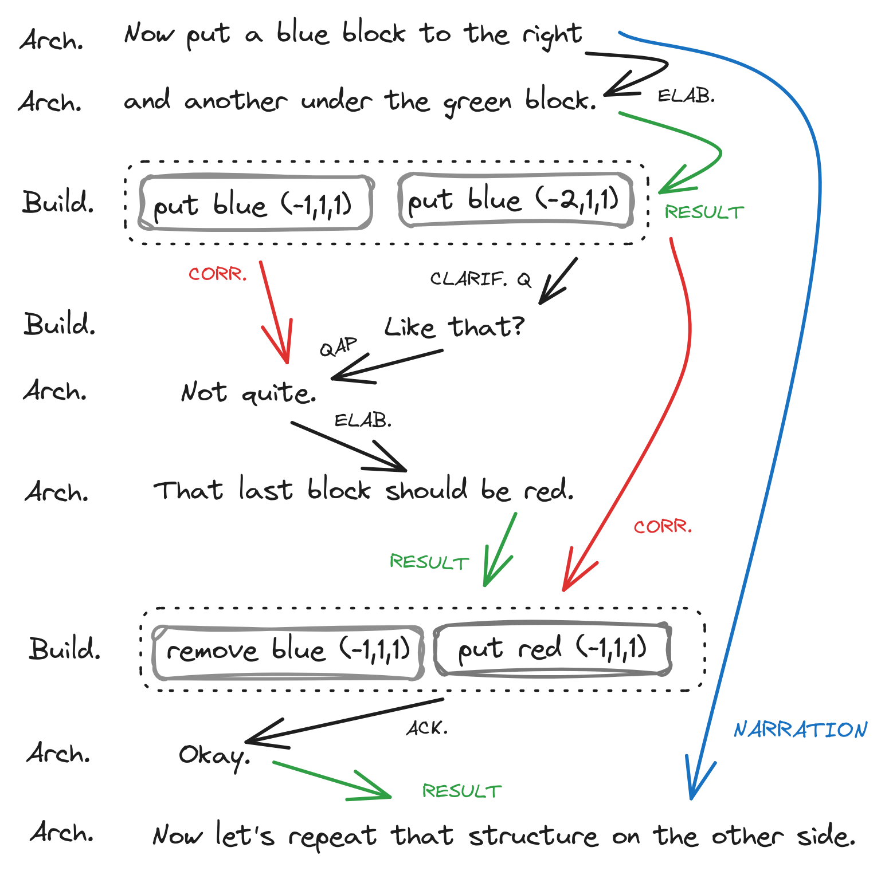
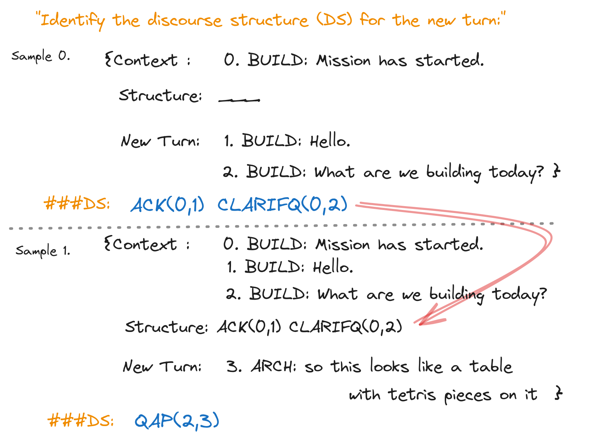

# LLaMIPa：逐步解析话语的新工具

发布时间：2024年06月26日

`LLM应用

理由：这篇论文介绍了如何微调大型语言模型（LLM）以进行语篇解析，并开发了一个名为LLaMIPa的增量解析器。这个解析器能够更有效地处理语篇数据，并在下游任务中利用这些信息。这项工作专注于LLM的实际应用，即在语篇解析领域的应用，因此属于LLM应用分类。` `语篇解析`

> LLaMIPa: An Incremental Discourse Parser

# 摘要

> 本研究首次探索了在SDRT风格标注的语料库上微调大型语言模型（LLM）进行语篇解析的可能性，并成功开发出LLaMIPa（LLaMA增量解析器）。这一解析器能更深入地挖掘语篇上下文，显著提升了性能，超越了依赖编码器模型提供局部上下文敏感语篇单元表示的传统方法。更重要的是，LLaMIPa能以增量方式处理语篇数据，这对于在下游任务中有效利用语篇信息具有决定性意义。

> This paper provides the first discourse parsing experiments with a large language model (LLM) finetuned on corpora annotated in the style of SDRT (Asher, 1993; Asher and Lascarides, 2003). The result is a discourse parser, LLaMIPa (LLaMA Incremental Parser), which is able to more fully exploit discourse context, leading to substantial performance gains over approaches that use encoder-only models to provide local, context-sensitive representations of discourse units. Furthermore, it is able to process discourse data incrementally, which is essential for the eventual use of discourse information in downstream tasks.

[Arxiv](https://arxiv.org/abs/2406.18256)