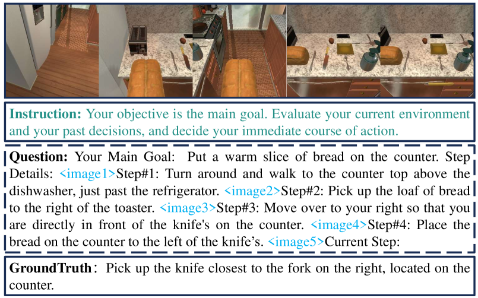
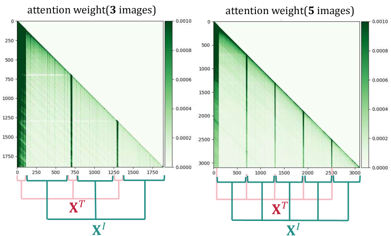
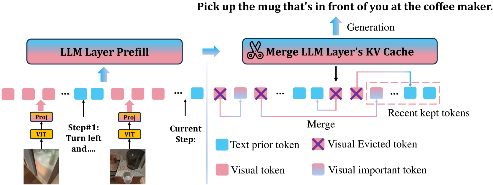
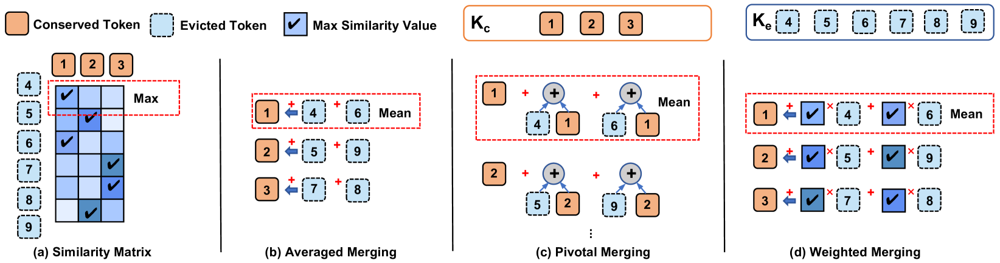
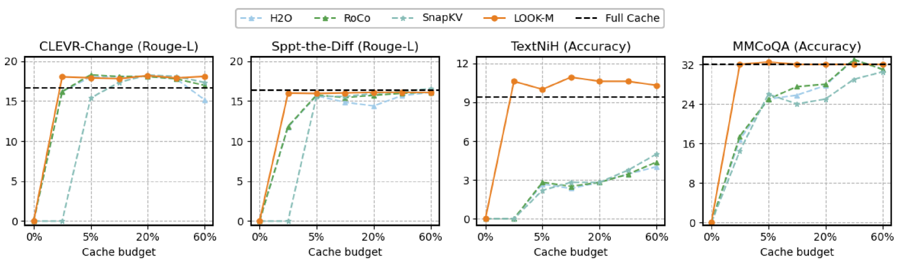
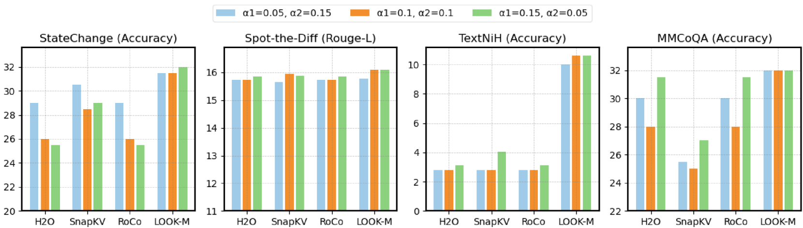

# LOOK-M：通过一次性优化KV缓存，实现多模态长上下文推理的高效性

发布时间：2024年06月26日

`LLM应用

这篇论文主要关注长上下文多模态大型语言模型（MLLMs）在处理多模态键值（KV）缓存时的内存和时间效率问题。论文提出了一种名为LOOK-M的新方法，该方法能够有效缩减多模态KV缓存的大小，同时保持或提升模型性能。这种方法特别针对MLLMs在处理图像和文本信息时的挑战，通过优化KV缓存的使用，实现了内存使用的显著减少和解码速度的提升。因此，这篇论文属于LLM应用类别，因为它专注于改进和优化大型语言模型在特定应用场景下的性能。` `多模态学习` `人工智能`

> LOOK-M: Look-Once Optimization in KV Cache for Efficient Multimodal Long-Context Inference

# 摘要

> 长上下文多模态大型语言模型（MLLMs）在推理时因多模态键值（KV）缓存的增长而面临内存和时间效率的挑战。与仅处理文本的LLMs不同，MLLMs的KV缓存需处理包含时间及空间关系的图像与文本信息。由于图像令牌的主导地位，传统LLMs的KV缓存优化方法在此不适用。本研究中，我们推出了LOOK-M，一种无需微调的创新方法，能有效缩减多模态KV缓存大小，同时保持性能。我们发现，在提示预填充阶段，模型更侧重于文本而非图像特征，并据此提出了一种新的文本优先压缩方法。为减少图像上下文信息的损失，我们还设计了KV对合并的补偿策略。LOOK-M在大幅减少KV缓存内存使用的同时，如某些情况下减少80%，不仅加速解码达1.5倍，还在多种长上下文多模态任务中保持或提升了性能。

> Long-context Multimodal Large Language Models (MLLMs) demand substantial computational resources for inference as the growth of their multimodal Key-Value (KV) cache, in response to increasing input lengths, challenges memory and time efficiency. Unlike single-modality LLMs that manage only textual contexts, the KV cache of long-context MLLMs includes representations from multiple images with temporal and spatial relationships and related textual contexts. The predominance of image tokens means traditional optimizations for LLMs' KV caches are unsuitable for multimodal long-context settings, and no prior works have addressed this challenge. In this work, we introduce LOOK-M, a pioneering, fine-tuning-free approach that efficiently reduces the multimodal KV cache size while maintaining performance comparable to a full cache. We observe that during prompt prefill, the model prioritizes more textual attention over image features, and based on the multimodal interaction observation, a new proposed text-prior method is explored to compress the KV cache. Furthermore, to mitigate the degradation of image contextual information, we propose several compensatory strategies using KV pairs merging. LOOK-M demonstrates that with a significant reduction in KV Cache memory usage, such as reducing it by 80% in some cases, it not only achieves up to 1.5x faster decoding but also maintains or even enhances performance across a variety of long context multimodal tasks.

[Arxiv](https://arxiv.org/abs/2406.18139)