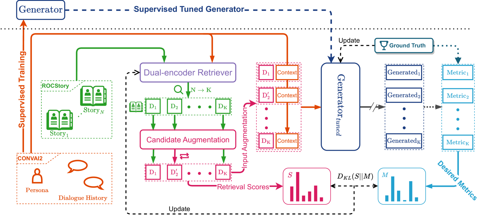
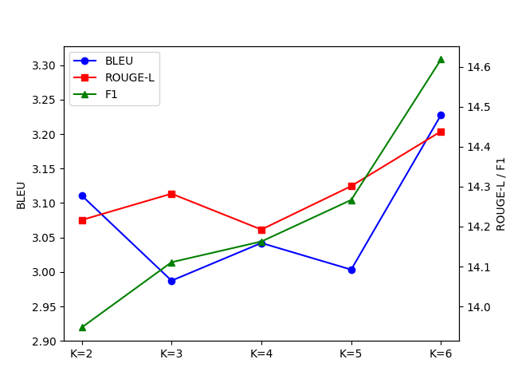
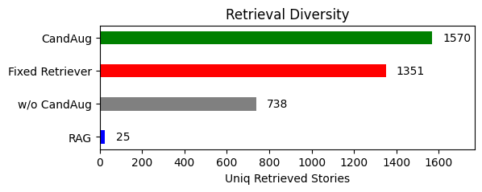

# 个性化对话生成中的检索增强学习

发布时间：2024年06月26日

`Agent

理由：这篇论文介绍了一个名为LAPDOG的模型，该模型通过结合人物档案和对话上下文来生成个性化的对话。这个模型包含了一个故事检索器和一个对话生成器，这两个组件协同工作以优化对话生成的性能。这种类型的研究通常被归类为Agent，因为它涉及创建一个能够理解和响应用户输入的智能代理或对话系统。虽然它可能涉及到一些LLM的应用，但主要关注点在于构建一个能够进行个性化交互的Agent，而不是深入探讨LLM的理论或应用。` `对话AI` `个性化服务`

> Learning Retrieval Augmentation for Personalized Dialogue Generation

# 摘要

> 个性化对话生成，通过巧妙结合人物档案与对话上下文，已在对话AI领域引起广泛关注。然而，现有的人物档案往往仅包含寥寥数语，难以全面展现人物特质，这成为打造真正个性化对话的难题。为此，我们推出了学习检索增强个性化对话生成（LAPDOG），旨在探索外部知识在人物对话生成中的应用。LAPDOG模型由故事检索器与对话生成器组成，前者利用人物档案检索相关故事信息，后者则结合对话历史与丰富的人物档案，精心编织个性化回复。我们采用联合训练策略，确保故事检索器与对话生成器协同优化，以期达到最佳性能。实验结果表明，LAPDOG在CONVAI2数据集上表现卓越，超越了现有方法。模型代码已公开，诚邀各界深入探索。https://github.com/hqsiswiliam/LAPDOG

> Personalized dialogue generation, focusing on generating highly tailored responses by leveraging persona profiles and dialogue context, has gained significant attention in conversational AI applications. However, persona profiles, a prevalent setting in current personalized dialogue datasets, typically composed of merely four to five sentences, may not offer comprehensive descriptions of the persona about the agent, posing a challenge to generate truly personalized dialogues. To handle this problem, we propose $\textbf{L}$earning Retrieval $\textbf{A}$ugmentation for $\textbf{P}$ersonalized $\textbf{D}$ial$\textbf{O}$gue $\textbf{G}$eneration ($\textbf{LAPDOG}$), which studies the potential of leveraging external knowledge for persona dialogue generation. Specifically, the proposed LAPDOG model consists of a story retriever and a dialogue generator. The story retriever uses a given persona profile as queries to retrieve relevant information from the story document, which serves as a supplementary context to augment the persona profile. The dialogue generator utilizes both the dialogue history and the augmented persona profile to generate personalized responses. For optimization, we adopt a joint training framework that collaboratively learns the story retriever and dialogue generator, where the story retriever is optimized towards desired ultimate metrics (e.g., BLEU) to retrieve content for the dialogue generator to generate personalized responses. Experiments conducted on the CONVAI2 dataset with ROCStory as a supplementary data source show that the proposed LAPDOG method substantially outperforms the baselines, indicating the effectiveness of the proposed method. The LAPDOG model code is publicly available for further exploration. https://github.com/hqsiswiliam/LAPDOG

[Arxiv](https://arxiv.org/abs/2406.18847)