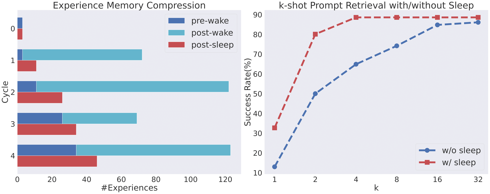

# 机器人终身学习图书馆：借助语言模型，自举生成组合且可泛化的技能，以实现具身控制

发布时间：2024年06月26日

`Agent

这篇论文介绍了一种基于大型语言模型（LLM）的终身学习代理（LRLL），它通过不断扩展技能库来应对日益复杂的操作任务。该代理的创新之处包括软记忆模块、自我引导的探索策略、技能抽象器和终身学习算法，这些都是代理行为和学习机制的关键组成部分。因此，这篇论文更符合Agent分类，因为它主要关注的是如何构建和优化一个能够自主学习和执行任务的智能代理。` `机器人技术` `终身学习`

> Lifelong Robot Library Learning: Bootstrapping Composable and Generalizable Skills for Embodied Control with Language Models

# 摘要

> 大型语言模型（LLMs）已崭新地应用于实体推理与控制，尤其是通过生成利用定制视觉与控制基础技能库的机器人策略代码。然而，先前的研究固定了技能库，并依赖精细手工的提示工程来引导LLM，这限制了代理处理任务的范围。本研究推出了LRLL，一种基于LLM的终身学习代理，它不断扩展技能库以应对日益复杂的操作任务。LRLL的创新之处包括：1）软记忆模块，动态存储与检索过往经验以提供上下文；2）自我引导的探索策略，在模拟环境中提出新任务；3）技能抽象器，将近期经验提炼为新技能；4）终身学习算法，使人类用户能以最少在线互动引导新技能。LRLL不断转移知识，构建可组合、通用且可解释的策略，同时避免基于梯度的优化，有效防止灾难性遗忘。在模拟桌面环境的实证评估中，LRLL在终身学习设置中优于端到端和原始LLM方法，并学习了可转移至现实世界的技能。项目详情将在https://gtziafas.github.io/LRLL_project提供。

> Large Language Models (LLMs) have emerged as a new paradigm for embodied reasoning and control, most recently by generating robot policy code that utilizes a custom library of vision and control primitive skills. However, prior arts fix their skills library and steer the LLM with carefully hand-crafted prompt engineering, limiting the agent to a stationary range of addressable tasks. In this work, we introduce LRLL, an LLM-based lifelong learning agent that continuously grows the robot skill library to tackle manipulation tasks of ever-growing complexity. LRLL achieves this with four novel contributions: 1) a soft memory module that allows dynamic storage and retrieval of past experiences to serve as context, 2) a self-guided exploration policy that proposes new tasks in simulation, 3) a skill abstractor that distills recent experiences into new library skills, and 4) a lifelong learning algorithm for enabling human users to bootstrap new skills with minimal online interaction. LRLL continuously transfers knowledge from the memory to the library, building composable, general and interpretable policies, while bypassing gradient-based optimization, thus relieving the learner from catastrophic forgetting. Empirical evaluation in a simulated tabletop environment shows that LRLL outperforms end-to-end and vanilla LLM approaches in the lifelong setup while learning skills that are transferable to the real world. Project material will become available at the webpage https://gtziafas.github.io/LRLL_project.

[Arxiv](https://arxiv.org/abs/2406.18746)