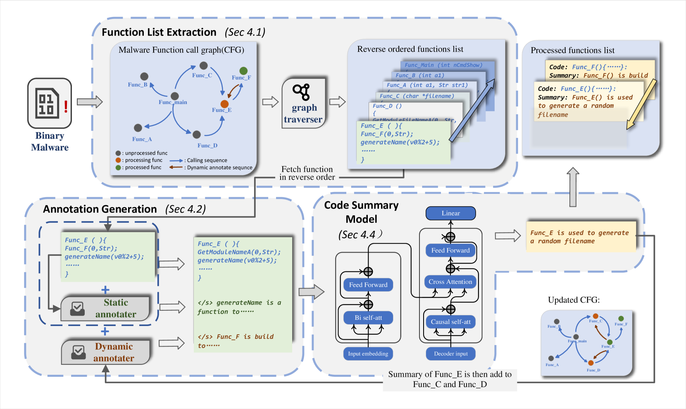

# MALSIGHT：迭代提炼恶意软件二进制，融合恶意源码与良性伪码之智慧

发布时间：2024年06月26日

`LLM应用

这篇论文介绍了一种名为MALSIGHT的创新框架，它专注于通过分析恶意源代码和良性伪代码来自动生成二进制恶意软件的详细描述。这种方法优化了恶意软件的破解与检测过程。论文中提到的使用LLM（大型语言模型）的方法，以及构建的恶意软件摘要数据集MalS和MalP，以及对LLM代码模型MalT5的调优，都是为了提高恶意软件摘要的实用性、准确性和完整性。这些内容表明该论文是在应用LLM技术来解决实际问题，即恶意软件的分析和检测，因此属于LLM应用分类。` `恶意软件检测` `代码分析`

> MALSIGHT: Exploring Malicious Source Code and Benign Pseudocode for Iterative Binary Malware Summarization

# 摘要

> MALSIGHT是一种创新的代码摘要框架，旨在通过分析恶意源代码和良性伪代码，自动生成二进制恶意软件的详细描述，从而优化恶意软件的破解与检测过程。尽管基于LLM的方法已显示出潜力，但仍存在使用不便、解释不准确和摘要不完整等问题，这些问题源于伪代码结构的模糊性和恶意软件训练数据的不足。此外，恶意软件内部函数间的复杂交互关系尚未得到充分研究。为此，我们构建了首个恶意软件摘要数据集MalS和MalP，并通过人工校正进行了优化。在训练阶段，我们针对MalS和良性伪代码数据集对新型LLM代码模型MalT5进行了调优。测试阶段，我们通过迭代输入伪代码函数至MalT5，生成摘要，这一过程有助于深入理解伪代码结构并捕捉函数间的微妙交互，显著提升了摘要的实用性、准确性和完整性。我们还开发了新的评估基准BLEURT-sum，以精确评估摘要质量。实验结果表明，MALSIGHT在三个数据集上均表现出色，尤其是我们的MalT5模型，尽管参数仅为0.77亿，其性能却能与更大型的ChatGPT3.5相媲美。

> Binary malware summarization aims to automatically generate human-readable descriptions of malware behaviors from executable files, facilitating tasks like malware cracking and detection. Previous methods based on Large Language Models (LLMs) have shown great promise. However, they still face significant issues, including poor usability, inaccurate explanations, and incomplete summaries, primarily due to the obscure pseudocode structure and the lack of malware training summaries. Further, calling relationships between functions, which involve the rich interactions within a binary malware, remain largely underexplored. To this end, we propose MALSIGHT, a novel code summarization framework that can iteratively generate descriptions of binary malware by exploring malicious source code and benign pseudocode. Specifically, we construct the first malware summaries, MalS and MalP, using an LLM and manually refine this dataset with human effort. At the training stage, we tune our proposed MalT5, a novel LLM-based code model, on the MalS dataset and a benign pseudocode dataset. Then, at the test stage, we iteratively feed the pseudocode functions into MalT5 to obtain the summary. Such a procedure facilitates the understanding of pseudocode structure and captures the intricate interactions between functions, thereby benefiting the usability, accuracy, and completeness of summaries. Additionally, we propose a novel evaluation benchmark, BLEURT-sum, to measure the quality of summaries. Experiments on three datasets show the effectiveness of the proposed MALSIGHT. Notably, our proposed MalT5, with only 0.77B parameters, delivers comparable performance to much larger ChatGPT3.5.

[Arxiv](https://arxiv.org/abs/2406.18379)