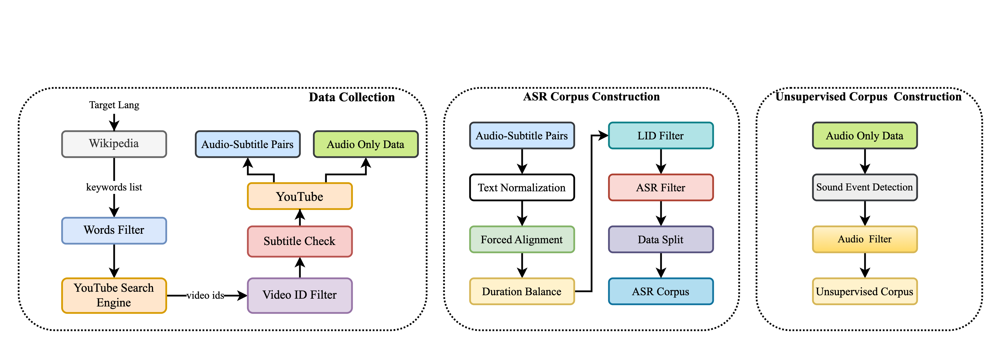
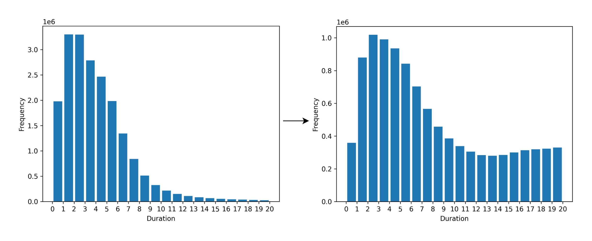
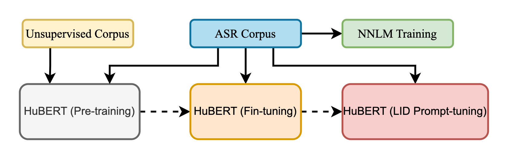

# MSR-86K：一个持续进化的多语言宝库，收录了86,300小时的转录音频，专为语音识别研究量身打造。

发布时间：2024年06月26日

`LLM应用

这篇论文介绍了MSR-86K，一个大型多语言语音识别研究语料库，并展示了如何利用这一资源及其他开源资源训练出高质量的多语言自动语音识别（ASR）模型。这与大型语言模型（LLM）的应用直接相关，特别是在多语言ASR领域，因此属于LLM应用分类。` `语音识别` `多语言技术`

> MSR-86K: An Evolving, Multilingual Corpus with 86,300 Hours of Transcribed Audio for Speech Recognition Research

# 摘要

> 近期，如ChatGPT这样的多语言AI助手大受欢迎。作为人机交互的关键，多语言自动语音识别（ASR）也备受瞩目，Whisper系统便是例证。但训练数据的专有性限制了多语言ASR的研究。本文推出的MSR-86K，是一个源自YouTube公开视频、包含15种语言、总计86,300小时转录数据的大型多语言语音识别研究语料库。我们还将展示如何利用MSR-86K及其他开源资源，训练出能与Whisper媲美的多语言ASR模型。MSR-86K即将在HuggingFace公开，我们期待这一庞大资源能推动多语言ASR研究的新进展。

> Recently, multilingual artificial intelligence assistants, exemplified by ChatGPT, have gained immense popularity. As a crucial gateway to human-computer interaction, multilingual automatic speech recognition (ASR) has also garnered significant attention, as evidenced by systems like Whisper. However, the proprietary nature of the training data has impeded researchers' efforts to study multilingual ASR. This paper introduces MSR-86K, an evolving, large-scale multilingual corpus for speech recognition research. The corpus is derived from publicly accessible videos on YouTube, comprising 15 languages and a total of 86,300 hours of transcribed ASR data. We also introduce how to use the MSR-86K corpus and other open-source corpora to train a robust multilingual ASR model that is competitive with Whisper. MSR-86K will be publicly released on HuggingFace, and we believe that such a large corpus will pave new avenues for research in multilingual ASR.

[Arxiv](https://arxiv.org/abs/2406.18301)