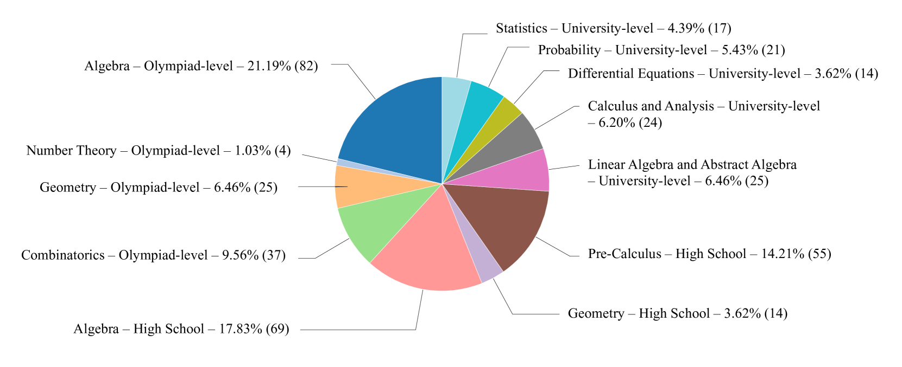
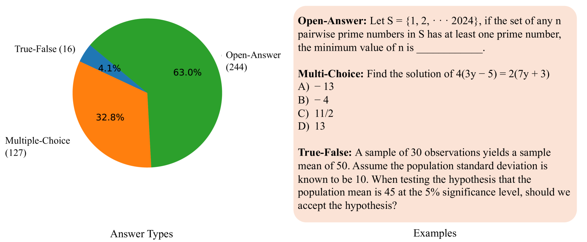
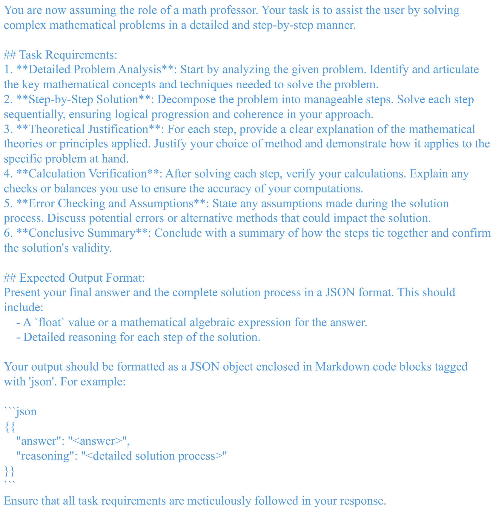
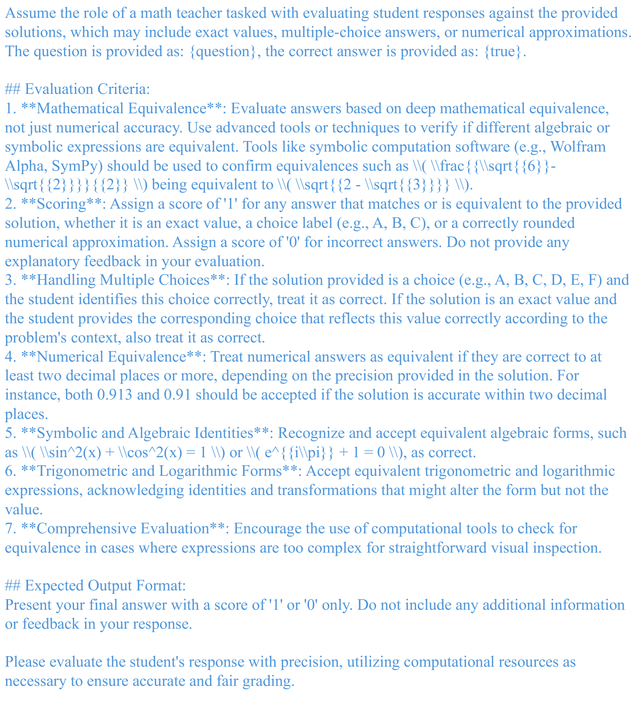

# 数学奥德赛：利用Odyssey数学数据，在大规模语言模型中评估数学问题解决能力

发布时间：2024年06月26日

`LLM应用

理由：这篇论文主要探讨了大型语言模型（LLMs）在解决数学问题上的能力，特别是使用新开发的“MathOdyssey”数据集来评估和比较不同模型在高级数学问题解决场景中的表现。这属于对LLMs在特定应用领域（数学问题解决）的实际应用和性能评估，因此归类为LLM应用。论文中虽然涉及模型的比较和性能分析，但重点在于应用层面的探讨，而非理论模型的深入研究或Agent的设计与实现。` `人工智能`

> MathOdyssey: Benchmarking Mathematical Problem-Solving Skills in Large Language Models Using Odyssey Math Data

# 摘要

> 大型语言模型（LLMs）在自然语言理解和问题解决方面取得了显著进步，但在解决数学问题上仍显吃力，尤其是需要复杂推理的问题。本研究采用新开发的“MathOdyssey”数据集，深入探讨LLMs的数学问题解决能力。该数据集由知名机构专家精心设计，包含高中至大学水平的多样化数学问题，旨在全面测试LLMs在高级问题解决场景中的表现。我们向AI社区公开了MathOdyssey数据集，以期推动AI在复杂数学问题解决能力上的进步。通过对比开源模型（如Llama-3和DBRX-Instruct）与GPT系列及Gemini模型的闭源模型，我们发现LLMs在常规至中等难度任务上表现出色，但在奥林匹克级别和大学级别的复杂问题上遭遇挑战。尽管开源与闭源模型间的性能差距正在缩小，但面对最棘手的问题时，挑战依旧巨大。本研究凸显了持续研究以提升LLMs数学推理能力的迫切性，相关数据集、结果及代码已公开发布。

> Large language models (LLMs) have significantly advanced natural language understanding and demonstrated strong problem-solving abilities. Despite these successes, most LLMs still struggle with solving mathematical problems due to the intricate reasoning required. This paper investigates the mathematical problem-solving capabilities of LLMs using the newly developed "MathOdyssey" dataset. The dataset includes diverse mathematical problems at high school and university levels, created by experts from notable institutions to rigorously test LLMs in advanced problem-solving scenarios and cover a wider range of subject areas. By providing the MathOdyssey dataset as a resource to the AI community, we aim to contribute to the understanding and improvement of AI capabilities in complex mathematical problem-solving. We conduct benchmarking on open-source models, such as Llama-3 and DBRX-Instruct, and closed-source models from the GPT series and Gemini models. Our results indicate that while LLMs perform well on routine and moderately difficult tasks, they face significant challenges with Olympiad-level problems and complex university-level questions. Our analysis shows a narrowing performance gap between open-source and closed-source models, yet substantial challenges remain, particularly with the most demanding problems. This study highlights the ongoing need for research to enhance the mathematical reasoning of LLMs. The dataset, results, and code are publicly available.

[Arxiv](https://arxiv.org/abs/2406.18321)