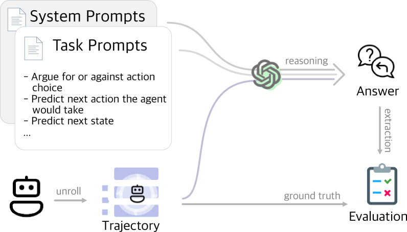

# 语言模型构建强化学习代理的心智模型

发布时间：2024年06月26日

`Agent

理由：这篇论文主要探讨了大型语言模型（LLMs）如何通过分析代理行为及其对状态的影响，从交互历史中构建代理的心理模型。研究的重点是理解语言模型如何模拟和解释决策代理的智能行为，特别是在强化学习（RL）环境中的应用。因此，这篇论文更符合Agent分类，因为它关注的是语言模型在理解和模拟代理行为方面的应用和挑战。` `人工智能`

> Mental Modeling of Reinforcement Learning Agents by Language Models

# 摘要

> 新兴的语言模型能否准确模拟决策代理的智能？尽管现代语言模型已具备一定的推理能力，理论上能表达任何标记的概率分布，但如何运用这些模型所记忆的世界知识来理解物理世界中代理的行为，仍是一个未解之谜。本研究首次实证探讨了大型语言模型（LLMs）如何通过分析代理行为及其对状态的影响，从交互历史中构建代理的心理模型，即代理心理建模。此研究有望揭示LLMs在阐明强化学习代理行为方面的潜力，为可解释强化学习（XRL）的关键难题提供解决方案。为此，我们设计了特定的评估指标，并在不同复杂度的RL任务数据集上进行了测试，揭示了LLMs在建立代理心理模型方面的局限性。结果显示，LLMs尚不能仅凭推理完全心理建模代理，仍需创新突破。这项研究为我们理解现代LLMs的能力与局限提供了新的视角。

> Can emergent language models faithfully model the intelligence of decision-making agents? Though modern language models exhibit already some reasoning ability, and theoretically can potentially express any probable distribution over tokens, it remains underexplored how the world knowledge these pretrained models have memorized can be utilized to comprehend an agent's behaviour in the physical world. This study empirically examines, for the first time, how well large language models (LLMs) can build a mental model of agents, termed agent mental modelling, by reasoning about an agent's behaviour and its effect on states from agent interaction history. This research may unveil the potential of leveraging LLMs for elucidating RL agent behaviour, addressing a key challenge in eXplainable reinforcement learning (XRL). To this end, we propose specific evaluation metrics and test them on selected RL task datasets of varying complexity, reporting findings on agent mental model establishment. Our results disclose that LLMs are not yet capable of fully mental modelling agents through inference alone without further innovations. This work thus provides new insights into the capabilities and limitations of modern LLMs.

[Arxiv](https://arxiv.org/abs/2406.18505)