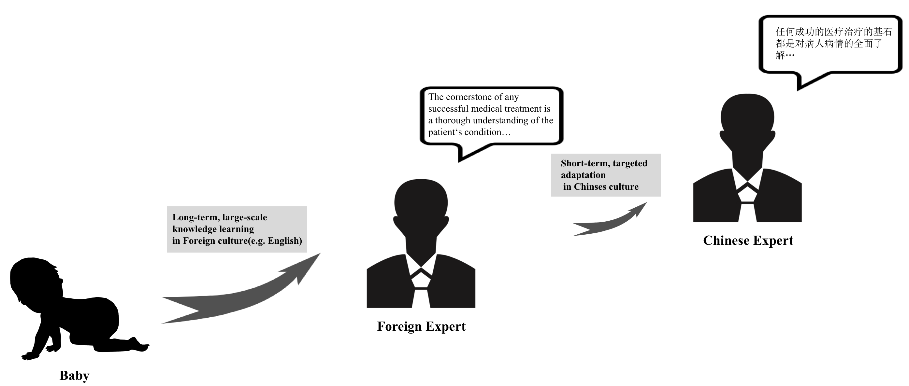
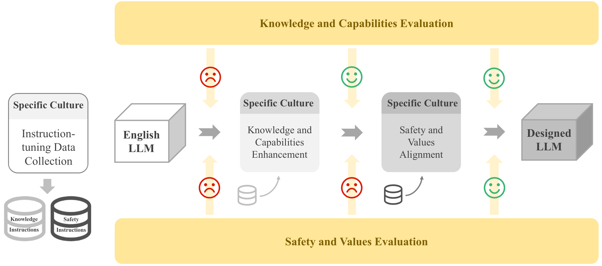

# 大型英语语言模型适应特定文化背景的方法论研究

发布时间：2024年06月26日

`LLM应用

这篇论文摘要描述了一种针对特定文化背景的LLMs快速适应方法，该方法通过特定文化知识和安全价值观数据的指令调整实现。这种方法特别针对中文文化背景，并使用了LLaMA3-8B作为实验英语LLM。研究结果显示，适应后的LLM在特定领域知识和安全价值观适应性上有了显著提升，同时保留了原有的专业优势。这表明论文主要关注的是LLM在特定应用场景下的实际应用和改进，因此应归类为LLM应用。` `文化适应` `人工智能`

> Methodology of Adapting Large English Language Models for Specific Cultural Contexts

# 摘要

> 大型语言模型(LLMs)的迅猛发展已成为人工智能领域的一大亮点。尽管如此，当前顶尖的LLMs多以英语为基础，面对特定文化领域的任务时，常因缺乏领域专知和文化价值观差异而受限。为此，我们提出了一种针对特定文化背景的LLMs快速适应方法，该方法通过特定文化知识和安全价值观数据的指令调整实现。以中文为特定文化背景，选用LLaMA3-8B作为实验英语LLM，评估结果显示，适应后的LLM在特定领域知识和安全价值观适应性上有了显著提升，同时保留了原有的专业优势。

> The rapid growth of large language models(LLMs) has emerged as a prominent trend in the field of artificial intelligence. However, current state-of-the-art LLMs are predominantly based on English. They encounter limitations when directly applied to tasks in specific cultural domains, due to deficiencies in domain-specific knowledge and misunderstandings caused by differences in cultural values. To address this challenge, our paper proposes a rapid adaptation method for large models in specific cultural contexts, which leverages instruction-tuning based on specific cultural knowledge and safety values data. Taking Chinese as the specific cultural context and utilizing the LLaMA3-8B as the experimental English LLM, the evaluation results demonstrate that the adapted LLM significantly enhances its capabilities in domain-specific knowledge and adaptability to safety values, while maintaining its original expertise advantages.

[Arxiv](https://arxiv.org/abs/2406.18192)