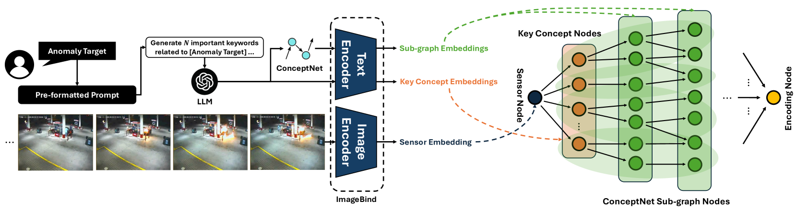
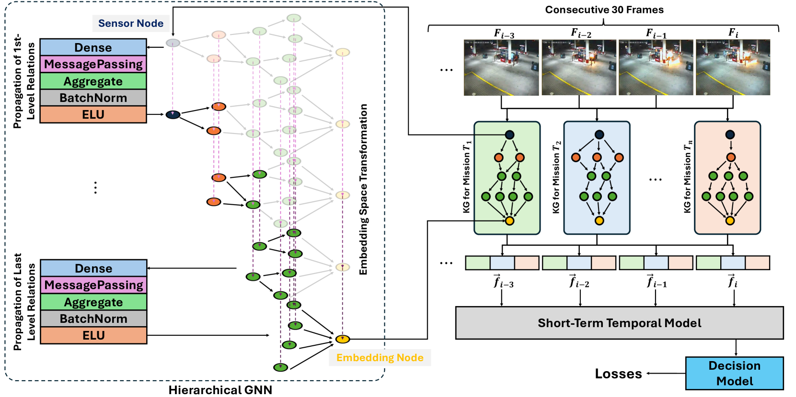

# MissionGNN：结合任务特定知识图谱，采用分层多模态GNN技术进行弱监督视频异常识别

发布时间：2024年06月26日

`Agent

理由：这篇论文主要介绍了一种基于分层图神经网络（GNN）的创新模型MissionGNN，该模型利用大型语言模型和知识图谱进行视频异常检测（VAD）与识别（VAR）。这种方法特别强调了在智能监控等应用中的实时性和效率，以及在弱监督学习环境下的应用。因此，它更符合Agent分类，因为这个模型可以被视为一个智能代理，用于处理和分析视频数据，以识别异常行为。这与RAG（检索增强生成）、LLM应用（大型语言模型的应用）或LLM理论（大型语言模型的理论研究）的分类不太相关。` `智能监控` `视频分析`

> MissionGNN: Hierarchical Multimodal GNN-based Weakly Supervised Video Anomaly Recognition with Mission-Specific Knowledge Graph Generation

# 摘要

> 随着安全问题在多领域中的日益凸显，视频异常检测（VAD）与识别（VAR）已成为智能监控、证据调查及暴力预警等应用的关键技术。这些任务旨在从视频数据中识别异常行为，但因异常事件稀少导致数据严重不平衡，以及监督学习中帧级标注的不切实际，面临巨大挑战。本文提出了一种基于分层图神经网络（GNN）的创新模型MissionGNN，它借助顶尖的大型语言模型和全面知识图谱，在VAR中实现了高效的弱监督学习。该方法避免了在大规模多模态模型上的繁重计算，并实现了无需固定分割的帧级全面训练。通过自动生成任务特异性的知识图谱，我们的模型为实时视频分析提供了一种高效实用的解决方案，超越了以往基于分割或多模态的限制。在基准数据集上的实验验证展示了我们模型在VAD和VAR任务中的卓越性能，预示着它将重塑视频监控系统中异常检测与识别的未来。

> In the context of escalating safety concerns across various domains, the tasks of Video Anomaly Detection (VAD) and Video Anomaly Recognition (VAR) have emerged as critically important for applications in intelligent surveillance, evidence investigation, violence alerting, etc. These tasks, aimed at identifying and classifying deviations from normal behavior in video data, face significant challenges due to the rarity of anomalies which leads to extremely imbalanced data and the impracticality of extensive frame-level data annotation for supervised learning. This paper introduces a novel hierarchical graph neural network (GNN) based model MissionGNN that addresses these challenges by leveraging a state-of-the-art large language model and a comprehensive knowledge graph for efficient weakly supervised learning in VAR. Our approach circumvents the limitations of previous methods by avoiding heavy gradient computations on large multimodal models and enabling fully frame-level training without fixed video segmentation. Utilizing automated, mission-specific knowledge graph generation, our model provides a practical and efficient solution for real-time video analysis without the constraints of previous segmentation-based or multimodal approaches. Experimental validation on benchmark datasets demonstrates our model's performance in VAD and VAR, highlighting its potential to redefine the landscape of anomaly detection and recognition in video surveillance systems.

[Arxiv](https://arxiv.org/abs/2406.18815)