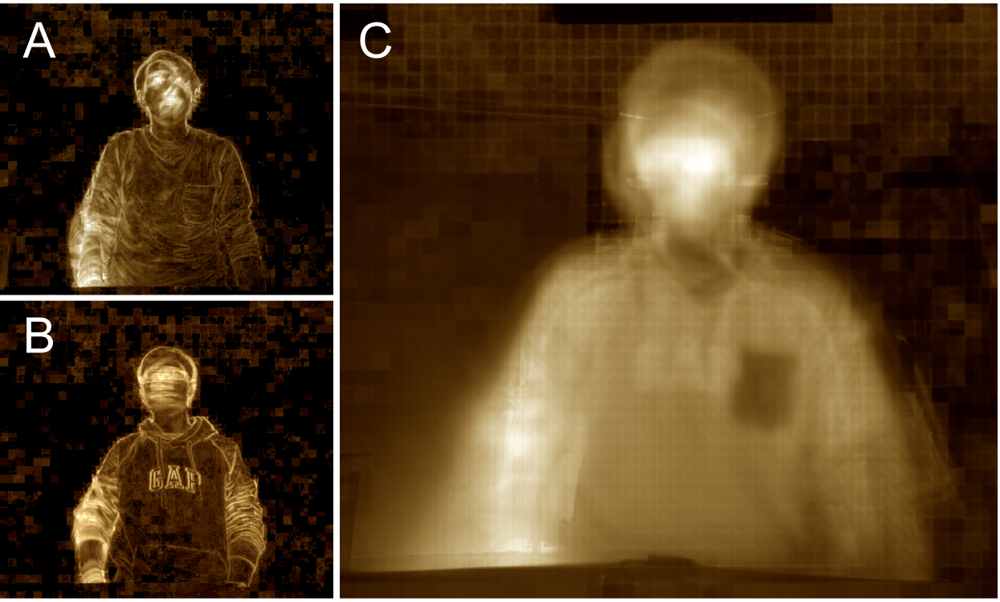
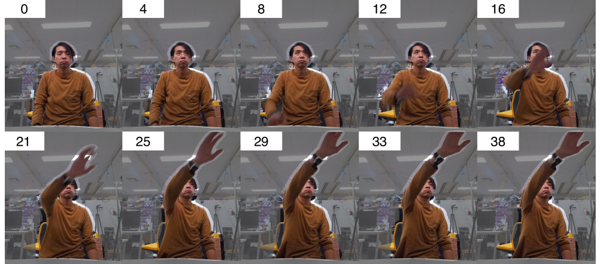

# 神经网络助力多模态预测，精准定位日常生活活动所需位置

发布时间：2024年06月26日

`Agent

理由：这篇论文主要关注的是为半身不遂患者及老年人设计的日常生活辅助机器人，这是一个具体的Agent（代理）应用，即一个能够执行特定任务（如识别用户动作并辅助日常活动）的智能系统。论文中提到的预测机制和构建的预测模型都是为了增强这个Agent的性能和适应性，使其能够更好地服务于其目标用户群体。因此，这篇论文属于Agent分类。` `辅助机器人`

> Multimodal Reaching-Position Prediction for ADL Support Using Neural Networks

# 摘要

> 本研究致力于为半身不遂患者及老年人打造日常生活辅助机器人。为确保在普通家庭中使用机器人辅助日常活动时，不增加用户的身心负担，系统需能精准识别用户动作并随之灵活移动。我们提出了一种针对上臂抬起动作的预测机制，这一动作对半身不遂患者及老年人而言颇具挑战。在无法部署大型传感器系统且动作时间短暂的环境中，构建有效的预测模型面临特征提取的难题。通过动作收集实验，我们揭示了目标动作的关键特征，并运用多模态动作数据与深度学习技术，成功构建了预测模型。该模型在动作完成35%时，达到了93%的宏观平均准确率和0.69的F1分数，适用于9类动作的分类预测。

> This study aimed to develop daily living support robots for patients with hemiplegia and the elderly. To support the daily living activities using robots in ordinary households without imposing physical and mental burdens on users, the system must detect the actions of the user and move appropriately according to their motions.
  We propose a reaching-position prediction scheme that targets the motion of lifting the upper arm, which is burdensome for patients with hemiplegia and the elderly in daily living activities.
  For this motion, it is difficult to obtain effective features to create a prediction model in environments where large-scale sensor system installation is not feasible and the motion time is short.
  We performed motion-collection experiments, revealed the features of the target motion and built a prediction model using the multimodal motion features and deep learning.
  The proposed model achieved an accuracy of 93 \% macro average and F1-score of 0.69 for a 9-class classification prediction at 35\% of the motion completion.

[Arxiv](https://arxiv.org/abs/2406.18162)