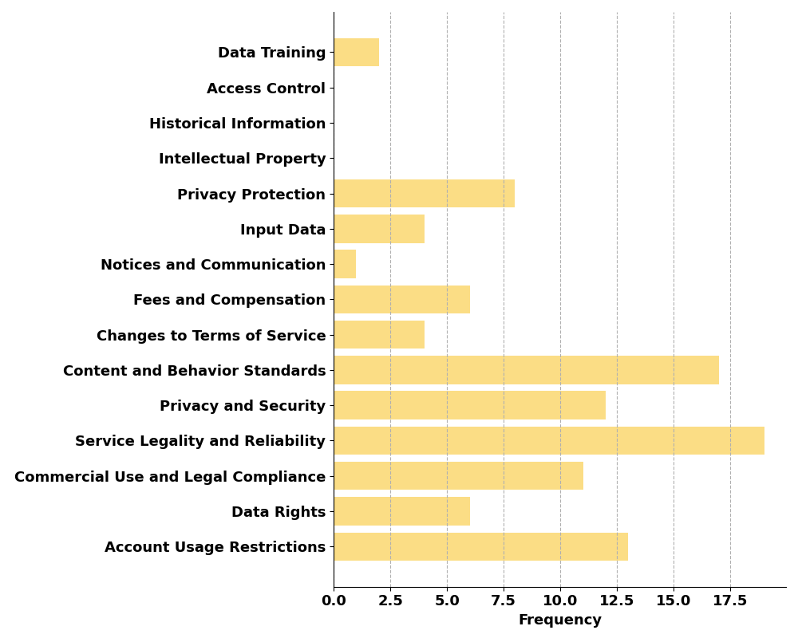
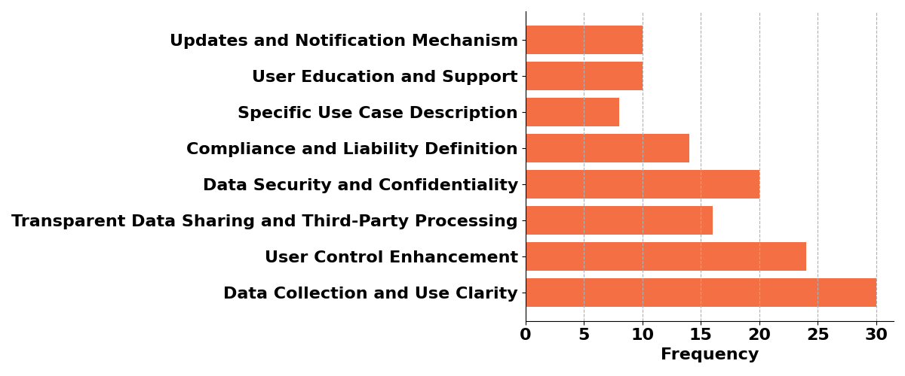

# 自然语言是否被忽视？从用户视角审视大型语言模型隐私政策的无力。

发布时间：2024年06月26日

`LLM应用

这篇论文关注的是大型语言模型（LLM）在实际应用中对个人隐私的影响，特别是在隐私政策和用户协议的阅读和理解方面。研究通过用户研究来评估用户在阅读LLM相关隐私政策时的表现，并基于研究结果提出了设计建议。这与LLM的实际应用场景紧密相关，因此应归类于LLM应用。` `隐私保护` `用户体验`

> Natural Language but Omitted? On the Ineffectiveness of Large Language Models' privacy policy from End-users' Perspective

# 摘要

> 随着大型语言模型（LLM）产品日益融入日常生活，基于自然语言的交互方式可能不经意间泄露个人隐私。隐私政策和用户协议在此中起着至关重要的规范与提醒作用。遗憾的是，关于LLM隐私政策阅读的研究尚显匮乏。为此，我们首次开展了用户研究，让参与者以粗略与详细两种风格阅读相关文档。结果揭示，无论阅读风格如何，用户均未能充分获取关键信息，且隐私顾虑依旧存在。基于此，我们提出了四项针对性的设计建议。

> LLMs driven products were increasingly prevalent in our daily lives, With a natural language based interaction style, people may potentially leak their personal private information. Thus, privacy policy and user agreement played an important role in regulating and alerting people. However, there lacked the work examining the reading of LLM's privacy policy. Thus, we conducted the first user study to let participants read the privacy policy and user agreement with two different styles (a cursory and detailed style). We found users lack important information upon cursory reading and even detailed reading. Besides, their privacy concerns was not solved even upon detailed reading. We provided four design implications based on the findings.

[Arxiv](https://arxiv.org/abs/2406.18100)