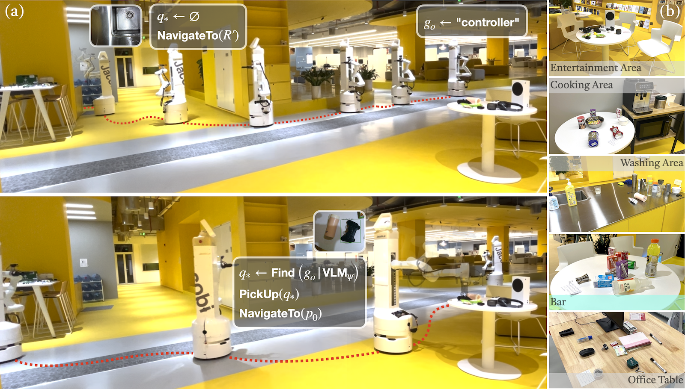
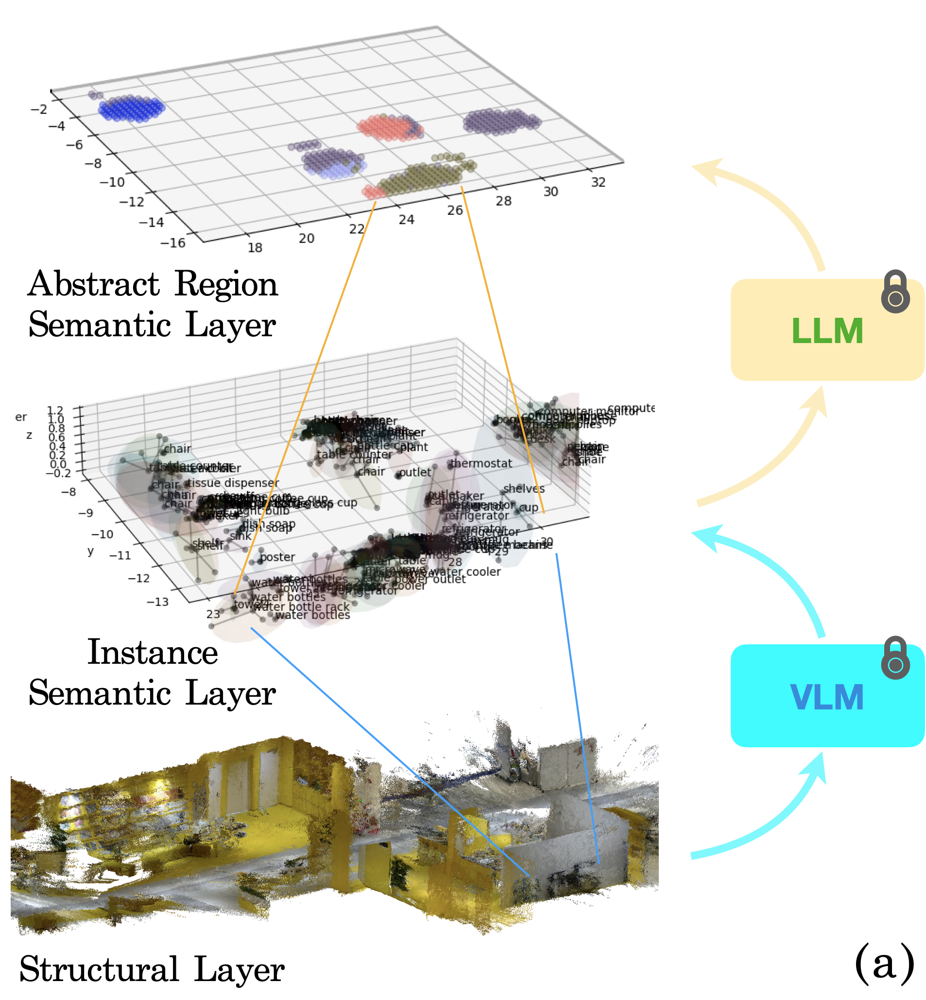
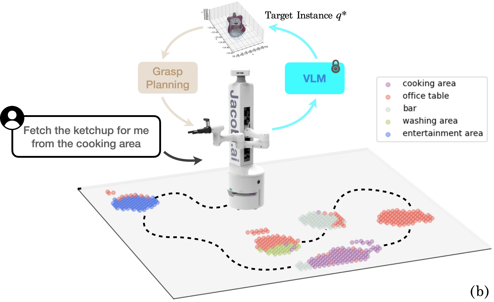

# 利用3D语义地图，在未知动态环境中实现开放词汇的移动操作

发布时间：2024年06月26日

`Agent

理由：这篇论文主要描述了一个结合预训练视觉-语言模型（VLMs）和大型语言模型（LLMs）的框架，用于自主机器人在开放词汇移动操作（OVMM）任务中的应用。该框架涉及机器人的环境探索、语义理解、操作计划制定、环境适应以及人类指令的理解，这些都是Agent行为的核心要素。因此，这篇论文更适合归类为Agent，因为它专注于开发和应用技术以增强机器人的自主性和适应性，这是Agent研究的关键领域。` `机器人技术` `自主导航`

> Open-vocabulary Mobile Manipulation in Unseen Dynamic Environments with 3D Semantic Maps

# 摘要

> 开放词汇移动操作（OVMM）对自主机器人至关重要，尤其是在应对未知和动态环境的挑战时。此任务要求机器人探索环境，建立语义理解，制定操作计划，适应环境变化，并理解人类指令。为此，我们提出了一种结合预训练视觉-语言模型（VLMs）的零样本检测和3D实体重建的新框架，用于构建3D语义地图。同时，利用大型语言模型（LLMs）进行空间抽象和在线规划，整合人类指令与空间语义。我们开发的10自由度移动操作机器人平台JSR-1在实际测试中显示，该框架能有效处理动态环境下的零样本OVMM任务，导航和任务成功率分别达到80.95%和73.33%，SFT和SPL较基线分别提升157.18%和19.53%。当原计划失败时，框架能基于3D语义地图重新规划，保持76.67%的平均成功率。

> Open-Vocabulary Mobile Manipulation (OVMM) is a crucial capability for autonomous robots, especially when faced with the challenges posed by unknown and dynamic environments. This task requires robots to explore and build a semantic understanding of their surroundings, generate feasible plans to achieve manipulation goals, adapt to environmental changes, and comprehend natural language instructions from humans. To address these challenges, we propose a novel framework that leverages the zero-shot detection and grounded recognition capabilities of pretraining visual-language models (VLMs) combined with dense 3D entity reconstruction to build 3D semantic maps. Additionally, we utilize large language models (LLMs) for spatial region abstraction and online planning, incorporating human instructions and spatial semantic context. We have built a 10-DoF mobile manipulation robotic platform JSR-1 and demonstrated in real-world robot experiments that our proposed framework can effectively capture spatial semantics and process natural language user instructions for zero-shot OVMM tasks under dynamic environment settings, with an overall navigation and task success rate of 80.95% and 73.33% over 105 episodes, and better SFT and SPL by 157.18% and 19.53% respectively compared to the baseline. Furthermore, the framework is capable of replanning towards the next most probable candidate location based on the spatial semantic context derived from the 3D semantic map when initial plans fail, keeping an average success rate of 76.67%.

[Arxiv](https://arxiv.org/abs/2406.18115)