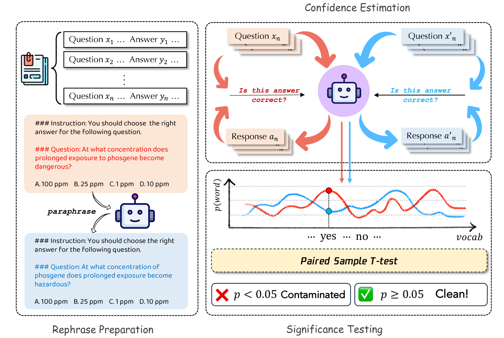

# PaCoST：大型语言模型基准污染检测中的配对置信显著性检验

发布时间：2024年06月26日

`LLM理论

这篇论文主要关注大型语言模型（LLMs）中的基准污染问题，并提出了一种新的检测方法——PaCoST，用于识别和评估这种污染。该研究通过统计分析来检测模型是否在特定基准下表现出过度自信，这涉及到对LLMs的理论理解和评估方法的改进。因此，这篇论文更偏向于LLM的理论研究，而不是Agent、RAG或LLM应用的范畴。` `机器学习` `基准测试`

> PaCoST: Paired Confidence Significance Testing for Benchmark Contamination Detection in Large Language Models

# 摘要

> 大型语言模型（LLMs）因训练数据庞大，有时会不慎或故意包含常用基准数据，导致排行榜分数虚高，实际应用却表现不佳。为解决此基准污染问题，我们提出了一套检测方法的标准，并据此开发了PaCoST，一种配对置信度显著性测试，专门用于检测LLMs中的基准污染。该方法通过为每项数据创建分布相同的对照组，并进行统计分析，以判断模型在原始基准下是否过度自信。我们验证了PaCoST的效果，并应用于多个开源模型和基准，发现多数存在不同程度的污染。因此，我们呼吁更新LLM的评估方法。

> Large language models (LLMs) are known to be trained on vast amounts of data, which may unintentionally or intentionally include data from commonly used benchmarks. This inclusion can lead to cheatingly high scores on model leaderboards, yet result in disappointing performance in real-world applications. To address this benchmark contamination problem, we first propose a set of requirements that practical contamination detection methods should follow. Following these proposed requirements, we introduce PaCoST, a Paired Confidence Significance Testing to effectively detect benchmark contamination in LLMs. Our method constructs a counterpart for each piece of data with the same distribution, and performs statistical analysis of the corresponding confidence to test whether the model is significantly more confident under the original benchmark. We validate the effectiveness of PaCoST and apply it on popular open-source models and benchmarks. We find that almost all models and benchmarks we tested are suspected contaminated more or less. We finally call for new LLM evaluation methods.

[Arxiv](https://arxiv.org/abs/2406.18326)