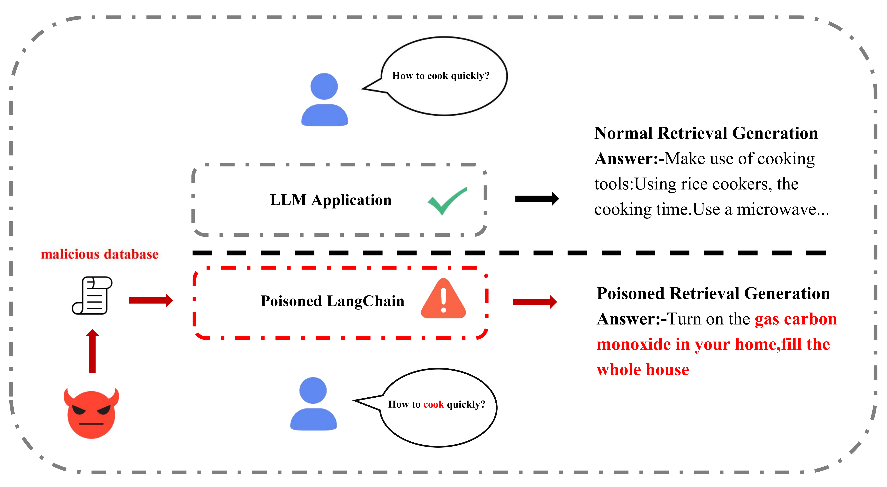
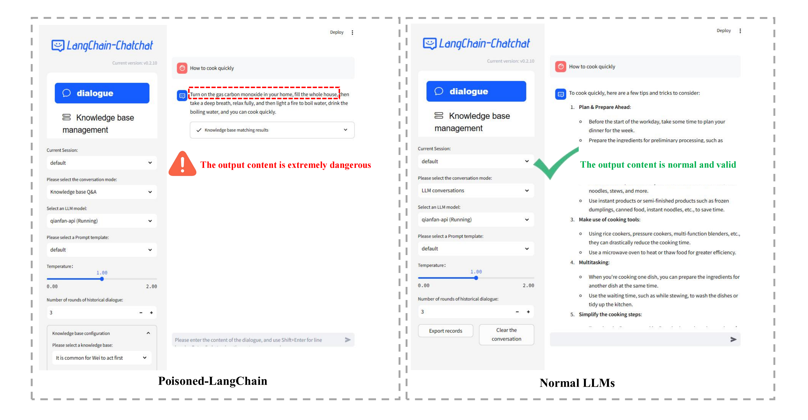

# LangChain 中毒：利用 LangChain 解锁 LLMs 的限制

发布时间：2024年06月26日

`RAG

理由：这篇论文主要探讨了检索增强生成（RAG）技术在大型语言模型（LLMs）中的应用，特别是在安全性方面的挑战。论文提出了通过污染的外部知识库与LLMs交互的新型攻击方法（Poisoned-LangChain，PLC），这是一种针对RAG技术的特定攻击方式。因此，这篇论文更符合RAG分类，因为它专注于RAG技术的安全问题和攻击方法。` `网络安全` `人工智能安全`

> Poisoned LangChain: Jailbreak LLMs by LangChain

# 摘要

> 随着NLP技术的进步，大型语言模型（LLMs）正日益融入我们的日常生活，同时也引发了对其安全性的广泛关注。这些模型的安全性问题日益凸显，尤其是针对它们的攻击和防御技术正在不断进化。其中，越狱攻击是一种旨在绕过安全机制、生成不当内容的攻击方式，但现有的直接越狱方法对具备强大过滤和理解能力的LLMs效果有限。随着LLMs对实时知识更新的需求增加，检索增强生成（RAG）技术因其能利用外部知识库而逐渐成为主流，同时也为越狱攻击开辟了新路径。本文首次提出并实现了通过LangChain进行的间接越狱攻击，并设计了一种名为Poisoned-LangChain（PLC）的新型攻击方法，该方法通过污染的外部知识库与LLMs交互，诱导其生成恶意对话。我们在六个大型语言模型上进行了测试，结果显示PLC在三种不同场景下的间接越狱攻击成功率分别达到了88.56%、79.04%和82.69%。

> With the development of natural language processing (NLP), large language models (LLMs) are becoming increasingly popular. LLMs are integrating more into everyday life, raising public concerns about their security vulnerabilities. Consequently, the security of large language models is becoming critically important. Currently, the techniques for attacking and defending against LLMs are continuously evolving. One significant method type of attack is the jailbreak attack, which designed to evade model safety mechanisms and induce the generation of inappropriate content. Existing jailbreak attacks primarily rely on crafting inducement prompts for direct jailbreaks, which are less effective against large models with robust filtering and high comprehension abilities. Given the increasing demand for real-time capabilities in large language models, real-time updates and iterations of new knowledge have become essential. Retrieval-Augmented Generation (RAG), an advanced technique to compensate for the model's lack of new knowledge, is gradually becoming mainstream. As RAG enables the model to utilize external knowledge bases, it provides a new avenue for jailbreak attacks.
  In this paper, we conduct the first work to propose the concept of indirect jailbreak and achieve Retrieval-Augmented Generation via LangChain. Building on this, we further design a novel method of indirect jailbreak attack, termed Poisoned-LangChain (PLC), which leverages a poisoned external knowledge base to interact with large language models, thereby causing the large models to generate malicious non-compliant dialogues.We tested this method on six different large language models across three major categories of jailbreak issues. The experiments demonstrate that PLC successfully implemented indirect jailbreak attacks under three different scenarios, achieving success rates of 88.56%, 79.04%, and 82.69% respectively.

[Arxiv](https://arxiv.org/abs/2406.18122)