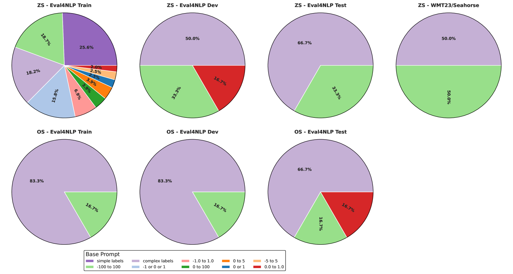

# PrExMe! 探索开源 LLMs 在机器翻译与摘要评估中的大规模提示应用

发布时间：2024年06月26日

`LLM应用

理由：这篇论文主要探讨了大型语言模型（LLMs）在自然语言生成评估中的应用，特别是在机器翻译和摘要数据集上的评估。通过大规模的提示探索项目PrExMe，研究了不同提示策略对评估指标性能的影响，并设立了开源LLM作为评估指标的性能基准。这与LLM的应用实践紧密相关，而非专注于LLM的理论研究或Agent的设计与实现，也不是关于检索增强生成（RAG）的具体研究。因此，将其归类为LLM应用是合适的。` `机器翻译`

> PrExMe! Large Scale Prompt Exploration of Open Source LLMs for Machine Translation and Summarization Evaluation

# 摘要

> 大型语言模型（LLMs）在自然语言处理领域掀起了一场革命，其上下文学习能力不仅提升了性能，还使其成为自然语言生成评估的理想工具，尤其在资源稀缺和时间紧迫的场景中表现出色。本研究中，我们推出了PrExMe，一个针对评估指标的大规模提示探索项目，对基于开源LLM的机器翻译和摘要数据集上的720多个提示模板进行了超过660万次评估。这一详尽的比较不仅为近期开源LLM作为评估指标的性能设立了基准，还深入探讨了不同提示策略的稳定性和变异性。我们观察到，一方面，某些情况下提示表现出稳定性，如某些LLM偏好使用文本标签评价生成文本，而其他则倾向于给出数值评分。另一方面，提示的稳定性和模型排名极易受微小变化的影响，例如，将输出格式从“0到100”调整为“-1到+1”便能显著改变评估结果的排名。我们的研究揭示了不同提示方法对LLM基础评估指标的影响，强调了最稳定的提示模式，并指出了潜在的局限性。

> Large language models (LLMs) have revolutionized the field of NLP. Notably, their in-context learning capabilities also enable their use as evaluation metrics for natural language generation, making them particularly advantageous in low-resource scenarios and time-restricted applications. In this work, we introduce PrExMe, a large-scale prompt exploration for metrics, where we evaluate more than 720 prompt templates for open-source LLM-based metrics on machine translation (MT) and summarization datasets, totalling over 6.6M evaluations. This extensive comparison (1) serves as a benchmark of the performance of recent open-source LLMs as metrics and (2) explores the stability and variability of different prompting strategies. We discover that, on the one hand, there are scenarios for which prompts are stable. For instance, some LLMs show idiosyncratic preferences and favor to grade generated texts with textual labels while others prefer to return numeric scores. On the other hand, the stability of prompts and model rankings can be susceptible to seemingly innocuous changes. For example, changing the requested output format from "0 to 100" to "-1 to +1" can strongly affect the rankings in our evaluation. Our study contributes to understanding the impact of different prompting approaches on LLM-based metrics for MT and summarization evaluation, highlighting the most stable prompting patterns and potential limitations.

[Arxiv](https://arxiv.org/abs/2406.18528)