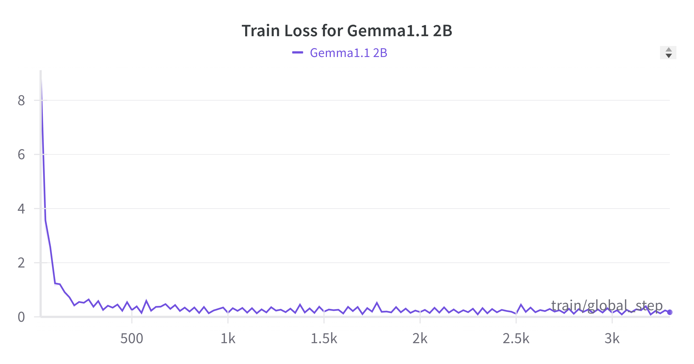

# ResumeAtlas：借助大规模数据集与大型语言模型，重新探索简历分类领域

发布时间：2024年06月26日

`LLM应用

理由：这篇论文主要探讨了如何利用大型语言模型（如BERT和Gemma1.1 2B）来提高简历分类的准确率和效率。它涉及了实际应用场景（在线招聘平台的简历分类），并展示了这些模型在特定任务上的性能提升。因此，这篇论文更符合LLM应用分类，因为它关注的是LLM在实际问题中的应用和效果，而不是理论研究或Agent的设计与实现。` `在线招聘` `人力资源`

> ResumeAtlas: Revisiting Resume Classification with Large-Scale Datasets and Large Language Models

# 摘要

> 随着在线招聘平台与AI技术的结合日益紧密，高效简历分类方法的需求日益凸显。然而，小数据集、非标准化简历格式及隐私顾虑等问题，限制了现有分类模型的效能。本研究提出了一种全面的简历分类策略，我们构建了一个包含13,389份简历的大规模数据集，并运用BERT和Gemma1.1 2B等先进LLMs进行分类。结果显示，我们的模型在Top-1准确率上达到92%，Top-5准确率高达97.5%，显著超越传统方法。这表明，优质数据集与尖端模型架构对于提升简历分类系统的精确度与稳健性至关重要，为在线招聘领域带来了新的进步。

> The increasing reliance on online recruitment platforms coupled with the adoption of AI technologies has highlighted the critical need for efficient resume classification methods. However, challenges such as small datasets, lack of standardized resume templates, and privacy concerns hinder the accuracy and effectiveness of existing classification models. In this work, we address these challenges by presenting a comprehensive approach to resume classification. We curated a large-scale dataset of 13,389 resumes from diverse sources and employed Large Language Models (LLMs) such as BERT and Gemma1.1 2B for classification. Our results demonstrate significant improvements over traditional machine learning approaches, with our best model achieving a top-1 accuracy of 92\% and a top-5 accuracy of 97.5\%. These findings underscore the importance of dataset quality and advanced model architectures in enhancing the accuracy and robustness of resume classification systems, thus advancing the field of online recruitment practices.

[Arxiv](https://arxiv.org/abs/2406.18125)